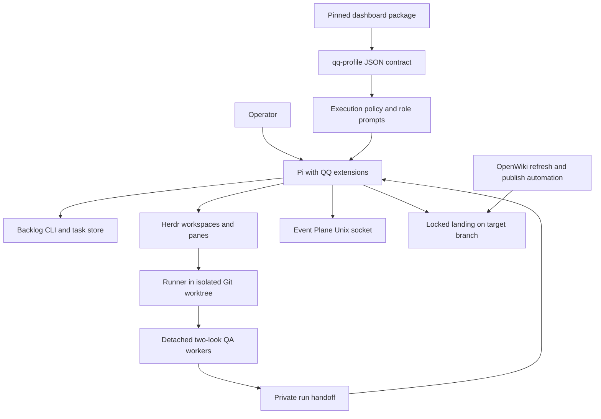
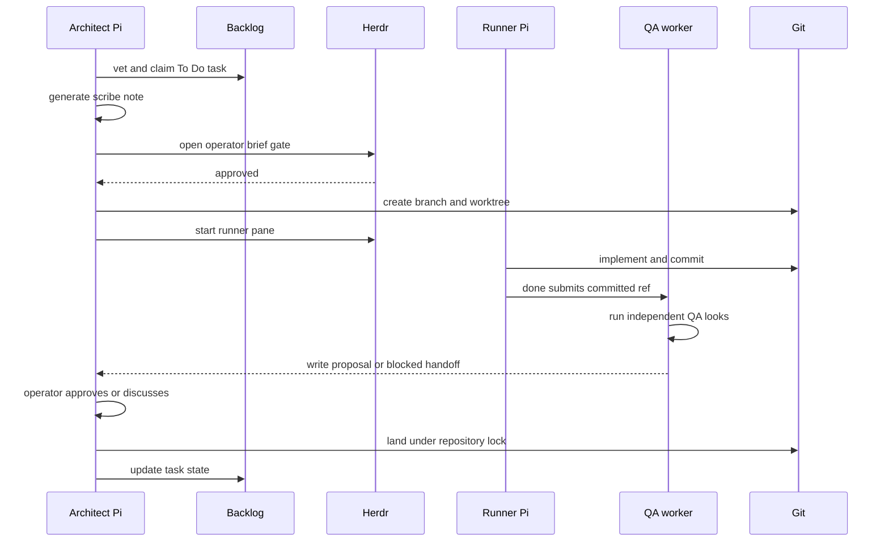

# QQ architecture overview

QQ is a private, local-first engineering workflow built around Pi. It composes execution policy, role-specific prompts, Backlog-managed planning, isolated Git worktrees, Herdr panes, independent QA, a local Event Plane, dashboard launchers, and OpenWiki maintenance. The repository owns the composition and policy; it does not own Pi, Git, Backlog, Herdr's Rust implementation, or the private dashboard implementation.

## System map

*The repository-owned Pi layer coordinates external runtimes through explicit CLI, file, and protocol boundaries.*

## Owned components and boundaries

| Surface | Repository owner and stable entrypoints | Boundary |
|---|---|---|
| Pi composition | `extensions/index.ts`, default `registerQQ(pi)` | Registers the normal session extensions in fixed order. `extensions/qa-result.ts` is intentionally worker-only and is not in the aggregate. See [Profiles and extensions](../runtime/profiles-and-extensions.md). |
| Activation and profiles | `bin/qq-methodology`; `bin/qq-profile`; `bin/lib/roles.mjs`; `bin/lib/execution-profiles.mjs`; `extensions/execution-profiles.ts` | QQ owns repository activation, profile schema, model/context checks, role prompt replacement, and pane-local selection. Pi owns model registration, authentication, tools, sessions, and events. |
| Delegation and review | `extensions/board.ts`; `extensions/review-flow.ts`; `extensions/qa-result.ts`; `bin/lib/{admission,run,review}.mjs`; `bin/qq-{review,land}-worker.mjs` | QQ owns admission, private handoffs, worktree/pane orchestration, two-look QA, operator approval, and landing. Git, Backlog, and Herdr execute the underlying operations. |
| Event Plane integration | `bin/lib/event_plane_service.py`; `bin/lib/event-plane-client.ts`; `bin/lib/event_plane_client.py`; `extensions/agent-messages.ts`; `bin/event-plane`; `bin/event-plane-admin` | The Python service owns the Unix-socket protocol and SQLite delivery state. The extension owns Pi presence and message injection, not transport persistence. |
| Herdr distribution | `herdr/downstream/upstream.env`; `herdr/config.toml`; `bin/qq-herdr-{build,smoke,activate,upgrade,pane-add,launch}`; `systemd/user/herdr.service` | QQ pins, validates, installs, activates, and configures Herdr. The centered-pane Rust implementation and its source tests live in the pinned upstream repository, not this checkout. |
| Dashboard | `package.json`; `package-lock.json`; `bin/qq-dashboard`; `bin/qq-dashboard-cookies`; `dashboard/README.md` | QQ pins and launches the private package and supplies `QQ_PROFILE_BIN`. Dashboard internals are unavailable here; its supported profile input is `qq-profile list --json`. |
| OpenWiki automation | `bin/qq-openwiki-{refresh,publish,dispatch,refresh-legacy}`; `config/openwiki-repositories`; `systemd/user/qq-openwiki.{service,timer}`; `.github/workflows/openwiki-update.yml` | Local automation owns isolated refresh/publication and locking. The hosted workflow is a separate PR-producing path, not evidence of local timer authority. |

## Central delegated flow

*Delegation separates operator approval, implementation, QA, and landing; no runner merges its own work.*

The stable orchestration symbols are `admitDelegate()` and `makeNote()` in `extensions/board.ts`, `prepareRun()` and `startRun()` in `bin/lib/run.mjs`, `prepareDone()` and `conductReview()` in `bin/lib/review.mjs`, and `land()` inside `registerReviewFlow()` in `extensions/review-flow.ts`. The handoff records `schema: qq.run-handoff/v1`; `readHandoff()` rejects another schema/version. `startRun()` changes the handoff from `starting` to `running` only after the worktree, pane, agent, and prompt exist. Landing is serialized by `<git-common-dir>/qq-land.lock` and only a QA-passed proposal offers `approve`.

## State and configuration

| State/configuration | Location or schema | Owner and invariant |
|---|---|---|
| Repository activation | common local Git config `qq.methodology=true` | `bin/qq-methodology` and `isActivatedRepository()`. Shared by linked worktrees, absent from clones, and fail-closed for missing/invalid values. |
| Execution policy | `${XDG_CONFIG_HOME:-~/.config}/qq/execution-profiles.json`, `qq.execution-profiles/v1` | Exact top-level and role/profile keys; only `runner` and `architect`; private regular file; Grok via `xai-auth`; 200,000 Grok context ceiling. |
| Pane selection | `${XDG_STATE_HOME:-~/.local/state}/qq/pane-profiles/<HERDR_PANE_ID>.json` | Version 1 exact shape; owner-only directory/file; atomic write; ignored if unsafe, malformed, or no longer declared. It never changes the durable default. |
| Event Plane | `${XDG_STATE_HOME:-~/.local/state}/qq/event-plane/` | Service owns the fixed socket/database namespace. Presence is extension-owned state conceptually adjacent to it; a production layout must not place an unexpected `presence/` entry in the core service directory because service startup validates fixed names. The live messaging harness separates those roots. |
| Delegated run | private run directory and `qq.run-handoff/v1` JSON selected by `QQ_RUN_STATE` | Architect session ID establishes proposal ownership; runner receives a dedicated branch/worktree and may submit, never merge. |
| QA verdict | `qq.qa-verdict/v1` JSON at `QQ_QA_RESULT` or beside the handoff | `qa_verdict` writes exactly one final pass/fail result and shuts the QA session down. |
| Session scrub | `${XDG_STATE_HOME:-~/.local/state}/qq/scrub/{marker.json,ledger.jsonl}` | Marker names one transcript; only that finalized previous session may be overwritten and unlinked. Ledger contains metadata, not transcript content. |
| Dashboard state | `~/.local/state/qq/telemetry/` | Private package state; QQ installation and upgrades must preserve it. |

## Cross-cutting invariants

- **Activation is explicit.** A normal external checkout activates only through repository-local `qq.methodology=true`; delegated workers may be forced with validated `QQ_AGENT_ROLE`.
- **Profile startup fails closed.** Every role, scribe, and QA binding must resolve to an available model with an integer acceptable context window before input proceeds. Authentication and requested effort are checked when applying a profile.
- **Private state is not followed through symlinks.** Profile, presence, run, and result writers use owner checks, restrictive modes, exclusive temporary files, and atomic rename where implemented.
- **Planning mutations use Backlog.** `extensions/backlog-guard.ts` blocks Pi `write` and `edit` calls into the checkout's logical or real `backlog/` tree; workflow code invokes the pinned Backlog CLI.
- **Operator authority is preserved.** High-impact shell commands are staged but not executed; delegation has a brief gate; landing requires an owning architect session and explicit approval.
- **Delivery is persistence-aware.** Agent messages are acknowledged only after their custom-message receipt is observable in the Pi session transcript; otherwise they are retried.

## Extension seams

- Add normal session behavior through a `registerX(pi, deps = {})` module and register it in `extensions/index.ts`; dependency injection (`deps.exec`, paths, clocks, clients) is the established narrow-test seam.
- Add role/profile policy through `validateExecutionPolicy()` and the `qq-profile` CLI contract, not dashboard internals. Any schema change must update CLI JSON consumers and startup validation together.
- Add delegated state only through validated handoff readers/writers and preserve architect ownership, private modes, rollback, and lock boundaries.
- Add Event Plane behavior at the service protocol and both maintained clients before consuming it from an extension.
- Update Herdr by changing the immutable upstream manifest and passing build, smoke, install, and activation checks; do not patch an installed binary.

## Validation map

`npm test` is the aggregate order in `package.json`, but focused checks are preferred while changing one boundary:

- activation: `tests/test-methodology.sh`
- profiles and prompt composition: `node --experimental-strip-types tests/test-execution-profiles.mjs .`
- messaging/Event Plane: `tests/test-event-plane.sh`, `tests/test-agent-messages.mjs`, and conditional `tests/test-agent-messages-live.sh`
- delegation and review: `tests/test-delegation.mjs`, `tests/test-brief-gate.mjs`, `tests/test-review-flow.mjs`
- Herdr: `tests/test-herdr-downstream.sh`; `tests/test-herdr-live.sh` requires a live runtime
- OpenWiki: `tests/test-openwiki-refresh.sh`, `tests/test-openwiki-refresh-legacy.sh`, `tests/test-openwiki-dispatch.sh`

Source and tests are authoritative. In particular, do not infer dashboard internals from its launcher contract or Herdr implementation details from QQ's downstream wrappers.
