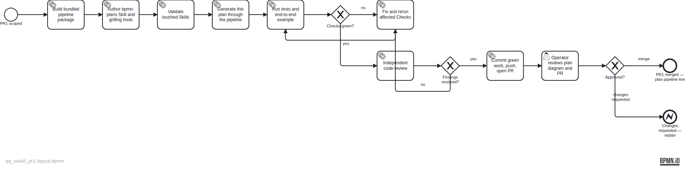

# Plan — Land TASK-8 PR1: BPMN plan artifacts

**Owning task:** TASK-8 (with TASK-6 sharing the pipeline foundation) · **Branch:** `feat/task-8-bpmn-plan-artifacts` · **Status:** awaiting operator approval at PR review

This is the first real plan artifact produced by the flow it delivers (TASK-8 AC #1). Every element carries a spot-checkable `Evidence: file:lines` stamp in `bpmn:documentation` and a `qq:evidence` extension; the pipeline verified the stamps survive layout losslessly at generation time. Evidence line numbers reference the files as committed in this PR.

**Files:** `assets/doc-19/plan-spec.json` (source spec) · `qq_task8_pr1.bpmn` (semantic model) · `qq_task8_pr1.png` (publishable render; carries the visible BPMN.io watermark — the SVG variant is deliberately not stored because it lacks one). All intermediates regenerate deterministically from the spec via `skills/bpmn-plans/pipeline`.

**Scope of PR1:** bundled pipeline package under `skills/bpmn-plans/pipeline/` (codegen, qq-subset bpmnlint plugin, layout+render, conformance CLI, 13-test suite), the `bpmn-plans` Skill, the one-line grilling close hook, and this plan document. Conformance report will be appended here after the PR lands.
