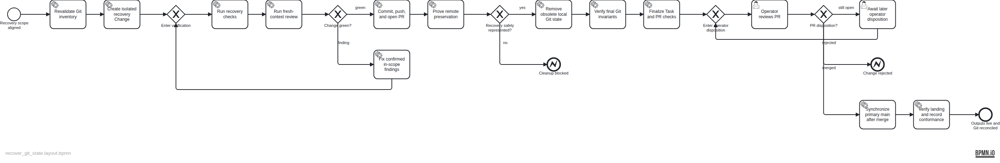

# Plan — Recover approved local outputs and reconcile Git state

## Intent

Recover the three previously approved outputs that were expected to be live, deliver them through one isolated GitHub Flow Change, and remove only the explicitly approved stale local Git state after committed remote preservation is proven. Commit `8ed35f2` remains deliberately unreferenced.

## Diagram

## Artifacts

- Plan spec: `assets/doc-23/plan-spec.json`
- Semantic BPMN: `assets/doc-23/plan.bpmn`
- Published render: `assets/doc-23/plan.png`

The diagram is the approval and execution contract. Post-landing conformance will be appended here.
