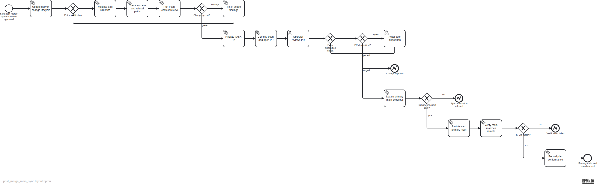

# Plan — Synchronize primary main after browser merges

## Intent

After the operator merges a Change in GitHub, make the accountable `deliver-change` agent safely fast-forward the single local `main` checkout so Backlog files and the standing Herdr board reflect landed state. Refuse dirty, absent, branch-mismatched, or non-fast-forward states without mutation.

## Diagram

## Artifacts

- Plan spec: `assets/doc-24/plan-spec.json`
- Semantic BPMN: `assets/doc-24/plan.bpmn`
- Published render: `assets/doc-24/plan.png`
- Executed completions: `assets/doc-24/completions.json`
- Conformance report: `assets/doc-24/conformance.md`

The diagram is the approved execution contract.

## Conformance report (post-landing, 2026-07-13)

Plan: `backlog/docs/plans/assets/doc-24/plan.bpmn`

## Summary

- Flow nodes: 24
- Accounted: 24
- Unaccounted: 0
- Diverged: 0
- Unknown completion IDs: 0
- Strict verdict: PASS

## Per-element status

| ID | Name | Type | Status | Evidence / note |
| --- | --- | --- | --- | --- |
| scope_approved | Safe post-merge synchronization approved | StartEvent | done | Evidence: T-14 implementation notes record operator approval of the rendered doc-24 plan before implementation |
| update_skill | Update deliver-change lifecycle | ServiceTask | done | Evidence: Commit b126268 and merged PR #45 update deliver-change and its OpenAI interface metadata |
| verification_entry | Enter verification | ExclusiveGateway | done | Evidence: Verification was entered initially and re-entered after forward-test and independent-review corrections |
| validate_skill | Validate Skill structure | ServiceTask | done | Evidence: skill-creator quick_validate reported Skill is valid; openai.yaml parsed successfully; diff hygiene passed |
| check_safety_paths | Check success and refusal paths | ServiceTask | done | Evidence: Fresh-context scenario exercises covered clean-behind, dirty, diverged, absent-main, rewritten-main, shared-ref, and final-dirty states |
| review_change | Run fresh-context review | ServiceTask | done | Evidence: Independent read-only review found pull/ref races and stale evidence stamps; exact final corrective and staged deltas had no material findings |
| review_decision | Change green? | ExclusiveGateway | done | Evidence: The findings branch was taken, then the green branch after immutable-target and evidence corrections |
| fix_findings | Fix in-scope findings | ServiceTask | done | Evidence: The protocol gained exclusive-use refusal, immutable target capture/validation/integration, final ancestry checks, and corrected doc-24 evidence references |
| finalize_task | Finalize T-14 | ServiceTask | done | Evidence: T-14 is Done with all four acceptance criteria checked, final notes, modified-file records, and final summary in commit b126268 |
| publish_change | Commit, push, and open PR | ServiceTask | done | Evidence: Reviewed commit b126268 was pushed and published as PR #45 with merge state CLEAN and no configured status checks |
| operator_review | Operator reviews PR | UserTask | done | Evidence: PR #45 remained visible in Zen Browser and the operator merged it at 2026-07-13T00:13:16Z |
| disposition_entry | Enter disposition check | ExclusiveGateway | done | Evidence: PR #45 entered operator disposition after persistent browser visibility was verified |
| disposition_decision | PR disposition? | ExclusiveGateway | done | Evidence: The merged branch was taken during the first short disposition watch |
| await_disposition | Await later disposition | UserTask | skipped | Note: The operator merged PR #45 during the initial watch, so no later resume was needed |
| change_rejected | Change rejected | EndEvent | skipped | Note: The operator merged rather than rejected PR #45 |
| locate_primary | Locate primary main checkout | ServiceTask | done | Evidence: git worktree list --porcelain returned exactly one refs/heads/main checkout at /home/qqp/projects/qq |
| primary_safe | Primary checkout safe? | ExclusiveGateway | done | Evidence: Initial and post-fetch checks found refs/heads/main, zero status bytes, one accountable qq agent, and only the read-only Backlog board in the primary workspace |
| report_unsafe | Synchronization refused | EndEvent | skipped | Note: Every primary-checkout safety gate passed, so synchronization was not refused |
| fast_forward_main | Fast-forward primary main | ServiceTask | done | Evidence: Primary main fast-forwarded 40b806b..c1b498b by merging validated immutable target c1b498b with --ff-only |
| verify_main | Verify main matches remote | ServiceTask | done | Evidence: Final checks observed refs/heads/main, zero status bytes, HEAD c1b498b equal to captured target c1b498b, and PR merge ancestry |
| sha_match | SHAs match? | ExclusiveGateway | done | Evidence: Local main HEAD, captured fetched target, PR #45 merge commit, and GitHub main all resolved to c1b498b52b187982aa7d62db742b76c442285034 |
| report_mismatch | Verification failed | EndEvent | skipped | Note: All final branch, cleanliness, SHA, and merge-ancestry checks passed |
| record_conformance | Record plan conformance | ServiceTask | done | Evidence: backlog/docs/plans/assets/doc-24/completions.json accounts for execution and conformance.md is generated from the landed plan |
| board_current | Primary main and board current | EndEvent | done | Evidence: The standing Herdr Backlog pane refreshed to Done (9) and visibly listed T-14 after primary main synchronized |

## Unaccounted elements

None.

## Unknown completion IDs

None.

## Divergence summary

No elements diverged.
