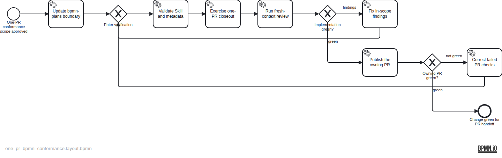

# Plan — Keep BPMN conformance inside the owning PR

## Intent

Revise `bpmn-plans` prospectively so planned execution ends when the implementation Change is green in its owning pull request. Conformance artifacts and Task finalization are same-PR closeout metadata outside the BPMN nodes; operator disposition and local-main synchronization remain delivery activities outside conformance. Historical plan records remain unchanged.

## Diagram

## Artifacts

- Plan spec: `assets/doc-25/plan-spec.json`
- Semantic BPMN: `assets/doc-25/plan.bpmn`
- Published render: `assets/doc-25/plan.png`

The diagram is the approved execution contract. Same-PR conformance and Task finalization will be appended as closeout metadata before final handoff.
