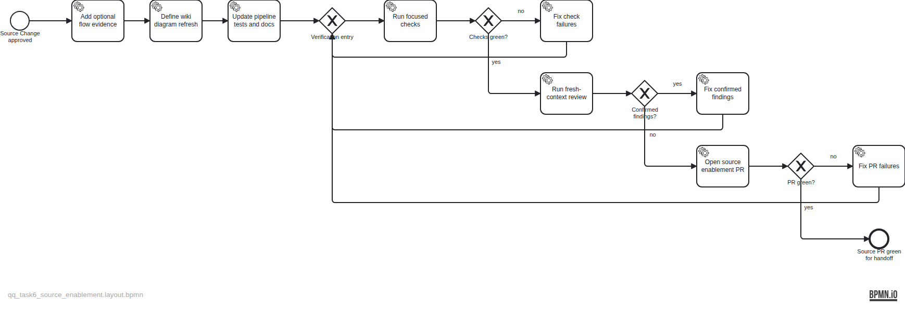

# Plan — Enable evidence-grounded OpenWiki BPMN refresh

**Owning Task:** TASK-6 — Living architecture model + rendered diagrams in OpenWiki

## Intent

Deliver the first of two Changes for TASK-6: make sequence-flow evidence a backward-compatible capability of the shared BPMN pipeline, and define the dedicated OpenWiki maintainer's deterministic diagram-refresh procedure.

## Ownership boundary

This plan ends when the source enablement pull request is green for handoff. It does not modify `openwiki/`, invoke the dedicated maintainer procedure, wait for merge, or perform the documentation-only refresh.

After this Change lands, the current agent will explicitly switch into the dedicated OpenWiki maintainer role, create a separate plan, and deliver the actual evidence-grounded OpenWiki models, attributed PNG renders, and wiki embeds in an `openwiki/update` Change.

## Artifacts

- Plan specification: `backlog/docs/plans/assets/doc-26/plan-spec.json`
- Evidence-stamped BPMN: `backlog/docs/plans/assets/doc-26/plan.bpmn`
- Rendered approval diagram: `backlog/docs/plans/assets/doc-26/plan.png`
