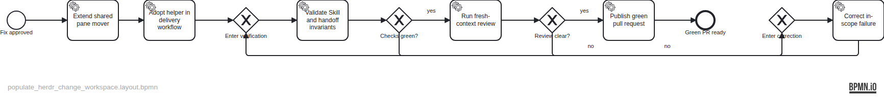

# Plan — Populate Herdr Change workspaces with the accountable agent

TASK-18 reuses `qq-herdr-pull` as the single owner of Herdr pane replacement. Existing operator selection remains intact; a fail-fast agent mode adopts a newly returned Change workspace, refuses ambiguous targets, moves before closing, and leaves subsequent repository actions anchored to the returned checkout.

Source specification: `assets/doc-27/plan-spec.json`

Executable BPMN: `assets/doc-27/plan.bpmn`
