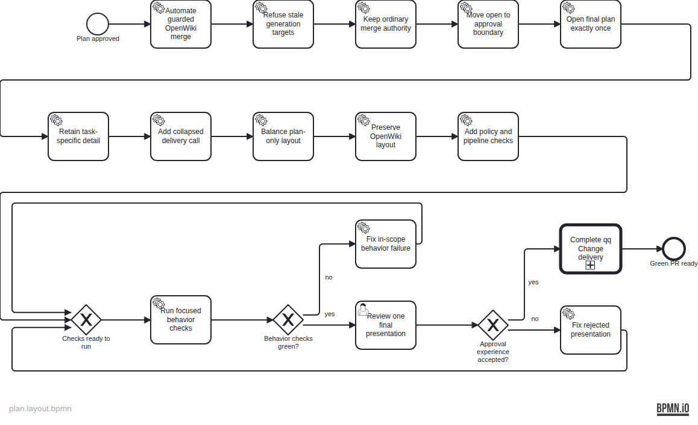

T-22 plan for removing two operator-friction failures without weakening the qq delivery boundary. OpenWiki maintenance gains a narrowly scoped, freshness-guarded autonomous merge. Plan presentation moves to one final approval event, work-specific detail remains explicit, and inherited qq delivery mechanics collapse to one reusable call activity. Ordinary Changes remain operator-merged, and OpenWiki generation and diagram layout remain unchanged.

The deterministic source specification is assets/doc-31/plan-spec.json; the semantic BPMN is assets/doc-31/plan.bpmn.

## Conformance

The completion record is assets/doc-31/completions.json; the generated report is assets/doc-31/conformance.md.

# BPMN conformance report

Plan: /home/qqp/.herdr/worktrees/qq/task-22-openwiki-auto-merge-plan-ux/backlog/docs/plans/assets/doc-31/plan.bpmn

## Summary

- Flow nodes: 20
- Accounted: 20
- Unaccounted: 0
- Diverged: 0
- Unknown completion IDs: 0
- Strict verdict: PASS

## Per-element status

| ID | Name | Type | Status | Evidence / note |
| --- | --- | --- | --- | --- |
| plan_approved | Plan approved | StartEvent | done | Evidence: backlog/tasks/task-22 - Automate-OpenWiki-merge-and-make-plan-approval-readable.md Note: T-22 comment #2 records operator approval of doc-31. |
| implement_openwiki_merge | Automate guarded OpenWiki merge | ServiceTask | done | Evidence: skills/openwiki-maintainer/SKILL.md |
| guard_current_target | Refuse stale generation targets | ServiceTask | done | Evidence: tests/test-openwiki-maintainer.sh Note: The behavioral Git fixture proves a concurrent main advance rejects the ordinary non-force publication. |
| preserve_operator_merge | Keep ordinary merge authority | ServiceTask | done | Evidence: skills/openwiki-maintainer/SKILL.md; skills/deliver-change/SKILL.md Note: The self-merge exception is limited to the dedicated OpenWiki maintainer; PR #61 remains operator-merged. |
| defer_plan_open | Move open to approval boundary | ServiceTask | done | Evidence: skills/bpmn-plans/SKILL.md |
| present_once | Open final plan exactly once | ServiceTask | done | Evidence: tests/test-bpmn-plans.sh; backlog/tasks/task-22 - Automate-OpenWiki-merge-and-make-plan-approval-readable.md Note: The policy check enforces final-boundary presentation and T-22 comment #3 records the accepted one-window UAT. |
| retain_specific_detail | Retain task-specific detail | ServiceTask | done | Evidence: skills/bpmn-plans/SKILL.md; tests/test-bpmn-plans.sh |
| add_delivery_call | Add collapsed delivery call | ServiceTask | done | Evidence: skills/bpmn-plans/pipeline/lib/generate.mjs; skills/bpmn-plans/pipeline/test/pipeline.test.mjs |
| wrap_plan_layout | Balance plan-only layout | ServiceTask | done | Evidence: skills/bpmn-plans/pipeline/lib/layout.mjs; skills/bpmn-plans/pipeline/test/pipeline.test.mjs |
| preserve_openwiki_layout | Preserve OpenWiki layout | ServiceTask | done | Evidence: skills/bpmn-plans/pipeline/lib/wiki.mjs; skills/bpmn-plans/pipeline/test/pipeline.test.mjs Note: The isolation regression compares OpenWiki layout output byte-for-byte with bpmn-auto-layout. |
| add_focused_checks | Add policy and pipeline checks | ServiceTask | done | Evidence: tests/test-openwiki-maintainer.sh; tests/test-bpmn-plans.sh; skills/bpmn-plans/pipeline/test/pipeline.test.mjs |
| check_retry_join | Checks ready to run | ExclusiveGateway | done | Evidence: backlog/tasks/task-22 - Automate-OpenWiki-merge-and-make-plan-approval-readable.md Note: T-22 comment #4 records the final post-fix verification pass. |
| run_behavior_checks | Run focused behavior checks | ServiceTask | done | Evidence: backlog/tasks/task-22 - Automate-OpenWiki-merge-and-make-plan-approval-readable.md Note: All 18 pipeline tests, six workflow wrappers, shell checks, and deterministic plan reproduction passed. |
| checks_green | Behavior checks green? | ExclusiveGateway | done | Evidence: https://github.com/hypermemetic-ai/qq/pull/61 Note: PR #61 is open, mergeable, and CLEAN; GitHub reports no configured branch checks, so the recorded fresh local suite is the applicable check evidence. |
| fix_in_scope_failure | Fix in-scope behavior failure | ServiceTask | done | Evidence: skills/openwiki-maintainer/SKILL.md; skills/bpmn-plans/pipeline/lib/layout.mjs; tests/test-openwiki-maintainer.sh; skills/bpmn-plans/pipeline/test/pipeline.test.mjs Note: Independent review findings about target races, wide-label overlap, and label-crossing edges were fixed and the exact deltas re-reviewed cleanly. |
| operator_uat | Review one final presentation | UserTask | done | Evidence: backlog/tasks/task-22 - Automate-OpenWiki-merge-and-make-plan-approval-readable.md Note: T-22 comment #3 records the hands-on review of the single final presentation. |
| uat_accepted | Approval experience accepted? | ExclusiveGateway | done | Evidence: backlog/tasks/task-22 - Automate-OpenWiki-merge-and-make-plan-approval-readable.md Note: The operator replied proceed after reviewing the final plan presentation. |
| fix_presentation | Fix rejected presentation | ServiceTask | skipped | Note: The approval presentation was accepted, so the rejection-only correction path was not taken. |
| complete_qq_delivery | Complete qq Change delivery | CallActivity | done | Evidence: https://github.com/hypermemetic-ai/qq/pull/61 Note: The reviewed, locally green source Change was committed, pushed, and handed off in the ordinary operator-merged PR. |
| green_pr_ready | Green PR ready | EndEvent | done | Evidence: https://github.com/hypermemetic-ai/qq/pull/61 Note: PR #61 is open, mergeable, and CLEAN at the planned handoff boundary. |

## Unaccounted elements

None.

## Unknown completion IDs

None.

## Divergence summary

No elements diverged.
