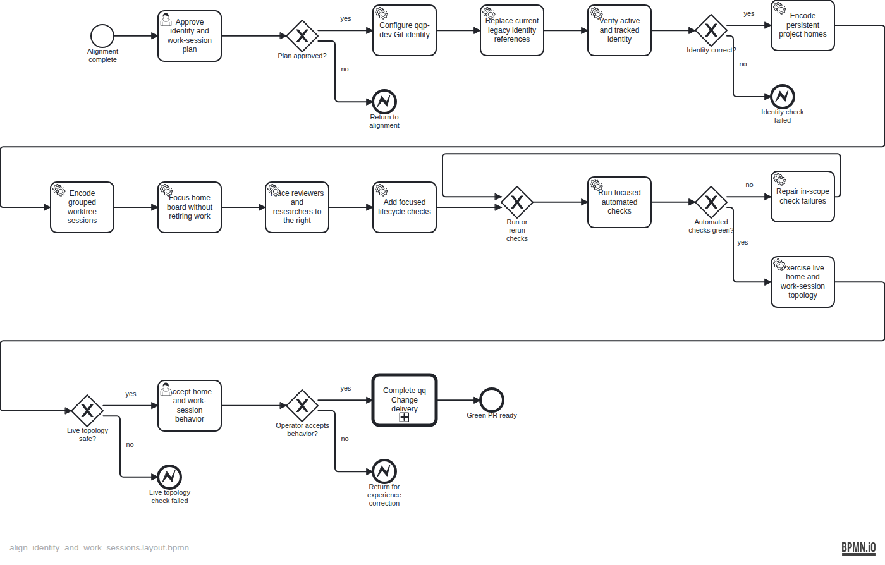

# Plan — Align operator identity and Herdr work-session topology

TASK-23 aligns the active qqp-dev identity and makes Herdr's native hierarchy explicit: one persistent main-checkout project home with a dedicated Backlog-board tab, plus one grouped worktree session per Change using a short, unique operator-agreed label. The current accountable conversation moves into its work session; reviewers and researchers split right there. At terminal disposition the session remains intact while focus returns to the synchronized home board.

The evidence-stamped source specification is at `backlog/docs/plans/assets/doc-32/plan-spec.json`; the semantic BPMN is at `backlog/docs/plans/assets/doc-32/plan.bpmn`.
