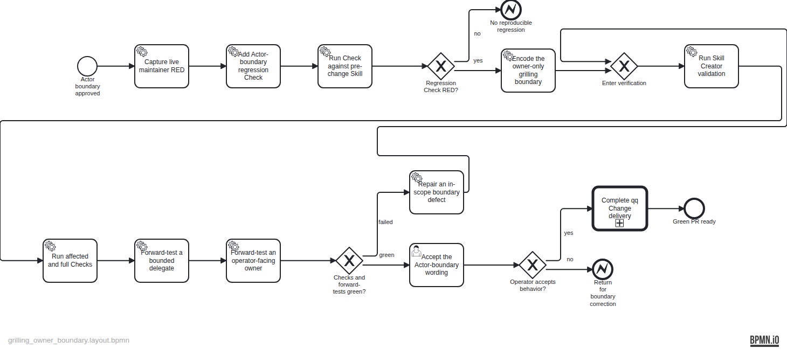

# Plan — Restrict grilling to the operator-facing owning Actor

This plan implements the operator-approved Actor boundary: only the operator-facing owning agent may invoke grilling; bounded non-owning agents execute their assignments and return new consequential decisions or scope gaps to their assigning or owning Actor.

The deterministic source spec is at backlog/docs/plans/assets/doc-33/plan-spec.json. The semantic BPMN is at backlog/docs/plans/assets/doc-33/plan.bpmn.

Review correction: Task-backed evidence coordinates were refreshed after the structured Task metadata stabilized; the semantic flow and rendered PNG are unchanged.
