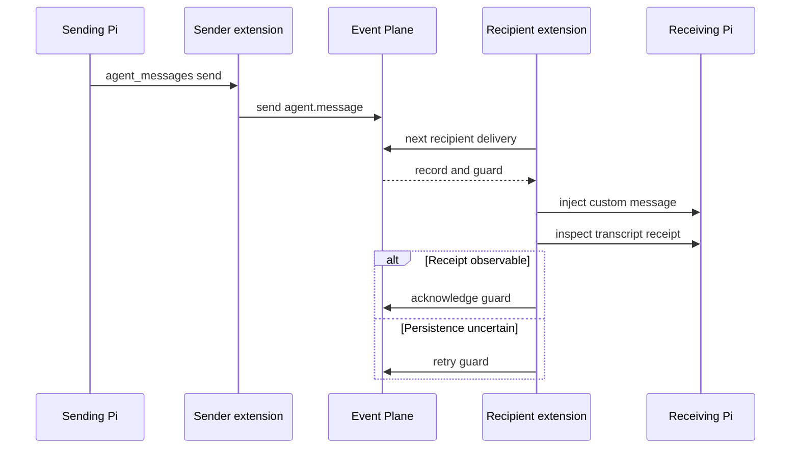

# Agent Messaging Extension

`extensions/index.ts:registerQQ` registers `register` from `extensions/agent-messages.ts` after [execution profiles](../agent-runtime/execution-profiles.md). It adapts the generic [Event Plane protocol](../event-plane/protocol-and-clients.md) into `agent_messages`, `/agent-tasks`, and Pi lifecycle handlers.

## Activation and presence

On `session_start`, optional `.pi/agent-messages.json` and environment values provide project and role. Role resolution follows the shared [activation contract](../agent-runtime/execution-profiles.md): explicit `QQ_AGENT_ROLE` or project config wins; otherwise QQ-activated repositories default to `runner`. Only `runner` and `architect` are valid. With no role or usable canonical Pi session ID, presence and receiving remain inactive; list still works, while send and `/agent-tasks` refuse.

The canonical session ID maps to Event Plane recipient `agents/<session_id>`. A mode-0600 `qq.agent-presence/v2` JSON file in the private Event Plane `presence/` directory records project, role, tasks, pane, busy state, current tool, busy start, update time, and a 45-second expiry; it renews every 15 seconds. `qq:role-selected` refreshes the role. Listing accepts only bounded, owned, non-symlink files with exact valid fields and future expiry. Thinking/tool cards appear only after five seconds to suppress transient noise.

`/agent-tasks` stores up to 32 trimmed, unique session-only labels and refreshes presence immediately.

## Tool surface

| Action | Behavior |
|---|---|
| `list` | Filters exact project, role, or task and excludes self. Metadata is discovery only; copy the complete `session_id`. |
| `send` | Sends 1–65,536 characters to a canonical session ID with `default` or `immediate` delivery. |
| `status` | Maps obligations to `queued`, `delivering`, `blocked`, `delivered`, `expired`, or `failed`; pending output may include the recipient's busy card. |

## Delivery flow

*Durable acknowledgement follows observable Pi transcript persistence, not merely injection.*

`send` wraps `qq.agent-message/v2`; `receiver` long-polls with a process-unique endpoint token. `parseMessage` rejects invalid schema, identity, role, metadata, content, or delivery and blocks poison obligations. `receiptExists` searches the Pi JSONL transcript for matching event/content hashes. An in-memory marker prevents duplicate injection while persistence is uncertain but never substitutes for a receipt.

For a busy recipient, both default and immediate messages inject as Pi `steer`; only immediate delivery makes an idempotent `agent.immediate-claim` and lets the first claimant abort the current run. Idle recipients trigger a turn. Shutdown invalidates the receive epoch, clears timers and dedup state, and removes presence.

## Change and validation

Keep session IDs as routing authority, preserve acknowledgement-after-receipt, and change presence/message writers, validators, rendering, and tests together. Add tool actions to both JSON schema and execute dispatch; lifecycle state needs startup, shutdown, and epoch cleanup. Keep agent semantics out of the payload-agnostic [service](../event-plane/service.md).

Run `node --experimental-strip-types tests/test-agent-messages.mjs .`. Use `tests/test-agent-messages-live.sh` for role events, busy state, steering/interruption, receipt acknowledgement, or Event Plane integration. `npm test` is conditional on composition changes.
