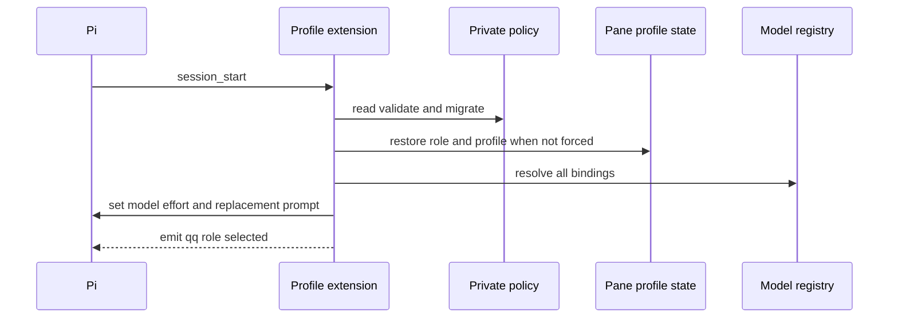

# Roles and Execution Profiles

Consult this page when changing activation, roles, prompts, `/profile`, `qq-profile`, or the policy shared with [telemetry](../operations/telemetry.md) and [run delegation](../workflows/workshops.md).

## Activation and startup

QQ activates in this repository, when `QQ_AGENT_ROLE` explicitly selects `runner` or `architect`, or in a Git repository whose common local config contains exactly the boolean `qq.methodology=true`. Manage the latter with:

```bash
qq-methodology link
qq-methodology unlink
qq-methodology inspect
```

`bin/qq-methodology` is fail-closed for non-Git, absent, duplicate, or malformed values; linking applies to all worktrees through the common Git directory and takes effect after a fresh Pi session or `/reload`.

On `session_start`, `extensions/execution-profiles.ts` reads exact schema `qq.execution-profiles/v1`, loads `prompts/roles/<role>.md`, resolves every role, `scribe`, and `qa` binding, then applies the selected role profile. The reader automatically migrates the former `compactor` field to `scribe`. Only xAI models are limited to 200,000 tokens; other providers retain their model defaults. Startup fails closed on invalid policy, unavailable models, or an over-cap Grok model.



*An explicit `QQ_AGENT_ROLE` wins over pane state; normal Herdr panes restore their own validated selection across `/new` and `/reload`.*

`before_agent_start` replaces, rather than appends to, Pi's base system prompt. `/profile [role] [profile]` atomically stores the selection in mode-0600 `$XDG_STATE_HOME/qq/pane-profiles/<HERDR_PANE_ID>.json`; another pane does not inherit it. The command never changes the durable role default.

## Operator CLI and public profile list

```bash
bin/qq-profile list [role] [--json]
bin/qq-profile default <role> [profile]
bin/qq-profile context inspect
bin/qq-profile context install
```

`list --json` emits `qq.profile-list/v1`, the consumer-facing contract used by [telemetry](../operations/telemetry.md). It contains ordered role profiles and `scribe`/`qa` service bindings without exposing the writable policy representation. `default` is the only command that changes a durable role default.

`context install` writes or updates only xAI context overrides in Pi's `models.json` and removes QQ's old context overrides from other configured providers while preserving unrelated provider/model fields. Policy, pane-state, and model writes are private and atomic.

## Change and validation

A role change crosses `ROLE_NAMES`, policy validation, prompts, profile UI, messaging presence, board gating, telemetry, and tests. A policy or list-contract change must update `validateExecutionPolicy`, `profileListDocument`, `qq-profile`, consumers, and focused tests. Internal policy tests are not enough: smoke the shipped `bin/qq-profile list --json` path because telemetry executes that command.

```bash
node --experimental-strip-types tests/test-execution-profiles.mjs .
tests/test-methodology.sh
```

Run `tests/test-telemetry.sh` for profile-list or display changes, messaging live tests for role-event changes, and `npm test` only for composition or cross-extension changes.
