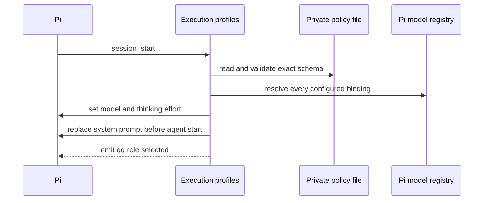

# Roles and Execution Profiles

Consult this page when changing role activation, model bindings, prompts, `/profile`, `qq-profile`, or the shared policy consumed by [telemetry](../operations/telemetry.md) and [workshop delegation](../workflows/workshops.md).

## Runtime contract

`extensions/index.ts` registers `registerExecutionProfiles` first. QQ activates inside this repository, in a Git checkout with local `qq.methodology=true`, or when `QQ_AGENT_ROLE` explicitly selects `runner` or `architect`. `bin/lib/roles.mjs` owns that closed role set and defaults activated repositories to `runner`.

On `session_start`, the extension reads the exact `qq.execution-profiles/v1` policy from `$XDG_CONFIG_HOME/qq/execution-profiles.json` (otherwise `~/.config/qq/execution-profiles.json`), loads `prompts/roles/<role>.md`, validates every role, compactor, and QA model against Pi's registry and the 200,000-token ceiling, then applies the role default. Failure refuses QQ input rather than silently running a different profile.



*Profile startup is fail-closed and publishes role changes to messaging and workshop consumers.*

`before_agent_start` replaces—not appends to—the base system prompt using the current role prompt and Pi's selected tool, guideline, context-file, and visible-skill metadata. `/profile [role] [profile]` changes only the current session, emits `qq:role-selected`, and updates status. Manual Pi model/effort selection is shown as `custom` unless it exactly matches a declared profile.

## Durable administration

`bin/qq-profile` is the operator surface:

```bash
bin/qq-profile list [role]
bin/qq-profile default <role> [profile]
bin/qq-profile context inspect
bin/qq-profile context install
```

Only `default <role> <profile>` changes durable policy. `context install` writes model overrides to Pi's `models.json` so every used binding has at most 200,000 tokens; it preserves unrelated provider settings. Policy and model writes are atomic mode-0600 writes, and unsafe or malformed policy files are refused.

## Change surface and validation

A role change crosses `ROLE_NAMES`, policy exact-shape validation, `prompts/roles/`, profile UI, messaging presence validation, workshop gating, telemetry rendering, and tests; do not add a role in one layer only. A policy field change must update `validateExecutionPolicy`, `qq-profile`, telemetry's jq validator, consumers, and focused tests.

Run `node --experimental-strip-types tests/test-execution-profiles.mjs .`. Also run `tests/test-telemetry.sh` when policy shape/display changes and the messaging tests when role event behavior changes. `npm test` is conditional for composition or cross-extension changes.