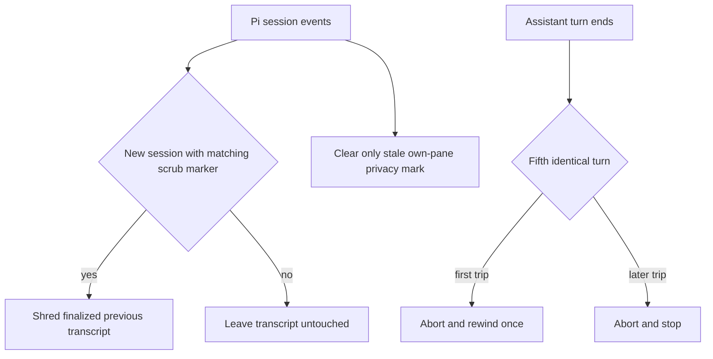

# Pi Session Safety Extensions

`extensions/index.ts` registers these small, independent guards alongside [profiles](execution-profiles.md), [messaging](../agent-messaging/extension.md), and [workshops](../workflows/workshops.md). Consult this page before changing Pi lifecycle hooks, destructive/privacy behavior, Herdr interaction, or managed Backlog writes.

| Capability | Surface and invariant | Focused test |
|---|---|---|
| Operator staging | `operator_stage` creates a no-focus Herdr pane, waits for a shell prompt, inserts but never executes one newline-free command, and notifies the operator. Low danger needs Enter; high danger needs Enter then `y`. Any post-creation failure attempts to close only the owned pane. | `tests/test-operator-stage.mjs` |
| Transcript scrub | `mark_session_for_scrub` records the exact current transcript. Only a later `session_start` with reason `new` may overwrite, fsync, unlink, and ledger the matching previous file. Current, foreign, linked, missing, or out-of-session-root files are never scrubbed. | `tests/test-session-scrub.mjs` |
| Dictation privacy | `mark_session_dictation_private` supports `mark`, `unmark`, and `status` for the caller's validated `HERDR_PANE_ID`. Mode-0600 marks live in a private state directory, operations for one mark serialize, and `/new` clears stale own-pane state without touching another pane. | `tests/test-dictation-private.mjs` |
| Backlog guard | The `tool_call` hook blocks Pi `write` and `edit` for both the checkout's `backlog/` path and its resolved symlink store. Use the Backlog CLI; reads and unrelated paths remain allowed. | `tests/test-backlog-guard.mjs` |
| Loop guard | Five identical consecutive assistant turns—normalized text plus stable tool name/arguments—abort the run. The first trip rewinds without summarization to the last usable non-user leaf; a second trip in the session stops without another rewind. Tree changes reset the streak. | `tests/test-loop-guard.mjs` |
| Continue shortcut | `shift+alt+enter` sends `continue` only while Pi is idle. | `tests/test-continue.mjs` |

## Lifecycle boundaries

*Destructive work is fenced to finalized, identity-matched state; loop recovery is session-scoped.*

## Change recipes

For a new guard, register it in `extensions/index.ts`, keep refusal local to its actual tool/event, define reset behavior for `/new`, tree navigation, and shutdown where applicable, and add a direct focused test. For filesystem state, test absent, valid, malformed, symlink, wrong target/identity, failed write/cleanup, and concurrent transitions. For Herdr flows, preserve no-focus and never use `send-keys` for operator approval.

Run the matching `node --experimental-strip-types tests/test-<name>.mjs .`; use `npm test` only when registration order or shared lifecycle behavior changes.