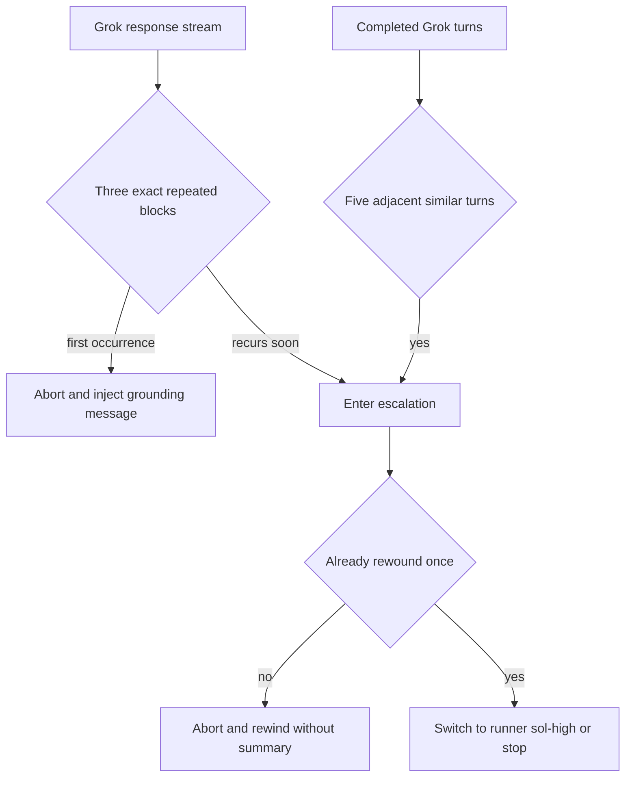

# Pi Session Safety Extensions

`extensions/index.ts` registers these independent guards alongside [profiles](execution-profiles.md), [messaging](../agent-messaging/extension.md), and [board/run workflow](../workflows/workshops.md). Consult this page before changing Pi lifecycle hooks, destructive behavior, Herdr interaction, or managed Backlog writes.

| Capability | Surface and invariant | Focused test |
|---|---|---|
| Operator staging | `operator_stage` creates a no-focus Herdr pane, waits for a shell, inserts but never executes one newline-free command, and notifies the operator. Low danger needs Enter; high danger needs Enter then `y`. Failures close only the owned pane. | `tests/test-operator-stage.mjs` |
| Transcript scrub | `mark_session_for_scrub` records the exact current transcript. Only a later `session_start` with reason `new` may overwrite, fsync, unlink, and ledger the matching previous file. Current, foreign, linked, missing, or out-of-root files remain untouched. | `tests/test-session-scrub.mjs` |
| Backlog guard | The `tool_call` hook blocks Pi `write` and `edit` for both checkout `backlog/` and its resolved symlink store. Use the Backlog CLI; reads and unrelated paths remain allowed. | `tests/test-backlog-guard.mjs` |
| Grok repetition guard | On `grok-4.6`, three exact streamed repetitions of 12–96 words abort and first inject one grounding message. A recurrence within three turns escalates; independently, five adjacent completed turns at trigram Jaccard similarity at least 0.6 escalate directly. Escalation rewinds once, then switches through [profiles](execution-profiles.md) to runner `sol-high`, or stops if unavailable. | `tests/test-grok-paraphrase-guard.mjs` |
| Continue shortcut | `shift+alt+enter` sends `continue` only while Pi is idle. | `tests/test-continue.mjs` |

## Recovery flow

*The stream detector scans bounded batches of completed words; session/model/tree changes reset the applicable evidence.*

## Change recipes

For a new guard, register it in `extensions/index.ts`, keep refusal local to its tool/event, define `/new`, tree, and shutdown reset behavior, and add a direct test. Filesystem state needs absent, malformed, symlink, wrong-owner/identity, cleanup failure, and concurrent cases. Herdr flows must preserve no-focus and never use `send-keys` for approval.

For Grok changes, test streamed boundary lengths and split deltas, batched scan delay, grounding-window expiry, completed-turn similarity, non-Grok isolation, rewind, fallback success/failure, and resets. Run the matching `node --experimental-strip-types tests/test-<name>.mjs .`; use `npm test` only for registration or shared lifecycle changes.
