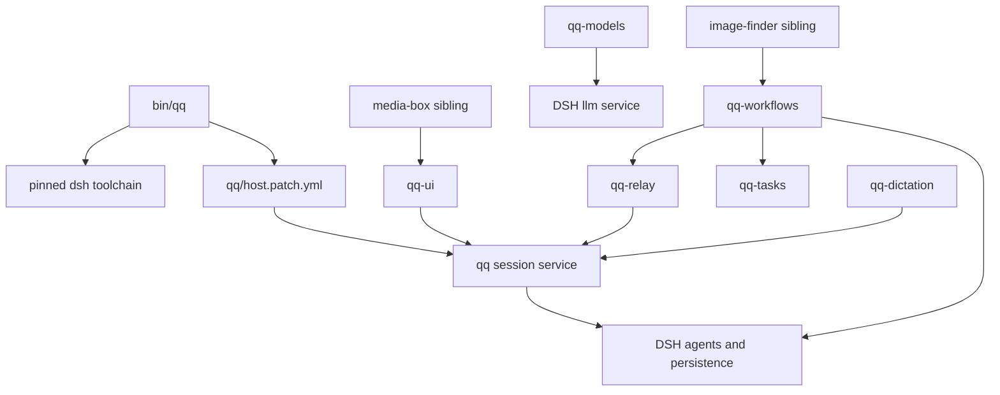

# System topology and ownership

qq currently contains two runtime paths:

- **Daily DSH host:** `bin/qq` starts the pinned DSH toolchain and composes the presentation-neutral `qq` session service with optional `qq-*` Cordis plugins. This is the active operator surface.
- **Legacy Pi/Herdr orchestration:** `extensions/index.ts` still provides activation profiles, guarded tools, delegation, QA, landing, and durable installed-relay outcomes. It remains the complete Backlog delegation path.

## Daily host composition

*`bin/qq` discovers packages on disk and DSH/Cordis wires them as replaceable plugin fibers.*

`qq/src/session.mjs#createQqService` owns project discovery, live root-session operations, observation, and spoken session aliases. [`qq-ui`](../runtime/dsh-console.md) is one-way presentation over that service. [`qq-workflows`](../workflow/dsh-workflows.md), [`qq-tasks`](../workflow/dsh-workflows.md#task-pile), [`qq-relay`](../event-plane/service.md#dsh-in-process-relay), [`qq-models`](../runtime/model-connectors.md), and dictation are optional siblings: absence removes that capability but must not prevent the core host from booting.

The launcher generically adds every local `qq-*/package.json`, plus optional adjacent `image-finder` and `media-box` repositories. Named flags enable the three inserts declared directly in `qq/host.patch.yml`; other sibling packages activate through their own `dsh.bundle`. HMR watches only the discovered roots. Plugins must register routes, tools, listeners, timers, and background work with reversible `ctx.effect` handlers and communicate through Cordis services rather than sibling imports.

## Legacy Pi composition

`extensions/index.ts` registers profiles first, then `read`, agent messaging, operator staging, continue, scrub, Backlog guard, Grok repetition and retry recovery, board, and review flow. `qq:role-selected` remains the coupling event among profiles, presence, architect tools, and run outcomes. This runtime's durable relay is the external installed product described in [agent messaging](../event-plane/agent-messaging.md), not the DSH in-process mailbox.

The [delegation lifecycle](../workflow/delegation-and-review.md) still owns protected worktrees and two-look QA. Completed runner packets are now routed: trivial presentation-only changes can land immediately, while control/runtime changes go through isolated QA and then auto-land on pass.

## Durable state

| State | Owner and invariant |
|---|---|
| `${XDG_STATE_HOME:-$HOME/.local/state}/qq` | Daily DSH home; private profile/session persistence, `qq.session`, aliases, and plugin stores. |
| `${XDG_CONFIG_HOME:-$HOME/.config}/qq/workflows-settings.json` | Workflow role bindings, passed by `qq/host.patch.yml`. |
| `~/.local/state/qq/runs/` and `~/.herdr/worktrees/` | Legacy delegation handoffs and isolated Git worktrees. |
| `~/.local/state/qq-relay/` | External Pi relay state only; DSH relay state is in-process. |
| repository `openwiki/` | Generated documentation owned by OpenWiki publication automation. |

## Change navigation

| Intent | Start with | Focused check |
|---|---|---|
| Host discovery, profile, pins, or HMR | `bin/qq`, `qq/host.patch.yml`, `dsh/pins.json` | `node tests/test-qq-host.mjs .` then conditional `tests/test-qq-host-live.sh` |
| Session/project/alias behavior | `qq/src/session.mjs`, `qq/src/alias.mjs` | `node tests/test-qq-projects.mjs` and `node tests/test-qq-alias.mjs .` |
| Optional plugin lifecycle | owning `qq-*/src/plugin.mjs`; `ctx.effect` disposer | owning plugin test plus `tests/test-qq-host-boot.sh` when absence/boot changes |
| Legacy Pi registration | `extensions/index.ts` | owning extension test; use `npm test` only for cross-cutting validation |

Do not add a sibling as a hard npm dependency merely to compose it. A shipped plugin change is complete only when its own package entrypoint exposes the Cordis plugin, `bin/qq` discovers/binds it, registration is reversible, and the host or boot test proves the consumer path.