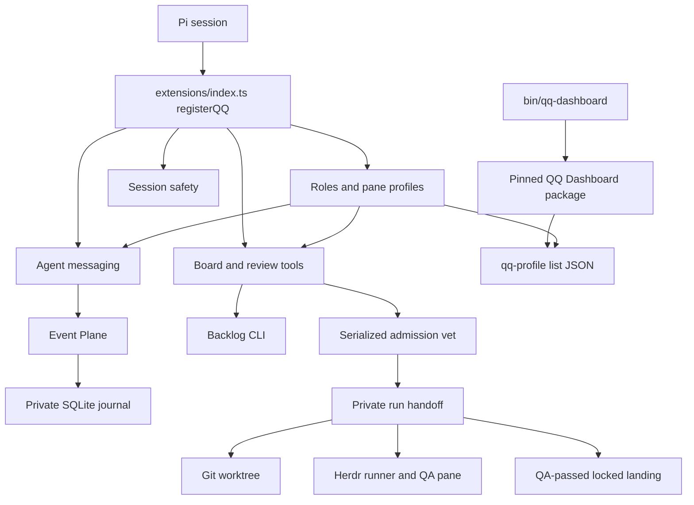

# QQ Architecture

QQ combines a Pi runtime, asynchronous [board/run workflow](../workflows/workshops.md), a pinned [provider Dashboard integration](../operations/telemetry.md), [Herdr operations](../operations/runbook.md#herdr-distribution), and a durable [Event Plane](../event-plane/service.md). `extensions/index.ts:registerQQ` is the Pi composition root: [execution profiles](../agent-runtime/execution-profiles.md) register first, followed by messaging, independent safety guards, board tools, and review.

## Runtime map

*Profile role events coordinate extensions; Event Plane owns message custody, while an admitted ticket becomes a private run spanning Backlog, Git, and Herdr.*

## Ownership

| Area | Entrypoint | Owns |
|---|---|---|
| Pi composition | `extensions/index.ts` | Extension registration order |
| Roles/profiles | `extensions/execution-profiles.ts`, `bin/qq-profile`, `bin/qq-methodology` | Activation, pane selection, prompts, policy and profile-list API |
| Messaging | `extensions/agent-messages.ts` | Presence, discovery, injection, receipt-aware acknowledgement |
| Session safety | `extensions/operator-stage.ts` and sibling guards | Operator boundary, transcript scrub, managed-file and Grok guards |
| Board and run | `extensions/board.ts`, `bin/lib/admission.mjs`, `bin/lib/run.mjs` | Tickets, admission, operator gate, worktree and runner startup |
| Review/landing | `extensions/review-flow.ts`, `bin/lib/review.mjs` | `done`, two-look QA, architect choice, serialized merge |
| Event Plane | `bin/event-plane` -> `event_plane_service.py:main` | Journal, obligations, retries, leases, retention |
| Operations | `bin/qq-dashboard*`, `bin/qq-herdr-*`, `bin/qq-openwiki-*` | Pinned Dashboard launch, cockpit distribution, wiki automation |

## Cross-system invariants

- `runner` and `architect` are the only roles. A pane selection emits `qq:role-selected`; messaging and board/review consume the selected role.
- Event Plane acknowledgement follows observable Pi transcript persistence, not message injection.
- Delegation is admitted against active tickets and live worktrees, then requires operator approval of the literal ticket and generated note.
- QA has at most two looks and may own tests only. Landing requires a QA pass, architect approval, original base branch, clean main and run worktrees, and the shared repository lock.
- Private ownership and modes protect Event Plane, profile, run, scrub, Dashboard state, and cookie state.

Use the linked component page for symbols and focused checks. Run `npm test` only for composition-root, shared-role, packaging, or multi-area changes.
