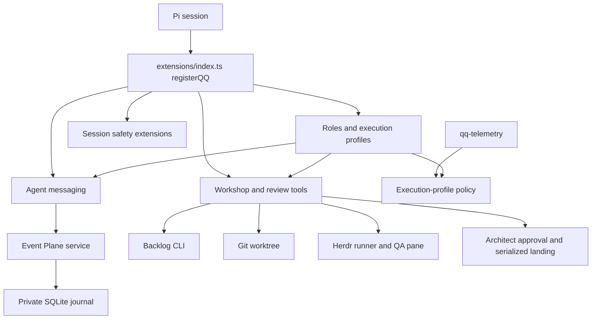

# QQ Architecture

QQ has four cooperating areas: a composed Pi runtime, asynchronous [workshops](../workflows/workshops.md), provider [telemetry](../operations/telemetry.md), and the durable [Event Plane](../event-plane/service.md). `extensions/index.ts:registerQQ` is the Pi composition root; registration order starts with [execution profiles](../agent-runtime/execution-profiles.md), then messaging and independent safety/workflow extensions.

## Runtime map

*Role selection is shared runtime state; messaging persists through Event Plane, while workshops provision isolated runners through Backlog, Git, and Herdr.*

## Ownership

| Area | Entrypoint | Owns |
|---|---|---|
| Pi composition | `extensions/index.ts` | Extension registration order only |
| Roles/profiles | `extensions/execution-profiles.ts`, `bin/qq-profile` | Activation, model/effort binding, prompt replacement, profile policy |
| Messaging | `extensions/agent-messages.ts` | Presence, discovery, Pi injection, receipt-aware acknowledgement |
| Session safety | `extensions/operator-stage.ts` and sibling guards | Operator execution boundary, privacy markers, managed-file guard, Grok stall recovery |
| Workshops | `extensions/workshop.ts`, `bin/lib/workshop.mjs` | Backlog tools, approved brief, worktree and Herdr runner startup |
| Review and landing | `extensions/review-flow.ts`, `bin/lib/review.mjs` | `done`, two-look QA, architect choice, serialized merge and cleanup |
| Event Plane | `bin/event-plane` -> `event_plane_service.py:main` | Generic journal, obligations, retries, leases, retention |
| Operations | `bin/qq-telemetry*`, `bin/event-plane-admin`, systemd units | Usage display, cookie gate, service administration, wiki refresh |

## Cross-system invariants

- `runner` and `architect` are the only roles. Profile selection emits `qq:role-selected`; messaging refreshes presence and workshops update role gating.
- Agent addressing always uses canonical Pi session IDs. Presence metadata—including role, tasks, pane, and busy card—is discovery only.
- Event Plane owns durable custody; Pi transcript evidence gates acknowledgement.
- Workshop delegation requires operator approval of the exact generated brief before claiming the task or starting a runner.
- A runner can submit at most two QA looks. Only architect approval lands, under a repository lock; landing requires the original base branch and clean delegated worktree.
- Private filesystem ownership and modes protect Event Plane, profile, workshop, privacy, telemetry, and cookie state.
- Operator staging inserts text but never executes it; transcript scrub touches only an identity-matched finalized previous session.

Use the component page linked above for exact symbols and focused checks. Run `npm test` for composition-root, shared-role, or multi-area changes.