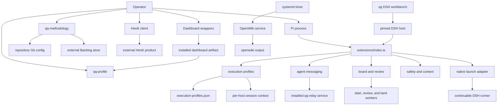

# System topology and ownership

qq is a private ESM package and operator-controlled orchestration layer around Pi/Herdr with incremental DSH adoption. It owns policy, extensions, workers, state contracts, a daily DSH coding workbench, and native DSH runner launch through submission. It does not own the Herdr, qq-relay, dashboard, pi2dsh, or DSH product implementations. [DSH compatibility](../runtime/dsh-compatibility.md) records the remaining review/landing cutover boundary.

## Component topology

*The operator enters through qq-owned adapters; independent services and external products remain separate process and ownership boundaries.*

## Pi composition and role coupling

`extensions/index.ts` registers extensions in this exact order:

1. `registerExecutionProfiles`
2. `registerRead`
3. `registerAgentMessages`
4. `registerOperatorStage`
5. `registerContinue`
6. `registerSessionScrub`
7. `registerBacklogGuard`
8. `registerGrokParaphraseGuard`
9. `registerBoard`
10. `registerReviewFlow`

The order makes profile activation the composition root and installs qq's replacement `read` before workflow tools. `registerQQ` creates one `createQqSessionContext()` instance and shares it with profiles, board, and review flow so DSH parent/child sessions do not leak role or run ownership through process-global state. On profile application, `extensions/execution-profiles.ts` emits `qq:role-selected` with `{ role, profile }` and, for DSH, `sessionId`. Messaging updates presence, the board gates architect-only tools, and review flow starts or stops the matching architect session's run-event reception from that event. The Grok guard can also emit the event when selecting its fallback. The standalone QA-result surface is intentionally not registered globally; review workers invoke isolated QA behavior instead. See [repository activation and execution policy](../runtime/profiles-and-activation.md), [agent messaging](../event-plane/agent-messaging.md), [delegation and review](../workflow/delegation-and-review.md), and [safety and context](../extensions/safety-and-context.md).

## Process boundaries and responsibilities

| Boundary | qq-owned responsibility | External or independent side |
|---|---|---|
| Pi session | Extension registration, role prompt replacement, tools, guards, role events | Installed Pi runtime and provider authentication |
| qq-relay | Installed executable/client resolution and message/run-outcome consumer contracts | Protocol, persistence, installation, service lifecycle, and product checks in the linked qq-relay repository |
| Startup, review, and landing | Pi workers plus native DSH adapter/runner, runtime-discriminated bootstrap/handoff contracts, QA verdict schema, and locks | DSH continuable/persistence services or Herdr socket, child Git, Backlog, model, and installed qq-relay delivery |
| Herdr | Config, activation/smoke scripts, plugin adapters, `herdr.service` packaging | Rust source, tests, build, install, and product lifecycle in the linked Herdr repository |
| Dashboard | Two installed-artifact launch wrappers and the `qq-profile list --json` contract | Source, tests, installation, upgrades, and cookie semantics in the linked dashboard repository |
| OpenWiki | Timer/service, dispatch, isolated writer/publication scripts, allowed generated paths | OpenWiki executable and model provider |

Herdr's service launches `%h/.local/lib/qq/herdr/bin/herdr server`, logs under `%h/.local/state/herdr/`, and uses `ExitType=cgroup` so a live handoff can retain the replacement process. Operational details belong in [Herdr operator workflows](../herdr/operator-workflows.md).

## Durable state and ownership

| Location | Owner and invariant |
|---|---|
| Repository common local Git config, `qq.methodology` | `qq-methodology`; the activation marker is local and shared by linked worktrees, never clones |
| `~/.config/qq/execution-profiles.json` | qq profile policy; owner-only, non-symlink regular file with schema `qq.execution-profiles/v1` |
| `~/.local/state/qq/store/<project>/` and checkout `backlog` symlink | `qq-methodology` and Backlog.md; data is outside Git and `auto_commit` is false |
| `${XDG_STATE_HOME:-~/.local/state}/qq/pane-profiles/<pane>.json` | profile extension; owner-only pane-local role/profile selection for Pi/Herdr |
| `${XDG_STATE_HOME:-~/.local/state}/qq/session-contexts/<session>.json` | shared host boundary; owner-only DSH role/profile/run ownership, exclusively claimed for native bootstrap parent and runner identities |
| `${XDG_STATE_HOME:-~/.local/state}/qq/dsh-workbench/` | daily workbench default DSH home; persistent profile, sessions, and saved default session identity; credentials, if file-backed, remain owner-only |
| `${XDG_STATE_HOME:-~/.local/state}/qq-relay/` | qq-relay-owned service state and `qq-relay.sock`; qq consumers connect but do not manage it |
| `${XDG_STATE_HOME:-~/.local/state}/qq/agent-messages/presence/` | Agent-messaging extension; ephemeral private presence leases, separate from relay state |
| `~/.local/state/qq/telemetry/` | Dashboard contract; preserve usage caches and cookie snapshot across installs and upgrades |
| qq run/handoff state and `qq/bootstrap-failures/` below the qq state home | Delegation/review libraries and workers; private bootstrap/handoff JSON, durable sanitized startup-failure outbox, and worktree lifecycle |
| Repository `openwiki/` | OpenWiki automation is the sole generated-output writer; publication validates paths and modes and coordinates landing locks |

Do not move external Backlog or telemetry state into the repository. Generated OpenWiki publication and its lock boundary are covered in [OpenWiki automation](../operations/openwiki-automation.md).

## Practical entrypoints

| Intent | Stable entrypoint | Notes |
|---|---|---|
| Link, inspect, or unlink a checkout | `bin/qq-methodology` | Writes the common Git marker and prepares Pi trust/settings and Backlog state |
| Inspect or change profile policy | `bin/qq-profile` | `/profile` is the session and pane selector; CLI `default` is durable |
| Invoke the installed relay CLI | `bin/qq-relay` | Resolves only `${QQ_RELAY_INSTALL_ROOT:-$HOME/.local/lib/qq/relay}/bin/qq-relay`; product lifecycle belongs upstream; see [qq-relay integration](../event-plane/service.md) |
| Run the dashboard | `bin/qq-dashboard`, `bin/qq-dashboard-cookies` | Execute only binaries under `${QQ_DASHBOARD_INSTALL_ROOT:-$HOME/.local/lib/qq/dashboard}` |
| Activate or inspect Herdr integration | `bin/qq-herdr-activate`, `bin/qq-herdr-smoke` | Does not build Herdr |
| Start, review, or land a delegated run | `bin/qq-start-worker.mjs`, `bin/qq-review-worker.mjs`, `bin/qq-land-worker.mjs` | Internal workers consume private bootstrap or handoff JSON paths; they are not normal operator entrypoints |
| Refresh generated wiki | `bin/qq-openwiki-service` | Reads the `openwiki` service profile then dispatches refreshes |
| Exercise the pinned DSH host | `compat/pi2dsh/run.sh` | Compatibility-only harness; see [DSH compatibility](../runtime/dsh-compatibility.md) |
| Start the daily DSH coding workbench | `bin/qq-dsh-workbench` | Persistent DSH home, explicit model, loopback-only sequential use; see [DSH workbench](../runtime/dsh-console.md) |
| Load Pi extensions | `extensions/index.ts` | Default export `registerQQ(pi)` |
| Invoke the host Pi installation | `bin/pi` | Host-local compatibility shim that hard-codes `/home/qqp/.local/bin/pi`; it is not a portable installer and has no focused local test |

## Invariants and extension rules

- Keep execution profiles first in registration order unless role-event consumers and startup ordering are revalidated.
- Add global behavior only through `extensions/index.ts`; keep isolated QA extensions out of the bundle.
- Treat `qq:role-selected` as the role-coupling seam and preserve its `{ role, profile }` payload.
- Add executable adapters under `bin/` with explicit process and state ownership; do not blur external product ownership.
- Generated files remain confined to `openwiki/`; automation must not create or modify sibling repository content.
- Linked-product adapters must resolve only explicit installed roots; never execute landed source, search `PATH`, or reintroduce product code as an npm dependency.

## Validation

Run the complete sequential ownership chain with `npm test`. For narrow checks, route activation/profile changes to `tests/test-methodology.sh` and `tests/test-execution-profiles.mjs`; qq-relay, dashboard, Herdr, safety, and OpenWiki changes have their corresponding tests in `tests/`. See [practical test routing](../testing/validation.md). A composition review should also compare the registration list above directly with `extensions/index.ts` and verify every new `bin/` entry has one canonical owner page.
