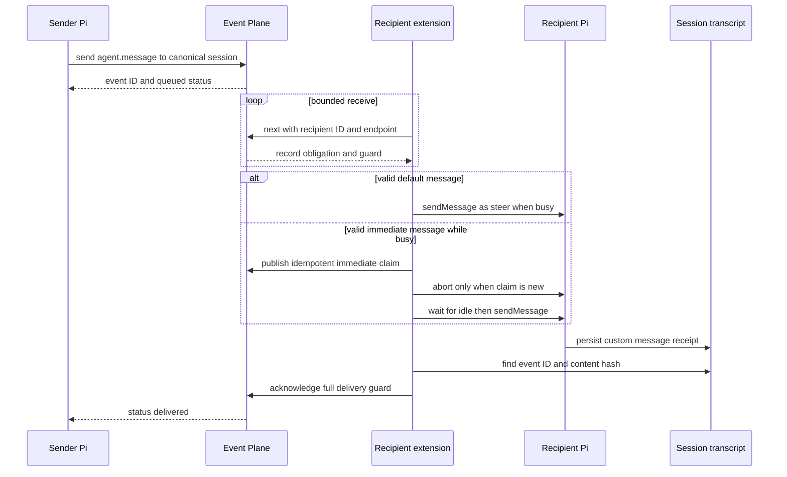
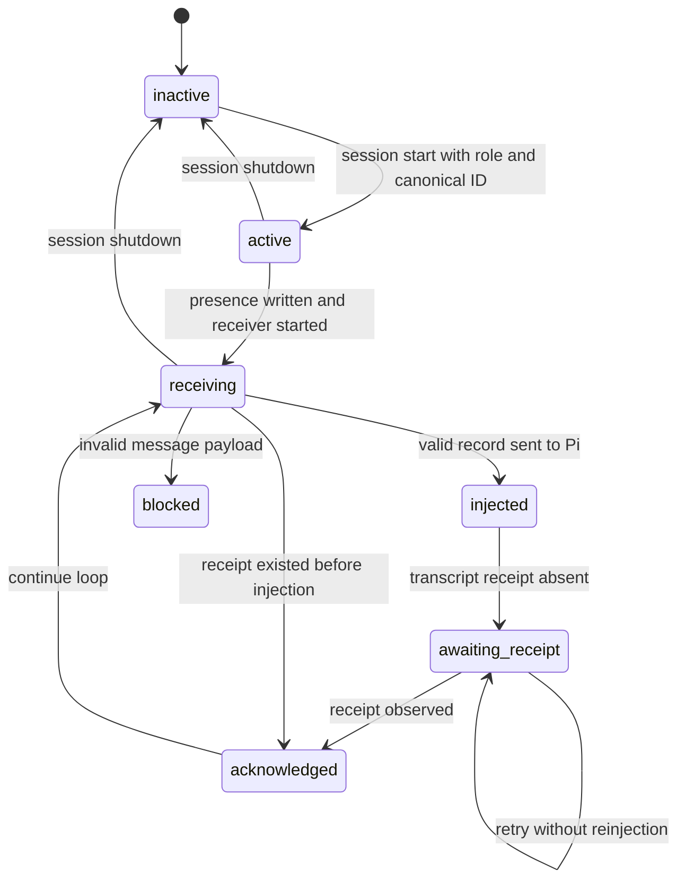

# Presence and cross-session delivery

`extensions/agent-messages.ts` adds machine-local discovery and durable cross-session messages to Pi. It stores ephemeral presence beside the Event Plane and sends `qq.agent-message/v2` envelopes through the journal described in [Durable event journal and protocol](service.md). It is registered by `extensions/index.ts`.

This channel is not the run-outcome channel. Agent messages use product `agents`, kind `agent.message`, and recipient `agents/<canonical-session-id>`. Run outcomes use product `qq`, kinds `run.landed` or `run.blocked`, and recipient `qq/review-flow/<architect-session-id>` in `bin/lib/run-events.mjs`; review flow validates and injects them separately.

## Public surface

### `agent_messages`

The tool accepts exactly the documented parameters and returns refusals as text plus `details.status:"refused"` rather than throwing through Pi.

| Action | Inputs | Behavior |
|---|---|---|
| `list` | Optional `project`, `role`, exact `task` | Reads valid, unexpired presence records, applies filters, sorts deterministically, and excludes the current session. Project/role/task/pane are discovery metadata, never an address. Ask when multiple candidates remain. |
| `send` | Canonical `to`, non-empty `message` up to 65,536 characters, optional `delivery` | Requires an active registered sender. Defaults delivery to `default`; accepts only `default` or `immediate`. Sends one durable Event Plane record and returns its `evt_...` message ID and current status. |
| `status` | `message_id` | Reads Event Plane status and maps obligations to `queued`, `delivering`, `blocked`, `delivered`, `expired`, or `failed`. Blocked/expired/failed output includes reasons; queued/delivering may include a recipient activity card. |

A destination is only the complete canonical lowercase UUID supplied by Pi and returned by `list`, for example `019ff7ad-2cba-75a9-adc2-c15a0a92d6a9`. `planeAgentId(sessionId)` maps it to `agents/<session-id>`. Project, role, task, and pane must never be concatenated into the address.

### `/agent-tasks`

`/agent-tasks T-12, T-18` replaces the current advertised task list; an empty argument clears it. Entries are trimmed, deduplicated in first-seen order, non-empty, at most 191 characters, and limited to 32. The command requires an active registered session and immediately rewrites presence.

## Identity and configuration precedence

At `session_start`, the extension reads `<cwd>/.pi/agent-messages.json`. The file must be a JSON object with only `project` and `role`; arrays, extra keys, and malformed JSON fail startup. Values are slugged to lowercase readable identifiers of at most 63 characters. Role validation ultimately permits only symbols in `ROLE_SET`: `runner` and `architect`.

Precedence is intentionally field-specific:

| Value | Highest to lowest precedence |
|---|---|
| Project | `QQ_AGENT_PROJECT` → `.pi/agent-messages.json` `project` → repository directory basename. |
| Initial role | A previously received `qq:role-selected` event → `QQ_AGENT_ROLE` → config `role` → `roleForRepository` fallback. |
| Repository role fallback | Explicit configured role above; otherwise `runner` only when `cwd` is the qq runtime tree or local Git config `qq.methodology=true`; otherwise no role. |
| Pane | `HERDR_PANE_ID` → `null`. |

`qq:role-selected` is state, not merely a live update. A valid event received before `session_start` seeds initial presence; after start it updates `current.role` and rewrites presence. This ordering is required because profile restoration can emit the role first. An unlinked session with no selected, environment, or file role has no fallback, stays inactive, writes no presence, and cannot send. A session ID missing or non-canonical also does not activate (a non-canonical supplied ID is refused).

## Presence v2 and activity

Presence lives under `$XDG_STATE_HOME/qq/event-plane/presence`, or `$HOME/.local/state/qq/event-plane/presence`. The directory must be a real, account-owned private directory. Each account-private `0600` JSON file is named by SHA-256 of the session ID and atomically replaced after file sync.

```json
{
  "schema": "qq.agent-presence/v2",
  "version": 2,
  "session_id": "019ff7ad-2cba-75a9-adc2-c15a0a92d6a9",
  "project": "qq",
  "role": "runner",
  "tasks": ["T-12"],
  "pane": "w1:p2",
  "busy": "tool",
  "tool": "bash",
  "busy_since": 1730000000000,
  "updated_at": 1730000006000,
  "expires_at": 1730000051000
}
```

The lease is 45 seconds and renews every 15 seconds. Readers ignore expired, oversized, loosely permissioned, symlinked, foreign-owned, malformed, unreal-role, invalid-task, or invalid-activity files. `session_shutdown` stops renewal, clears local dedup/activity state, and removes presence.

Activity hooks map `agent_start` to `thinking`, `agent_settled` to `idle`, and tool start/end to the current validated tool name. A list/status card reports `thinking Ns` or `tool <name> Ns` only after five seconds, limiting transient noise. Multiple in-flight tools retain the most recently active remaining tool.

## Message v2 schema

A `send` record has this stable envelope:

```json
{
  "producer_id": "agents/<sender-session-id>",
  "request_id": "msg_<uuid>",
  "origin_id": "agents/<sender-session-id>",
  "recipient_id": "agents/<recipient-session-id>",
  "product_id": "agents",
  "kind": "agent.message",
  "schema_version": 1,
  "payload": {
    "schema": "qq.agent-message/v2",
    "message": {
      "from": "<sender-session-id>",
      "project": "qq",
      "role": "architect",
      "tasks": ["T-12"],
      "pane": "w1:p1",
      "content": "Review this now",
      "delivery": "default"
    }
  }
}
```

`parseMessage` additionally requires a canonical sender and recipient, a valid project and real role, canonical task normalization, bounded pane/content, and delivery `default` or `immediate`. Invalid durable payloads are not silently acknowledged: the receiver calls Event Plane `block` with `unsupported agent message payload`.

## Send-to-ack flow



*One addressed message is acknowledged only after its exact transcript receipt is observable.*

The receiver long-polls `next` for recipient generation 0 with a random `agent-messages/<uuid>` endpoint and 30-second wait. Transport/refusal failures reconnect after 500 ms while the same activation epoch remains current.

### Default delivery

If Pi is idle, the extension sends a displayed `qq-agent-message` custom message with `triggerTurn:true`. If Pi is busy, it adds `deliverAs:"steer"`; it does not abort the current run. The visible prefix includes event ID, sender UUID, project/role, and optional tasks.

### Immediate delivery and claim deduplication

When Pi is busy, immediate mode publishes `agents/agent.immediate-claim` with request ID `immediate_<message-event-id>`, correlation ID equal to the message event, and payload containing the message event ID and content hash. Event Plane idempotency elects one claimant: only a non-idempotent claim calls `context.abort()`. The receiver polls every 50 ms for up to 5 seconds. If Pi does not become idle it retries the original obligation with reason `Pi did not become idle after immediate abort`; otherwise it injects as a normal triggered turn. An already-idle immediate message needs no claim or abort.

The claim is a coordination fact, not proof of delivery. It prevents repeated interruption across competing/restarted receivers; transcript persistence remains the acknowledgement boundary.

### Persistence receipt and in-process deduplication

The injected custom message details include:

```json
{
  "schema": "qq.agent-message/v2",
  "event_id": "evt_...",
  "content_hash": "<sha256 of exact content>",
  "from": "<sender-session-id>",
  "delivery": "default"
}
```

Before injection, `receiptExists` scans the active JSONL session file for `type:"custom_message"`, `customType:"qq-agent-message"`, and the same event ID plus content hash. An existing receipt is safe to acknowledge without reinjection.

After injection, the receiver acknowledges only if that receipt is observable (or the explicit test-only `assumePersisted` seam is enabled). Until then, a process-local set retains `<event-id>:<content-hash>` and calls Event Plane `retry` with `Pi session persistence not yet observable`. Redelivery in the same process sees the marker and retries without a duplicate injection. Once the transcript receipt appears, redelivery acknowledges and removes the marker. Thus “shown to Pi” is not “delivered”; durable transcript persistence is.

## State and failure semantics



*Extension lifecycle and the transcript receipt gate layered over Event Plane obligation state.*

Operational failures are explicit:

- Unsafe presence directories fail writes; unsafe or malformed individual presence files are ignored during discovery.
- Missing Event Plane socket makes send/status fail and the receiver reconnect; the extension does not start the service.
- A missing role leaves an unlinked session inactive; `send` and `/agent-tasks` explain that registration is required.
- Invalid recipient UUID, empty/oversized content, unsupported delivery, malformed config, invalid Pi session ID, and unreal roles are refused.
- Unsupported received schema/content is blocked for diagnosis, not dropped.
- Injection exceptions clear the in-memory marker and leave the durable obligation unacknowledged for Event Plane redelivery.
- Endpoint, attempt, and receipt handling inherit the journal’s guarded retry, eight-failure blocking, one-hour addressed TTL, and crash redelivery semantics from [Durable event journal and protocol](service.md).

## Focused validation

```bash
# Pure schema, normalization, presence filtering, parsing, and status mapping
node --experimental-strip-types tests/test-agent-messages.mjs .

# Real Event Plane plus two Pi harnesses, role-before-start ordering and receipts
tests/test-agent-messages-live.sh

# Event Plane guard, retry, crash, expiry, framing, and persistence substrate
tests/test-event-plane.sh
```

The unit test verifies canonical addressing, task deduplication, presence expiry/roles/activity, private presence filtering, message schema rejection, and status mapping. The live test proves that a pre-start `qq:role-selected` event seeds architect presence; task/pane and delayed activity appear in discovery; default delivery steers without aborting; immediate delivery aborts once and waits for idle; absent transcript persistence neither acknowledges nor reinjects; writing the matching receipt causes acknowledgement and `delivered`; and shutdown removes both sessions. Configuration precedence and malformed `.pi/agent-messages.json` are enforced in source but do not have dedicated assertions in these focused tests, so validate them directly when changing configuration logic.
