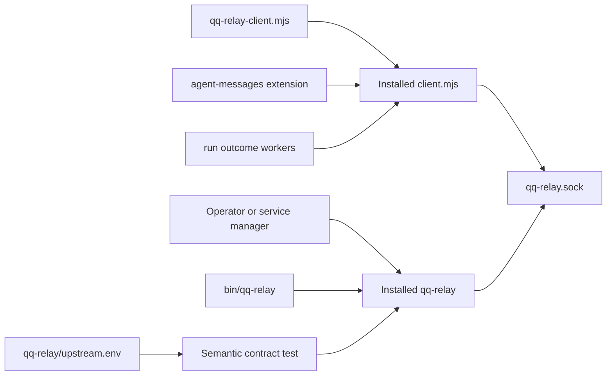

# qq-relay installed-product boundary

qq-relay is the machine-local durable relay used by [agent messaging](agent-messaging.md) and by [delegation run outcomes](../workflow/delegation-and-review.md). Its protocol, persistence, service lifecycle, installation, and upgrades are owned by the external [qq-relay product](https://github.com/hypermemetic-ai/qq-relay), not this repository. qq owns only the installed-artifact adapters and the semantic consumer contract.

## Runtime boundary



*qq consumers execute or import only the installed artifact; the linked source relation is test evidence, not a runtime path.*

The default installation root is `$HOME/.local/lib/qq/relay`. `QQ_RELAY_INSTALL_ROOT` may override it only with a non-empty absolute path.

| Consumer surface | Resolution and contract |
|---|---|
| `bin/qq-relay` | Executes `<install-root>/bin/qq-relay`, passes all arguments unchanged, and fails if the executable is absent. It never searches `PATH`, fetches, or installs. |
| `bin/lib/qq-relay-client.mjs` | Imports `<install-root>/client.mjs` and re-exports `QQ_RELAY_PROTOCOL`, `RelayClient`, `RelayError`, and `canonicalRelayJson`. Missing exports or imports fail module loading. |
| Relay socket | Consumers connect to `${XDG_STATE_HOME:-$HOME/.local/state}/qq-relay/qq-relay.sock`. `extensions/agent-messages.ts` and `bin/lib/run-events.mjs` do not start the service. |
| Source relation | `qq-relay/upstream.env` records only upstream `refs/heads/main` and the landed repository. It intentionally stores no commit, tag, version, or capability floor. |

Presence is not relay-owned journal state: agent discovery files live separately under `${XDG_STATE_HOME:-$HOME/.local/state}/qq/agent-messages/presence`; see [agent messaging](agent-messaging.md#presence-v2-and-activity).

## Change navigation

For install-root or loader changes, start with `qqRelayInstallRoot` and `qqRelayClientPath` in `bin/lib/qq-relay-install-root.mjs`, then check `bin/qq-relay` and `bin/lib/qq-relay-client.mjs`. A public client change is complete only when the installed `client.mjs` exports it, the qq loader re-exports it, and a real consumer imports that loader. Current consumers are `extensions/agent-messages.ts`, `extensions/review-flow.ts`, and `bin/lib/run-events.mjs`.

Do not copy relay service code back into qq, import from `/home/qqp/projects/qq-relay`, hand-edit an installed artifact, or encode product provenance in `upstream.env`. Service activation, restart, backup, retention, and protocol/schema changes belong in qq-relay and must follow its README.

## Focused validation

```bash
tests/test-qq-relay.sh
```

This network-crossing contract suite fetches the configured branch tip, checks the public executable/client/installer/service-unit surface, installs into a private temporary root, deletes the source checkout, and then exercises qq's launcher, client exports, agent messaging, and run outcomes against only that installed artifact. It also proves missing and relative install roots fail closed. It does **not** touch the operator installation or user service manager.

For a quick resolver-only check after an installed test fixture exists, use `node tests/test-qq-relay-client.mjs "$PWD" <absolute-install-root>`. Changes to relay protocol, persistence, or lifecycle require qq-relay's own checks in addition to this repository contract suite.
