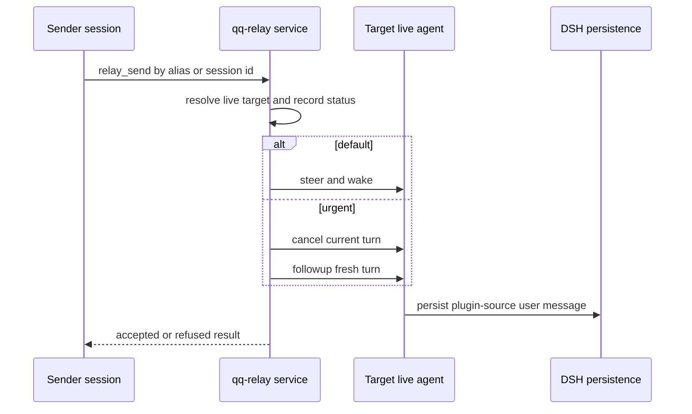

# qq relay boundaries

The repository currently contains two unrelated runtime transports with the same product name. Keep the boundary explicit.

| Runtime | Implementation | Semantics | Focused test |
|---|---|---|---|
| Daily DSH host | `qq-relay/` Cordis plugin | In-process, live sessions only, DSH persistence owns resulting transcript entries | `node tests/test-qq-relay-plugin.mjs .` |
| Legacy Pi/Herdr | Installed external qq-relay resolved by `bin/lib/qq-relay-client.mjs` | Durable socket journal, guarded obligations and acknowledgements | `tests/test-qq-relay.sh` |

## DSH in-process relay

The plugin provides `qq-relay` and registers `relay_list`, `relay_send`, and `relay_status` when DSH tools are available. Canonical addresses are live `session-<UUID>` IDs; short spoken aliases come from the [`qq` service](../runtime/dsh-console.md#projects-and-sessions), not a relay-owned map. If qq is absent, ID addressing still works and aliases disappear.

*The mailbox routes directly to a live agent; it has no daemon, socket, offline queue, or second durable database.*

`default` steers at the next boundary and starts a turn when idle. `urgent` cancels first, then starts a fresh followup turn. Labels are an in-memory bulletin board: workflow/task plugins call `hang`, `clear`, or `release`, while relay only displays or filters namespaced tokens. Hot reload must drop plugin-local work through `ctx.effect`; live session identity and aliases remain owned by qq.

The DSH plugin is consumed by [architect and iterate workflows](../workflow/dsh-workflows.md), including invoke replies and hands/reviewer coordination. It does not import or execute the external installed relay.

## Legacy installed relay

[Pi agent messaging](agent-messaging.md) and [delegation outcomes](../workflow/delegation-and-review.md) still load the external product from `${QQ_RELAY_INSTALL_ROOT:-$HOME/.local/lib/qq/relay}`. `bin/qq-relay` executes only that root's CLI, and `bin/lib/qq-relay-client.mjs` imports only its `client.mjs`; neither searches `PATH` nor imports landed source. Consumers connect to `${XDG_STATE_HOME:-$HOME/.local/state}/qq-relay/qq-relay.sock` and do not start the service.

`tests/test-qq-relay.sh` fetches the configured upstream branch, installs it into a private root, removes source, and exercises wrappers plus Pi consumers. This is intentionally broader and network-dependent. Use it only for the installed-artifact contract, Pi messages, or run outcomes—not for the DSH mailbox.

## Change rules

- Never add durable/offline claims to the DSH plugin without new storage and lifecycle evidence.
- Keep alias ownership in `qq/src/alias.mjs`; validate both `test-qq-alias.mjs` and the DSH relay suite when its service contract changes.
- A DSH public service change must update `qq-relay/src/plugin.mjs`, consumer calls, and `tests/test-qq-relay-plugin.mjs`.
- An installed-client export change must exist in the installed `client.mjs`, qq's loader, a real Pi consumer, and `tests/test-qq-relay.sh`.