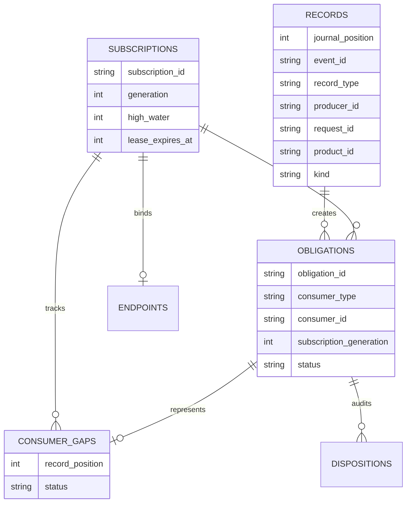
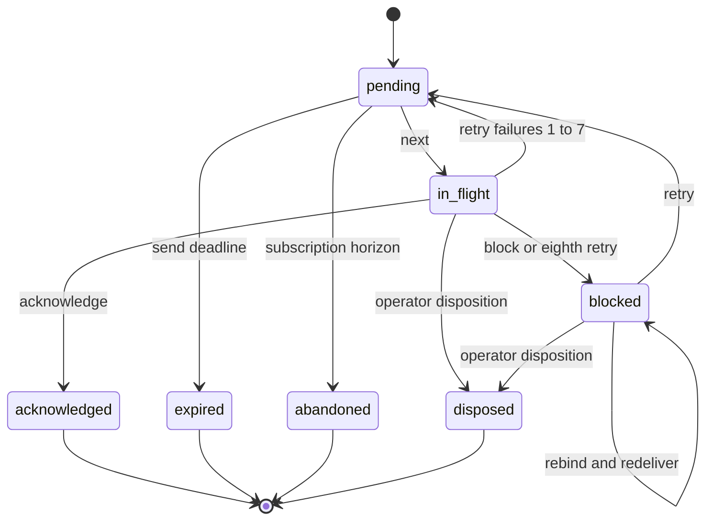

# Event Plane Service

`bin/lib/event_plane_service.py` is a dependency-free, payload-agnostic machine-local service. `bin/event-plane` only locates Python and executes it. `main` accepts `serve`, resolves a private state directory, builds `Config`, and calls `serve`. The [agent-messaging extension](../agent-messaging/extension.md) is its principal upstream consumer; the downstream authority is one SQLite connection owned by `Store`.

## Startup and state ownership

Default state is `$XDG_STATE_HOME/qq/event-plane`, otherwise `$HOME/.local/state/qq/event-plane`. `private_directory`, `validate_directory_chain`, and `inspect_state_namespace` reject symlinks, foreign ownership, unsafe writable ancestors, unexpected fixed names, hard-linked fixed files, and wrong modes. `Singleton` takes a nonblocking lock on `event-plane.lock`; a second service is refused. `serve` validates state before and after lock acquisition, opens `Store`, then creates `event-plane.sock`; database, lock, and socket are mode `0600`, state is `0700`. After owning the lock it may unlink an account-owned stale socket, but refuses a pre-existing non-socket, symlink, or foreign socket.

`Store` requires SQLite `DELETE` journal mode, `synchronous=FULL`, foreign keys, and exact schema version 2. Existing altered, unknown-version, WAL, corrupt, or loosely-permissioned databases are refused rather than migrated, and startup refusal leaves the pre-existing database bytes and namespace unchanged. SQLite may first recover its own valid hot journal; exact schema and integrity checks then occur before the socket accepts requests. Startup resets persisted `in_flight` obligations to `pending` and deletes endpoint bindings.

## Data model

*Schema 2 separates immutable accepted records from independently changing delivery obligations and subscription progress.*

`metadata` stores only `instance_id` and schema version. `retention_boundaries` records deleted publication ranges so replay cannot falsely claim completeness. The `records_immutable` trigger protects event identity and envelope metadata while allowing payload compaction fields and terminal state to change.

## Acceptance: `Store.append`

`send` and `publish` require exact envelopes: product-scoped logical IDs, kind, integer schema version, and canonical JSON payload at most 64 KiB. A `send` adds one generation-0 recipient obligation and a deadline no later than the one-hour TTL. A `publish` fans out to every active, matching `(product_id, kind)` subscription. No obligations means immediate terminal status.

Canonical input is hashed. Reusing `(producer_id, request_id)` with identical normalized request bytes returns the same event as `idempotent`; reusing that identity with any different normalized bytes raises `idempotency_conflict`. Payload compaction does not weaken either outcome: the retained `input_hash` still recognizes an identical request and rejects a changed request after `normalized_input`, envelope, and payload have been purged. All acceptance is under `Store.lock` and `BEGIN IMMEDIATE`, so committed `journal_position` values define monotonic global acceptance order.

## Subscriptions and delivery

`ensure_subscription` creates generation 1 only with explicit `reconstruct_from`. An unchanged active generation renews without that field. An expired or changed subscription requires exactly the next generation and an explicit reconstruction position; old unresolved obligations become `abandoned`, matching retained publications are replayed, and compacted/deleted ranges raise `replay_unavailable`.

`next_delivery` binds one `endpoint_token` per consumer/generation. Rebinding invalidates stale attempts and makes unresolved work eligible again. Delivery includes immutable record data, an obligation, attempt/endpoint tokens, and a guard containing subscription `high_water` and a hash of outstanding gaps. `acknowledge`, `retry`, `block`, and `disposition` all pass `_guarded_obligation`; stale identity, attempt, endpoint, generation, high-water, or gap state is refused.

*Obligations remain independently resolvable; one blocked subscription gap does not prevent later records from advancing high-water.*

Retries use exact delays of 1, 2, 5, 10, 30, 60, 120, then 300 seconds. Long-poll `next` and `status` install waiters on the same condition lock used by mutations, preventing missed wakeups.

## Cleanup, recovery, and scope

Every major operation runs one bounded cleanup batch. A `send` has a one-hour maximum TTL; at its deadline any `pending`, `in_flight`, or `blocked` recipient obligation becomes `expired`. A subscription lease is exactly 24 hours. At lease expiry the subscription becomes inactive, and unresolved publication obligations become `abandoned`; independently, no publication obligation may remain open beyond its 24-hour delivery horizon even if the lease was renewed.

Terminal payloads compact after 24 hours, retaining identity/hash/status as a tombstone. Records delete after seven days of terminal age. An inactive subscription is eligible for deletion only when its `expired_at` is at least seven days old and no obligations still refer to it. Deleting a publication advances `retention_boundaries` for exactly its `(product_id, kind)` through that position: reconstruction with `reconstruct_from <= unavailable_through_position` is refused, while a later position and the same position in a different product or kind remain eligible. Constants can be shortened only with `QQ_EVENT_PLANE_TESTING=1` and the isolated test-clock seam.

An obligation is open in `pending`, `in_flight`, or `blocked`; it is terminal in `acknowledged`, `expired`, `disposed`, or `abandoned`. `next` moves pending to in-flight; acknowledge resolves it; retry moves in-flight/blocked to pending until the eighth failure blocks it; explicit block preserves unresolved custody; operator disposition can terminate a currently guarded open state. Startup moves every in-flight obligation back to pending and clears endpoint bindings, while blocked obligations remain blocked until rebound/retry/disposition. Cleanup can expire a send or abandon a subscription obligation from any open state. A record is terminal only when no open obligations remain. `terminal_failure` is narrower: only a terminal `send` whose sole obligation is `expired` or `disposed` reports failure; acknowledged sends are terminal success, and publication outcomes do not use this send-only flag.

On SIGINT, SIGTERM, or guarded protocol shutdown, the server stops accepting work, closes SQLite, removes the socket it owns, and releases the singleton lock. SIGKILL cannot run that cleanup; on restart, SQLite recovers any valid hot journal, the service preserves committed custody, returns `in_flight` work to `pending`, clears endpoint bindings, and safely replaces its stale owned socket.

The service intentionally has no routing DSL, auth provider, network transport, restore/rollback, Pi import, dead-letter service, or domain-specific payload handling. Backup is supported; restoration is an external operator procedure, not a protocol API.

## Focused tests and changes

`tests/event_plane_test.py` is the service contract. Key scenarios are `crash_and_validation`, `native_hot_journal_recovery`, `delivery_gaps_and_guards`, `predicate_wait_atomicity`, `backoff_blocking`, `expiry_lease_and_retention`, `online_backup_contract`, `exact_v2_and_fixed_process_contract`, and `state_ancestor_fence`. Run `tests/test-event-plane.sh`.

When changing schema or state transitions, update `SCHEMA_OBJECTS`, the relevant `Store` method, document builders, both [clients](protocol-and-clients.md) if the public shape changes, and focused tests. There is deliberately no migration seam: a schema change is a new explicit compatibility decision.
