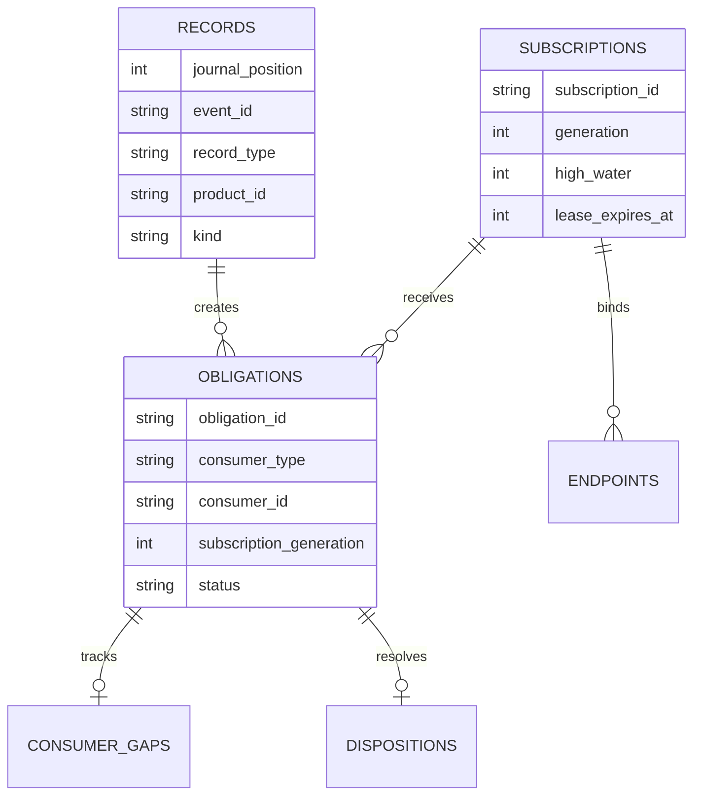
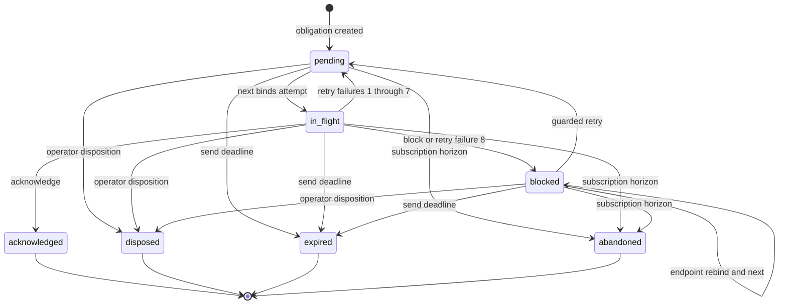

# Durable event journal and protocol

The Event Plane is a machine-local, payload-agnostic journal. `bin/lib/event_plane_service.py` is the sole SQLite owner; callers use bounded operations rather than SQL. Addressed agent messages are one consumer of this service; their payload and receipt rules live in [Presence and cross-session delivery](agent-messaging.md).

## Runtime and storage

Start it explicitly:

```bash
bin/event-plane serve
bin/event-plane-admin inspect '{"view":"health"}'
```

`--state-dir` overrides the default `$XDG_STATE_HOME/qq/event-plane`, or `$HOME/.local/state/qq/event-plane` when `XDG_STATE_HOME` is unset. There is no local systemd unit for this service: an operator or caller must own its lifecycle.

The state directory must be account-owned mode `0700`, reached through real, trusted directory components. A writable ancestor is accepted only through a sticky directory into an account-owned private child. The namespace admits only:

| Path | Contract |
|---|---|
| `event-plane.sqlite3` | Account-owned regular file, mode `0600`, one link; exact schema 2; SQLite `DELETE` journal mode and `synchronous=FULL`. |
| `event-plane.lock` | Account-owned `0600` one-link file with a non-blocking `flock`; contains the serving PID. |
| `event-plane.sock` | Account-owned Unix socket, mode `0600`, one link. |
| `event-plane.sqlite3-journal` | The only permitted SQLite side file; SQLite may recover a valid hot journal. |

WAL/SHM files, symlinks, hard-linked fixed files, unknown names, foreign ownership, altered schemas, corruption, and an installed database without its lock are startup refusals. A stale socket is removed only if it is an account-owned socket. `SIGINT`, `SIGTERM`, and guarded `shutdown` close the database and unlink the owned socket; `SIGKILL` can leave it for validated restart cleanup.

## Wire contract

Each Unix-stream connection carries exactly one request and one response:

1. Four-byte unsigned big-endian payload length.
2. UTF-8 JSON of 2 through 131,072 bytes.
3. Client half-close, proving EOF and therefore no trailing byte or second frame.
4. One identically framed response, then EOF.

A request is exactly `{"protocol":"qq-event-plane/v1","operation":string,"body":object}`. A response is `{"protocol":"qq-event-plane/v1","ok":true,"result":object}` or `ok:false` with `error.code` and `error.message`. Dispatch waits for the half-close. Duplicate fields, trailing bytes, unsupported fields, floats, unsafe integers, invalid Unicode scalars, JavaScript array-index object keys, and cyclic/non-JSON client values are refused. Payload canonical JSON is limited to 64 KiB; framing is limited to 128 KiB. `next` and `status` long-polls are capped at 30 seconds.

Runtime call path is explicit: `RequestHandler.handle` applies the 35-second socket timeout, reads and bounds the one frame, waits for EOF, decodes constrained JSON, and calls `EventPlane.dispatch`. `dispatch` validates the exact protocol/operation/body envelope, refuses work during shutdown, maps the operation name to one `Store` transition (or guarded shutdown), and returns its result. The handler alone converts `Refusal` into a framed public error and hides unexpected exceptions behind `internal`; the `Store` alone validates operation bodies and owns serialized SQLite transitions.

Both `bin/lib/event_plane_client.py` (`EventPlaneClient`) and `bin/lib/event-plane-client.ts` (`EventPlaneClient`) expose the same bounded methods. Python uses snake case; TypeScript uses `ensureSubscription`. Their `wait` helper is `next` with mandatory `wait_ms`. `bin/event-plane-admin` accepts an inline object, `@file`, or `-` for stdin and exits `2` on a protocol/client refusal.

## Operations

Unknown fields are always rejected. IDs are bounded tokens; `product_id` is a lower-case product slug, and producer, origin, recipient, subscription, and consumer logical IDs must stay under the declared `product/` boundary.

| Operation | Exact body and effect |
|---|---|
| `send` | Requires `producer_id`, `request_id`, `origin_id`, `recipient_id`, `product_id`, `kind`, positive `schema_version`, `payload`. Optional `subject_id`, `correlation_id`, `causation_id`, `source_revision`, `source_ref`, `occurred_at`, `deadline_at`. Appends one record and one generation-0 recipient obligation. The deadline must be after acceptance and no later than the one-hour service TTL. |
| `publish` | Same as `send` without `recipient_id`; `deadline_at` is forbidden. Atomically creates one obligation for every active, unexpired subscription matching product and kind. No match makes the record immediately terminal. |
| `ensure_subscription` | Requires `subscription_id`, `product_id`, `kind`, positive `generation`; optional `reconstruct_from`. A new subscription requires generation 1 plus an explicit positive reconstruction position. An unchanged active generation renews only when reconstruction is omitted. An expired or changed subscription requires exactly the next generation and reconstruction position, abandons old open obligations, clears endpoints, and replays retained matching publications from that position. |
| `next` | Requires `consumer_type`, `consumer_id`, `generation`, `endpoint_token`; optional `wait_ms`. Recipient generation is 0; subscription generations are positive. Binds/rebinds the endpoint, returns the oldest due deliverable record with a fresh attempt token and complete transition guard, or `delivery:null` plus consumer state. |
| `acknowledge` | Requires the full delivery guard: `obligation_id`, `event_id`, consumer identity/generation, attempt and endpoint tokens, expected high-water and gap token. Only `in_flight` may become `acknowledged`; subscription gaps are removed and high-water advances. |
| `retry` | Full guard plus bounded readable `reason`. `in_flight` or currently redelivered `blocked` becomes `pending`, or `blocked` on failure 8; increments failure count and schedules backoff. |
| `block` | Full guard plus `reason`. Changes only `in_flight` to `blocked` and preserves the subscription gap and reason. |
| `disposition` | Full guard plus `authorized_by`, literal `authorization:"operator"`, `reason`, and `expected_status` in `pending`, `in_flight`, or `blocked`. Atomically writes an audit disposition, marks the obligation `disposed`, resolves its gap, and advances subscription high-water. |
| `status` | Selects exactly one record by `event_id` or by both `producer_id` and `request_id`; optional `wait_ms`. Returns record, all obligations, `terminal`, and send-only `terminal_failure`. It waits until terminal or timeout. |
| `inspect` | Requires `view`. `health` and `integrity` accept no filters. `journal` accepts `after_position`; `obligations` accepts `status` and `consumer_id`; `journal`, `obligations`, `subscriptions`, and `dispositions` accept `limit` 1–20. |
| `backup` | Requires a new absolute lexical `path` outside state, in an account-owned `0700` parent. Creates one `0600` file, snapshots under the store lock, verifies exact schema/integrity/instance/content baseline and inode stability, then fsyncs file and parent. Failure removes only the inode created by that operation. |
| `shutdown` | Requires current `expected_instance_id` and literal `authorization:"operator"`. Refuses a stale instance guard, stops accepting work, and requests server shutdown. |

There is deliberately no `restore` or `rollback` operation in the protocol, CLI, or either client.

## Acceptance, schema, and ownership

Acceptance order is `records.journal_position`, not source timestamps. `(producer_id, request_id)` is the idempotency key. The service hashes canonical `{record_type, ...body}` bytes: an exact retry returns the original event with `idempotent:true`; any changed normalized input returns `idempotency_conflict`, including after payload compaction while the tombstone remains.

Schema v2 is exact, not migration-based:

| Entity | Owned state and invariants |
|---|---|
| `metadata` | Exactly `instance_id` (`plane_` plus 32 hex digits) and `schema_version=2`; `PRAGMA user_version=2`. |
| `records` | Immutable acceptance identity, envelope hash/bytes, type, routing identity, acceptance/deadline, payload retention and terminal timestamps. Unique event ID and producer/request key. `records_immutable` prevents routing/identity mutation. |
| `subscriptions` | Product/kind selector, positive generation, reconstruction position, high-water, lease, active/expiry timestamps. |
| `obligations` | One per record/consumer/generation; unique on that tuple. Owns status, attempts, failures, endpoint/attempt fencing, retry time, reason, and terminal time. `obligations_delivery` serves ordered delivery lookup. |
| `consumer_gaps` | Unresolved subscription positions and reason, tied one-to-one to an obligation. |
| `endpoints` | Current endpoint token per consumer identity and generation; cleared on restart. |
| `dispositions` | Operator-authorized terminal audit record. |
| `retention_boundaries` | Highest deleted publication position by product and kind, used to refuse dishonest replay. |



*Schema entities used to turn immutable accepted records into independently fenced delivery obligations.*

## Delivery state and guards



*Persisted obligation transitions; terminal states are acknowledged, disposed, expired, and abandoned.*

A delivery transition is valid only when every returned guard still matches: obligation/event identity, consumer type/ID/generation, attempt token, current endpoint token, expected high-water, and SHA-256 gap token. Rebinding an endpoint resets pending/in-flight custody for redelivery and invalidates old attempts. It preserves blocked custody and reason but clears stale delivery fencing so the new endpoint can receive a guarded blocked delivery. Typical refusals are `guard_conflict`, `stale_attempt`, `stale_endpoint`, `generation_conflict`, and `gap_conflict`.

Attempts schedule 1 s, 2 s, 5 s, 10 s, 30 s, 60 s, 120 s, then 300 s; the eighth reported failure blocks. A blocked subscription gap does not prevent a later record from being acknowledged and advancing high-water. Only guarded retry or explicit operator disposition resolves that gap.

## Recovery, leases, and retention

On startup, SQLite first performs native `DELETE` hot-journal recovery. Exact schema, integrity, and foreign keys are then checked before the socket appears. The service changes persisted `in_flight` obligations and gaps back to `pending` and deletes all endpoint bindings, making unacknowledged work redeliverable.

Production constants are fixed: send TTL 1 hour, subscription lease/delivery horizon 24 hours, terminal payload retention 24 hours, and tombstone retention 7 days. Cleanup is bounded to 100 rows per category and runs during operations. Expired sends become `expired`; open publication obligations become `abandoned` when a subscription expires or their useful horizon ends. Terminal envelopes and normalized input become hash/status tombstones after payload retention, then records are deleted after tombstone retention. Deleting publications advances a product/kind retention boundary; reconstruction at or behind unavailable compacted data returns `replay_unavailable`. Consumers must reconstruct current authority at a newer position.

`QQ_EVENT_PLANE_TESTING=1` alone enables `--test-clock` and the `QQ_EVENT_PLANE_{SEND_TTL,SUBSCRIPTION_LEASE,PAYLOAD_RETENTION,TOMBSTONE_RETENTION}_MS` overrides. Production rejects these environment overrides. The test clock is validated before any state is created and must be an account-private, regular, non-symlink file reached through fenced ancestors.

## Focused validation

```bash
# Full Event Plane process, protocol, schema, crash, retention, and client matrix
tests/test-event-plane.sh

# Health and exact runtime constants on a manually started service
bin/event-plane-admin inspect '{"view":"health"}'

# Read-only SQLite consistency through the owner
bin/event-plane-admin inspect '{"view":"integrity"}'

# Durable online snapshot; destination parent must already be private
mkdir -m 700 "$HOME/event-plane-backups"
bin/event-plane-admin backup "{\"path\":\"$HOME/event-plane-backups/event-plane.sqlite3\"}"
```

`tests/event_plane_test.py` substantively covers committed records across `SIGKILL`, native hot-journal rollback, idempotency conflicts, concurrent monotonic positions, fan-out and independent gaps, stale guard/endpoint/generation failures, blocked rebind and operator disposition, atomic long-poll wakeups, exact retry schedule, send/lease expiry, compaction and replay refusal, framing and Python/TypeScript canonical-JSON parity, online-backup races, exact-v2 startup refusal, singleton/signal behavior, ancestor fencing, and absence of restore/rollback and out-of-scope dependencies.
