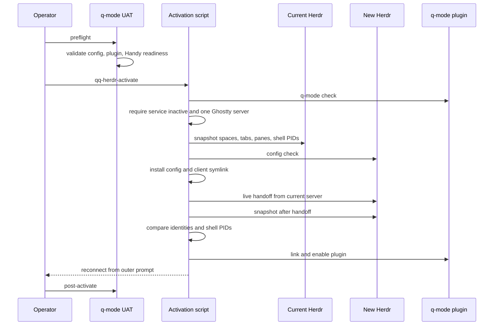
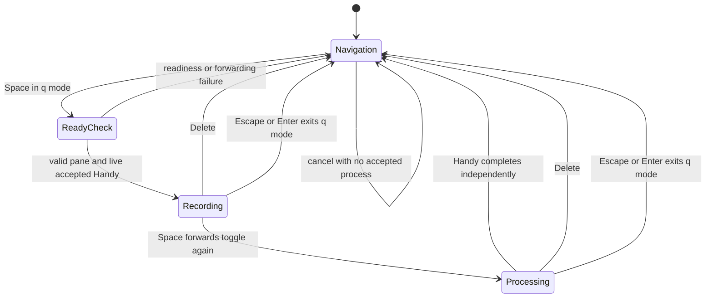

# Herdr operator workflows

Herdr is qq's terminal cockpit and human-control boundary. qq owns configuration, adapters, plugins, activation safeguards, and contract tests; Herdr's Rust implementation, build, installation, and product tests belong to the linked `/home/qqp/projects/herdr` repository. `herdr/downstream/upstream.env` records only upstream `master` and the landed repository—no commit, tag, version, or capability floor. qq validates required behavior semantically at the configured branch tip.

For repository activation and Pi roles, see [Profiles and activation](../runtime/profiles-and-activation.md). Delegation's use of panes and approval is canonical in [Delegation and review](../workflow/delegation-and-review.md). Durable notifications are described in [Agent messaging](../event-plane/agent-messaging.md).

## Operator entrypoints

| Intent | Entrypoint | Preconditions and result |
|---|---|---|
| Open the cockpit | `qq-herdr-launch` | Requires executable `~/.local/bin/herdr`; clears inherited pane identity and starts outer Ghostty titled `herdr`. |
| Add a qq pane | `qq-herdr-pane-add [--current\|--pane ID] [--cwd DIR] [--env K=V] [--focus\|--no-focus]` | Always splits right; rejects direction, ratio, and unknown overrides. |
| Validate installed boundary | `qq-herdr-smoke` | Exercises qq's plugin and public CLI contract against installed Herdr; does not build it. |
| Validate dictation cutover | `qq-q-mode-uat preflight` / `post-activate` | Checks version/config/plugin/readiness/control semantics and then presents manual cockpit checks. |
| Activate a new installed Herdr | `qq-herdr-activate` | Performs a guarded live handoff while preserving every workspace, tab, pane, and pane shell PID. |
| Stage a human command | Pi `operator_stage` tool | Creates a no-focus shell pane and inserts an unexecuted one-line command. |
| Approve a delegation | `qq.brief-gate` plugin pane | Renders the private ticket and note; operator presses `a` or `c`. |
| Dictate to focused pane | Right Alt, then Space | q mode targets the exact focused Herdr pane through an already-running Handy process. |

## Cockpit and pane policy

`herdr/config.toml` is the staged configuration. Direct navigation uses Alt plus arrows for workspaces/tabs. A clean Right Alt tap enters `q mode`; arrows navigate panes/workspaces, Ctrl plus arrows navigate tabs, digits focus agents, `?` shows help, and Escape or Enter exits. Panes are borderless with preferred width 80 (`configuration`).

`qq-herdr-pane-add` is the only qq-owned general add-pane primitive. It fixes `--direction right` and passes only pane/current, cwd, environment, and focus options. Raw Herdr APIs remain available when an operator intentionally needs another ratio or layout; qq workflows do not silently override the centered-row policy (`adapter`). Delegated runners reuse a literal `runs` tab; new run and operator-stage panes are no-focus, while the brief gate is deliberately focused.

## Launch and service lifecycle

`qq-herdr-launch` removes `HERDR_ENV`, pane/tab/workspace IDs, and socket inheritance before opening Ghostty. This prevents a terminal launched inside a pane from masquerading as another nested pane client. The exact title `herdr` is also the Handy bridge selector (`source`).

### Ghostty surface

`ghostty/config` defines the actual cockpit window: fullscreen, opaque, a 24-point MxPlus/BigBlue font stack, a 12-point horizontal safe edge, and forced title `herdr`. Ctrl+C copies only when a selection makes that action performable; otherwise it passes through as terminal interrupt. The full display deliberately replaces the retired 480-point side padding and masking shader because preferred-width layout now belongs to Herdr. Keep the launcher title and config title synchronized: Handy uses that exact title for bridge selection.

The installed user service runs `%h/.local/lib/qq/herdr/bin/herdr server`, restarts on failure, logs to `~/.local/state/herdr/herdr.log`, and uses `ExitType=cgroup` so a live-handoff replacement remains active after the old main PID exits (`unit`). Activation intentionally requires this service to be `inactive`; the currently live server must instead be the single Herdr server in the Ghostty scope.

## Coordinated activation

Build and install Herdr in its owner repository and Handy in `qq-dictation`; qq supplies no build or upgrade wrapper. Then run:

```text
qq-q-mode-uat preflight
qq-herdr-activate
qq-q-mode-uat post-activate
```



*The activation sequence shows the guarded handoff and the preservation checks required before accepting cutover.*

Both UAT modes also preserve the legacy Left-Control compatibility path: `~/.config/systemd/user/handy-ptt.service` must exist, `~/.local/bin/handy-ptt-bridge.py` must be executable, and that bridge must retain its `Control_L` path. These checks protect remote/laptop workflows independently of q-mode readiness. Manual UAT additionally proves that Right Alt and outer focus loss cancel active dictation and exit q mode, and that unconfigured printable keys are consumed.

Before committing, `qq-herdr-activate`:

1. requires q-mode readiness;
2. refuses while `herdr.service` owns the cgroup;
3. finds exactly one live Herdr `server`, verifies its executable is accepted and its cgroup is a Ghostty scope;
4. snapshots Herdr objects and each pane's shell PID;
5. validates the staged config with the new binary;
6. backs up live config/client, installs `herdr/config.toml`, and atomically points `~/.local/bin/herdr` at the new binary.

It then invokes `server live-handoff`, installs the systemd unit, waits for the new API, and requires identical workspace IDs, tab IDs, pane IDs, and pane shell PID mapping. Finally it links and enables `qq.q-mode` and re-checks config. The current client detaches once; reconnect from the outer prompt with `~/.local/bin/herdr`.

Rollback exists only before live handoff commits: failure restores the old config/client and asks the old server to reload config. After handoff, preservation or plugin failures are surfaced for operator recovery rather than pretending an automatic binary rollback is safe (`source`).

## Human execution and approval boundaries

### Staged commands

`operator_stage({command, description, danger})` saves copy/paste without granting the agent execution authority. It refuses multiline commands, invalid danger, or use outside a Herdr pane. It creates a right-side no-focus pane, renames it, waits up to five seconds for a shell prompt, and uses `pane send-text`—never `send-keys`—to insert:

- low danger: `{ command; } && exit`;
- high danger: a one-key `y` guard before the same command.

The command remains unexecuted. The operator navigates to the notified pane and presses Enter once for low danger, or Enter then `y` for high danger; any other key aborts the high-danger command. On success the shell exits and the pane disappears. The agent validates with `herdr pane read <id>`: gone means success; present means inspect the visible failure or abort. If rename, readiness, staging, or notification fails after pane creation, qq tries to close its pane and explicitly reports a possible orphan if teardown also fails (`source`).

### Delegation brief gate

The architect's `delegate` call ensures plugin `qq.brief-gate` is linked and enabled, resolves the caller's tab, then opens the plugin as a focused right split of that tab's last pane. It passes only private document and decision paths. The plugin rejects a missing or symlink document, defaults to `/home/linuxbrew/.linuxbrew/bin/glow`, requires the selected path to be executable and able to render, renders into the primary screen so resize does not erase it, and accepts only `a` or `c`. Its refusal text names Glow 2.1.2 as the expected deployment, but source does not probe or enforce the executable's version. It atomically writes `approved` or `cancelled`, prints `QQ_BRIEF_GATE_DECIDED`, and waits for the caller to close it.

<!-- openwiki: broken internal link [../workflow/delegation-and-review.md#2-disclose-context-and-gate-the-brief] heading anchor "2-disclose-context-and-gate-the-brief" does not exist in "../workflow/delegation-and-review.md". Fix the href or restore the target, then delete this comment. -->
The caller waits for that marker, validates that the decision is a regular owner-only file with one allowed value, closes the pane, and removes the decision. Closing without a decision, malformed Herdr responses, unsafe files, or pane-close failure fails the delegation; cancellation returns the Backlog item to `To Do`. See [Delegation and review](../workflow/delegation-and-review.md#2-disclose-context-and-gate-the-brief).

## q-mode dictation lifecycle



*The q-mode state diagram separates Herdr control forwarding from Handy-owned recording and processing state.*

`plugins/q-mode/q-mode.sh` is a narrow adapter, not a dictation process manager. `start-or-stop` requires an exact public pane ID matching `w…:p…`, verifies the plugin action context, and validates:

- `XDG_RUNTIME_DIR` and executable `~/.local/bin/handy` exist;
- `qq-dictation-handy-ready` is a regular file containing one PID and `ready`, `prepared`, or `armed`;
- that PID is live and `/proc/<pid>/exe` resolves to the installed `Handy.AppDir/usr/bin/handy`.

It then runs bounded `handy --toggle-transcription --herdr-pane <id>`. Space therefore starts, stops, and submits dictation to the pane that was focused when the action fired. A successful helper exit proves only that the control reached the existing Handy instance, not that transcription completed.

Delete calls targetless `--cancel` and stays in q mode. Escape and Enter leave q mode and invoke the same cancel through `on_exit`; neither submits. Cancellation is idempotent: absent or invalid readiness means nothing is running to cancel, so the adapter exits without cold-starting Handy. Timed-out helper processes are terminated. The product-owned `qq-dictation-commit` marker is informational build provenance only; q-mode neither reads nor compares it (`plugin guide`, `adapter`).

## Artifacts and invariants

| Artifact or boundary | Invariant |
|---|---|
| `herdr/config.toml` | Staged qq cockpit policy; activation validates before installation. |
| `~/.config/herdr/config.toml` | Live config installed during activation; pre-commit failures restore its backup. |
| `~/.local/bin/herdr` | Selected client symlink; launch always uses this exact outer client. |
| `~/.config/systemd/user/herdr.service` | Future server owner after activation; live handoff is refused while it is active. |
| `~/.local/state/herdr/herdr.log` | Service stdout/stderr. |
| Herdr socket | Defaults to `~/.config/herdr/herdr.sock`; activation snapshots through its public API. |
| plugin manifests | `qq.brief-gate` v0.1.0 supports Linux with Herdr ≥ 0.7.5; `qq.q-mode` v0.1.0 supports Linux with Herdr ≥ 0.8.0. These are plugin compatibility declarations; downstream relation metadata contains no product-history floor, and tests check manifest/action shape without locking exact floor values. |
| q-mode manifest and env | Plugin identity/actions plus qq-dictation upstream branch and landed repository only; no product-history fields. |
| Handy readiness marker | Runtime PID/state claim validated against liveness and executable identity before every non-cancel control. |
| pane targeting | qq general splits go right; dictation receives one exact focused pane ID; staged commands never receive agent-generated Enter. |
| live handoff | Workspace, tab, pane, and shell-process identities must remain equal across snapshots. |

## Failure routing

| Symptom | Meaning and action |
|---|---|
| `operator_stage requires a herdr session` | The Pi process lacks `HERDR_PANE_ID`; use a cockpit pane or run manually. |
| staged pane remains | Command aborted or failed; read it with `herdr pane read <id>`. An explicit orphan warning means automatic close also failed. |
| brief gate closes without decision | Plugin/pane exited before marker and safe decision; delegation rolls back rather than starting a runner. |
| q mode reports no readiness marker, stale PID, wrong executable, or timeout | Restart/fix the owner-managed Handy instance; q mode will not cold-start it. |
| UAT fails before q-mode checks complete | Restore the retained `handy-ptt.service`, executable `handy-ptt-bridge.py`, and its `Control_L` path; compatibility remains a cutover prerequisite. |
| activation says service owns cgroup | Stop `herdr.service`; live handoff accepts only one Ghostty-scoped current server. |
| activation finds multiple/no servers or changed snapshot identities | Do not accept cutover. Inspect running Herdr processes and preservation failure; post-commit recovery is operator-owned. |
| client detaches after handoff | Expected once; run `~/.local/bin/herdr` at the outer Ghostty prompt. |

## Validation

Fast local and contract checks:

```bash
node tests/test-operator-stage.mjs "$PWD"
node tests/test-brief-gate.mjs "$PWD"
bash tests/test-q-mode.sh
bash tests/test-herdr-downstream.sh
```

These prove command construction and non-execution, teardown failures, gate approval/cancellation and resize behavior, q-mode config/actions/readiness/pane validation/timeouts, the fixed right-split adapter, and systemd/launch contracts. The q-mode and Herdr downstream suites fetch the configured branch tip and inspect exact source and test evidence for required behavior; they reject product-history fields in relation metadata and may cross the network boundary.

Installed/live checks:

```bash
bin/qq-herdr-smoke
bash tests/test-herdr-live.sh
bin/qq-q-mode-uat preflight
# after an intentional activation
bin/qq-q-mode-uat post-activate
```

Live checks require installed Herdr and runtime services; they do not build Herdr or Handy. Use `npm test` for the complete sequential suite; see [Validation](../testing/validation.md).

## Source anchors

- Boundary and activation procedure: `herdr/README.md`, `bin/qq-herdr-activate`
- Cockpit, launcher, and service: `herdr/config.toml`, `ghostty/config`, `ghostty/README.md`, `bin/qq-herdr-launch`, `systemd/user/herdr.service`
- Pane and human-action adapters: `bin/qq-herdr-pane-add`, `extensions/operator-stage.ts`
- Approval plugin: `plugins/brief-gate/herdr-plugin.toml`, `plugins/brief-gate/brief-gate.sh`
- q mode: `plugins/q-mode/herdr-plugin.toml`, `plugins/q-mode/q-mode.sh`, `bin/qq-q-mode-uat`
- Tests: `tests/test-operator-stage.mjs`, `tests/test-brief-gate.mjs`, `tests/test-q-mode.sh`, `tests/test-herdr-downstream.sh`, `tests/test-herdr-live.sh`
