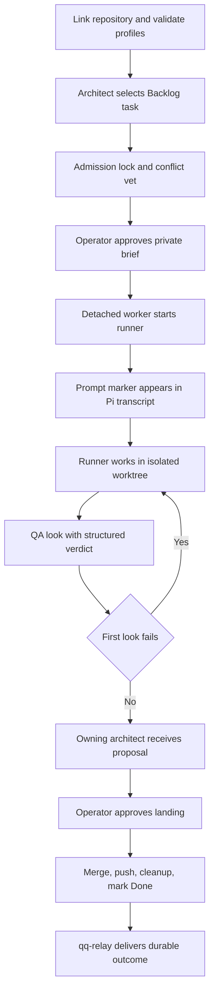

# qq OpenWiki quickstart

qq is an operator-controlled Pi/Herdr orchestration runtime with an incremental DSH path. Pi/Herdr still owns the complete Backlog-to-landing workflow. DSH now provides a daily coding workbench and can launch an approved native continuable runner through clean committed submission, but native review and landing are not yet wired. The externally owned qq-relay product provides durable agent messages and run outcomes.

## Start here

- [System topology and ownership](architecture/overview.md): processes, extension composition, external boundaries, state, and entrypoints.
- [Repository activation and execution policy](runtime/profiles-and-activation.md): `qq-methodology`, roles, profiles, prompts, context ceilings, pane state, and DSH session ownership.
- [DSH host compatibility](runtime/dsh-compatibility.md): native approved runner launch/submission, isolated QA evidence, relay receipts, and cutover blockers.
- [DSH coding workbench](runtime/dsh-console.md): daily launcher, persistent sessions, explicit model route, loopback security, SSE, and PWA limits.
- [Delegation and review lifecycle](workflow/delegation-and-review.md): `sketch`, `note`, `delegate`, `done`, QA, proposals, landing, and rollback.
- [qq-relay integration](event-plane/service.md): installed artifact resolution, consumer boundaries, source relation, and contract validation.
- [Agent messaging](event-plane/agent-messaging.md): `agent_messages`, `/agent-tasks`, presence, default/immediate delivery, and transcript receipts.
- [Herdr operator workflows](herdr/operator-workflows.md): cockpit, panes, live handoff, `operator_stage`, brief gate, and q-mode dictation.
- [Safety and context extensions](extensions/safety-and-context.md): bounded `read`, Backlog guard, transcript scrub, Grok recovery, and continue shortcut.
- [OpenWiki automation](operations/openwiki-automation.md): local scheduling, isolated publication, generated-tree ownership, and GitHub PR automation.
- [Model-visible skills](runtime/skills.md): Mermaid, OKF migration, and connector-writing instruction contracts.
- [Practical validation routing](testing/validation.md): focused commands, prerequisites, live boundaries, and known gaps.

## Complete Pi/Herdr lifecycle

*The primary engineering flow preserves explicit operator approval, runner/QA separation, clean Git boundaries, and durable outcome delivery.*

## Public concepts and APIs

| Surface | Purpose | Canonical page |
|---|---|---|
| `qq-methodology link|inspect|unlink` | Repository activation, external Backlog store, Pi settings/trust | [Profiles and activation](runtime/profiles-and-activation.md) |
| `qq-profile`, `/profile` | Durable defaults and pane- or DSH-session-local role/model/effort selection | [Profiles and activation](runtime/profiles-and-activation.md) |
| `bin/qq-dsh-workbench`, `/qq` | Persistent DSH coding session, native tools, Send, Interrupt, and live transcript snapshots | [DSH workbench](runtime/dsh-console.md) |
| `sketch`, `note`, `delegate` | Architect task and delegation tools | [Delegation and review](workflow/delegation-and-review.md) |
| `done`, isolated `qa_verdict` | Runner submission and structured QA result | [Delegation and review](workflow/delegation-and-review.md) |
| `agent_messages`, `/agent-tasks` | Session discovery and durable cross-agent delivery | [Agent messaging](event-plane/agent-messaging.md) |
| Installed qq-relay client and `bin/qq-relay` | Durable local journal and custody | [qq-relay integration](event-plane/service.md) |
| `operator_stage` | Stage, but never execute, a one-line command for the operator | [Herdr workflows](herdr/operator-workflows.md) |
| `read`, `mark_session_for_scrub`, Shift+Alt+Enter | Context and safety controls | [Safety and context](extensions/safety-and-context.md) |
| `qq-openwiki-*` | Scheduled generation and controlled publication | [OpenWiki automation](operations/openwiki-automation.md) |

## Task routing

| Change intent | Read first | Owning source / symbols | Focused tests | Minimal validation |
|---|---|---|---|---|
| Change activation, roles, models, prompts, pane state, or dashboard profile API | [Profiles and activation](runtime/profiles-and-activation.md) | `bin/qq-methodology`; `bin/lib/execution-profiles.mjs`; `bin/lib/session-context.mjs`; `extensions/execution-profiles.ts`; `bin/qq-profile` | `test-methodology.sh`, `test-execution-profiles.mjs`, `test-session-context.mjs` | Run the narrow owning Node test |
| Change pi2dsh mounting, DSH identity, native runner launch/submission, or native QA proof | [DSH compatibility](runtime/dsh-compatibility.md) | `bin/lib/dsh-run.mjs`; `startDshRun`; `bin/lib/native-launch.mjs`; `dsh-native-launch/plugin.mjs`; `bin/lib/qa-verdict.mjs` | `test-pi2dsh-compat.mjs`, `test-native-qa-proof.mjs`, `test-delegation.mjs` | `node tests/test-pi2dsh-compat.mjs .` |
| Change DSH workbench launch/model, sessions, HTTP/SSE, Send/Interrupt, security, or PWA | [DSH workbench](runtime/dsh-console.md) | `bin/qq-dsh-workbench`; `dsh-console/src/plugin.mjs`; `createConsoleHandler`; `createDshSessionBackend` | `test-dsh-console.mjs`, conditional live and real-model suites | `node tests/test-dsh-console.mjs .` |
| Change task admission, runtime-specific bootstrap/submission, Pi QA, or landing | [Delegation and review](workflow/delegation-and-review.md) | `extensions/board.ts`; `bin/lib/admission.mjs`; `bin/lib/run.mjs`; `bin/lib/dsh-run.mjs`; `bin/lib/review.mjs`; `extensions/review-flow.ts` | `test-delegation.mjs`, `test-brief-gate.mjs`, `test-review-flow.mjs` | Run the narrow owning Node test |
| Change qq-relay resolution or its consumer boundary | [qq-relay integration](event-plane/service.md) | `bin/qq-relay`; `qqRelayInstallRoot`; `qqRelayClientPath`; `RelayClient` loader | `test-qq-relay.sh`, `test-qq-relay-client.mjs` | `tests/test-qq-relay.sh` |
| Change presence or agent message delivery | [Agent messaging](event-plane/agent-messaging.md) | `extensions/agent-messages.ts`; `RelayClient`; `statePaths`; `relayAgentId` | agent-message unit and installed-relay contract suites | `tests/test-qq-relay.sh` |
| Change dashboard installed-artifact dispatch or profile contract | [Profiles and activation](runtime/profiles-and-activation.md#dashboard-boundary) | `bin/qq-dashboard`; `bin/qq-dashboard-cookies`; `qq-profile list --json` | `tests/test-dashboard.sh` | `tests/test-dashboard.sh` |
| Change Herdr layout, activation, approval, staging, or dictation | [Herdr workflows](herdr/operator-workflows.md) | `herdr/config.toml`; `ghostty/config`; `bin/qq-herdr-*`; `extensions/operator-stage.ts`; `plugins/` | operator, brief-gate, q-mode, Herdr downstream/live tests | Run the narrow contract test; live smoke only when installed |
| Change read/context/safety behavior | [Safety and context](extensions/safety-and-context.md) | `extensions/read.ts`, scrub, guards, Grok and continue extensions | matching `test-*.mjs` | Run only the changed extension's test first |
| Change generated-wiki scheduling or publication | [OpenWiki automation](operations/openwiki-automation.md) | `bin/qq-openwiki-*`; systemd units; workflow | four OpenWiki shell suites plus delegation/review boundaries | Run the owning OpenWiki shell suite |
| Add or revise a repository skill | [Model-visible skills](runtime/skills.md) | `skills/*/SKILL.md`; `composeSystemPrompt` | No focused skill suite | Review prose contract and validate in consuming runtime |
| Choose broader validation | [Validation routing](testing/validation.md) | `package.json` test chain | All applicable suites | `npm test` only when live prerequisites are available |

## Safety-critical ownership rules

1. **Backlog data is external and CLI-owned.** Do not edit managed Backlog Markdown directly.
2. **Generated `openwiki/` is automation-owned.** Delegated proposals touching it are rejected; publication alone thaws the live tree.
3. **Role changes are cross-cutting.** `qq:role-selected` affects messaging, architect tools, review behavior, and fallback status.
4. **Delivery is not acknowledgement.** Agent messages and run outcomes acknowledge only after the matching host-managed Pi or DSH entry is observable. Production runner startup likewise becomes `running` only after its exact prompt marker is visible in the Pi session JSONL.
5. **Runner, QA, and landing are separate authorities.** QA may append test-only commits; only the operator-approved land worker merges and pushes.
6. **Herdr and dashboard implementations are external.** qq owns their adapters, pins, state boundaries, and contract checks—not their full product internals.

## Durable state cautions

Important machine-local roots include `~/.config/qq/execution-profiles.json`, `~/.local/state/qq/store/`, `~/.local/state/qq/session-contexts/`, `~/.local/state/qq-relay/`, `~/.local/state/qq/agent-messages/`, `~/.local/state/qq/runs/`, `~/.local/state/qq/telemetry/`, and `~/.herdr/worktrees/`. Preserve owner-only permissions, symlink checks, and atomic-write behavior. Do not migrate, delete, or commit these roots as part of an unrelated code change.

## Backlog

- **Native DSH review and landing:** `compat/pi2dsh/README.md` proves isolated QA after native submission, but production review-state transitions, look continuity, proposal UI, landing, and host lifecycle are not wired.
- **Herdr Rust internals:** outside this repository; inspect the linked repository named by `herdr/downstream/upstream.env` when implementation detail is required. qq documents and tests only its integration contract.
- **qq-relay and dashboard internals:** owned by their linked product repositories. qq's installed-artifact and semantic branch-tip contracts are documented in [qq-relay integration](event-plane/service.md) and [profiles and activation](runtime/profiles-and-activation.md#dashboard-boundary), but local tests are not complete product test suites.
- **Hosted automation behavior:** local tests use fake OpenWiki generation and do not prove provider quality, GitHub secret wiring, PR creation, or model-visible skill execution. See [validation gaps](testing/validation.md#known-gaps).
