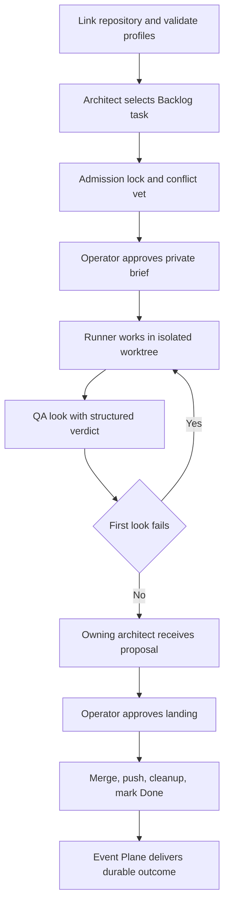

# qq OpenWiki quickstart

qq is an operator-controlled Pi and Herdr orchestration runtime. Its main workflow claims a Backlog task, asks the operator to approve a private brief, starts a runner in an isolated Git worktree, performs up to two independent QA looks, and lands only an approved, clean proposal. A machine-local Event Plane provides durable agent messages and run outcomes.

## Start here

- [System topology and ownership](architecture/overview.md): processes, extension composition, external boundaries, state, and entrypoints.
- [Repository activation and execution policy](runtime/profiles-and-activation.md): `qq-methodology`, roles, profiles, prompts, context ceilings, and dashboard wrappers.
- [Delegation and review lifecycle](workflow/delegation-and-review.md): `sketch`, `note`, `delegate`, `done`, QA, proposals, landing, and rollback.
- [Durable Event Plane](event-plane/service.md): Unix protocol, SQLite schema, delivery guards, subscriptions, recovery, retention, and admin operations.
- [Agent messaging](event-plane/agent-messaging.md): `agent_messages`, `/agent-tasks`, presence, default/immediate delivery, and transcript receipts.
- [Herdr operator workflows](herdr/operator-workflows.md): cockpit, panes, live handoff, `operator_stage`, brief gate, and q-mode dictation.
- [Safety and context extensions](extensions/safety-and-context.md): bounded `read`, Backlog guard, transcript scrub, Grok recovery, and continue shortcut.
- [OpenWiki automation](operations/openwiki-automation.md): local scheduling, isolated publication, generated-tree ownership, and GitHub PR automation.
- [Model-visible skills](runtime/skills.md): Mermaid, OKF migration, and connector-writing instruction contracts.
- [Practical validation routing](testing/validation.md): focused commands, prerequisites, live boundaries, and known gaps.

## Core lifecycle

*The primary engineering flow preserves explicit operator approval, runner/QA separation, clean Git boundaries, and durable outcome delivery.*

## Public concepts and APIs

| Surface | Purpose | Canonical page |
|---|---|---|
| `qq-methodology link|inspect|unlink` | Repository activation, external Backlog store, Pi settings/trust | [Profiles and activation](runtime/profiles-and-activation.md) |
| `qq-profile`, `/profile` | Durable defaults and pane-local role/model/effort selection | [Profiles and activation](runtime/profiles-and-activation.md) |
| `sketch`, `note`, `delegate` | Architect task and delegation tools | [Delegation and review](workflow/delegation-and-review.md) |
| `done`, isolated `qa_verdict` | Runner submission and structured QA result | [Delegation and review](workflow/delegation-and-review.md) |
| `agent_messages`, `/agent-tasks` | Session discovery and durable cross-agent delivery | [Agent messaging](event-plane/agent-messaging.md) |
| Event Plane `send`, `publish`, subscriptions and delivery operations | Durable local journal and custody | [Event Plane](event-plane/service.md) |
| `operator_stage` | Stage, but never execute, a one-line command for the operator | [Herdr workflows](herdr/operator-workflows.md) |
| `read`, `mark_session_for_scrub`, Shift+Alt+Enter | Context and safety controls | [Safety and context](extensions/safety-and-context.md) |
| `qq-openwiki-*` | Scheduled generation and controlled publication | [OpenWiki automation](operations/openwiki-automation.md) |

## Task routing

| Change intent | Read first | Owning source / symbols | Focused tests | Minimal validation |
|---|---|---|---|---|
| Change activation, roles, models, prompts, or dashboard profile API | [Profiles and activation](runtime/profiles-and-activation.md) | `bin/qq-methodology`; `bin/lib/execution-profiles.mjs`; `extensions/execution-profiles.ts`; `bin/qq-profile` | `test-methodology.sh`, `test-execution-profiles.mjs` | `bin/qq-profile list --json` plus owning test |
| Change task admission, worktree startup, QA, or landing | [Delegation and review](workflow/delegation-and-review.md) | `extensions/board.ts`; `bin/lib/admission.mjs`; `bin/lib/run.mjs`; `bin/lib/review.mjs`; `extensions/review-flow.ts` | `test-delegation.mjs`, `test-brief-gate.mjs`, `test-review-flow.mjs` | Run the narrow owning Node test |
| Change Event Plane protocol, schema, delivery, replay, or retention | [Event Plane](event-plane/service.md) | `RequestHandler`, `EventPlane.dispatch`, `Store` in `bin/lib/event_plane_service.py`; both clients | `tests/event_plane_test.py` | `tests/test-event-plane.sh` |
| Change presence or agent message delivery | [Agent messaging](event-plane/agent-messaging.md) | `extensions/agent-messages.ts`; `EventPlaneClient` | agent-message unit and live suites | Unit suite, then `test-agent-messages-live.sh` |
| Change Herdr layout, activation, approval, staging, or dictation | [Herdr workflows](herdr/operator-workflows.md) | `herdr/config.toml`; `ghostty/config`; `bin/qq-herdr-*`; `extensions/operator-stage.ts`; `plugins/` | operator, brief-gate, q-mode, Herdr downstream/live tests | Run the narrow contract test; live smoke only when installed |
| Change read/context/safety behavior | [Safety and context](extensions/safety-and-context.md) | `extensions/read.ts`, scrub, guards, Grok and continue extensions | matching `test-*.mjs` | Run only the changed extension's test first |
| Change generated-wiki scheduling or publication | [OpenWiki automation](operations/openwiki-automation.md) | `bin/qq-openwiki-*`; systemd units; workflow | four OpenWiki shell suites plus delegation/review boundaries | Run the owning OpenWiki shell suite |
| Add or revise a repository skill | [Model-visible skills](runtime/skills.md) | `skills/*/SKILL.md`; `composeSystemPrompt` | No focused skill suite | Review prose contract and validate in consuming runtime |
| Choose broader validation | [Validation routing](testing/validation.md) | `package.json` test chain | All applicable suites | `npm test` only when live prerequisites are available |

## Safety-critical ownership rules

1. **Backlog data is external and CLI-owned.** Do not edit managed Backlog Markdown directly.
2. **Generated `openwiki/` is automation-owned.** Delegated proposals touching it are rejected; publication alone thaws the live tree.
3. **Role changes are cross-cutting.** `qq:role-selected` affects messaging, architect tools, review behavior, and fallback status.
4. **Delivery is not acknowledgement.** Agent messages and run outcomes acknowledge only after the matching Pi transcript receipt is observable.
5. **Runner, QA, and landing are separate authorities.** QA may append test-only commits; only the operator-approved land worker merges and pushes.
6. **Herdr and dashboard implementations are external.** qq owns their adapters, pins, state boundaries, and contract checks—not their full product internals.

## Durable state cautions

Important machine-local roots include `~/.config/qq/execution-profiles.json`, `~/.local/state/qq/store/`, `~/.local/state/qq/event-plane/`, `~/.local/state/qq/runs/`, `~/.local/state/qq/telemetry/`, and `~/.herdr/worktrees/`. Preserve owner-only permissions, symlink checks, and atomic-write behavior. Do not migrate, delete, or commit these roots as part of an unrelated code change.

## Backlog

- **Herdr Rust internals:** outside this repository; inspect the linked repository named by `herdr/downstream/upstream.env` when implementation detail is required. qq documents and tests only its integration contract.
- **Dashboard implementation and cookie semantics:** owned by the pinned `@hypermemetic-ai/qq-dashboard` package, which is not available as local source or covered by local implementation tests. The local contract is documented in [profiles and activation](runtime/profiles-and-activation.md).
- **Hosted automation behavior:** local tests use fake OpenWiki generation and do not prove provider quality, GitHub secret wiring, PR creation, or model-visible skill execution. See [validation gaps](testing/validation.md#known-gaps).
