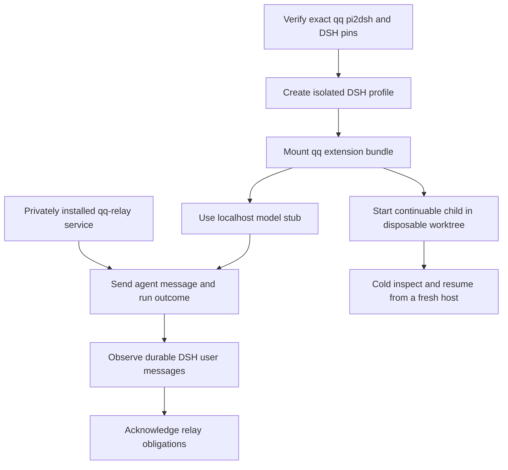

# DSH host compatibility

Consult this page when changing `extensions/`, host session identity, durable receipt detection, or the prospective DSH child-agent seam. The `compat/pi2dsh/` harness mounts qq's single `extensions/index.ts` bundle in a fresh pinned DSH `headless` profile through pi2dsh. It is evidence—not a production cutover from Pi and Herdr.

## What the proof establishes

*The live proof combines an exact pinned host, real installed relay, durable DSH entries, and a separate native-child persistence check.*

`tests/test-qq-relay.sh` owns the composed live path: it privately installs qq-relay, starts its isolated service, invokes `compat/pi2dsh/run.sh`, and proves messages to both `agents/<session-id>` and `qq/review-flow/<session-id>`. Delivery remains pending until the corresponding DSH `user/message` appears in host-managed durable entries. The model adapter points only to a deterministic localhost stub and uses no real credential.

`compat/pi2dsh/run-subagent-proof.sh` separately calls DSH's `ctx.subagents.startContinuable()` with the `spawn` provider. It proves the private bootstrap and a later follow-up survive cold persistence inspection and a fresh host process. A disposable detached worktree is inherited by the child and removed after success. This does not join native DSH children to production delegation.

## Host-specific session ownership

The child proof exercises the durable [session-context boundary](profiles-and-activation.md#dsh-per-session-ownership). A top-level DSH identity has form `session-<UUID>`; a continuable child has DSH's bare v4 UUID form and is treated as DSH-owned only when its private context record exists. Parent and child resolve independent role, profile, and run-state values even after process environment is cleared or the host restarts.

[Agent messaging](../event-plane/agent-messaging.md) and [delegation outcomes](../workflow/delegation-and-review.md) use `sessionManager.getEntries()` as the host-neutral receipt authority. Pi custom messages and pi2dsh-projected DSH user messages are both recognized; neither consumer falls back to reading a Pi session file.

## Limits and cutover blockers

The compatibility matrix still reports meaningful host differences: shortcut and session-tree handlers do not fire, shutdown is absorbed, trust is unavailable, qq's replacement `read` collides with DSH `tool-fs`, and the isolated model directory lacks qq's required normal profile routes. More importantly, production delegation still starts `herdr ... --kind pi`, runner bootstrap proof reads Pi JSONL, and session scrub is Pi-specific. Therefore do not infer production readiness from a successful mount.

The [DSH console](dsh-console.md) is a separate qq-owned operator slice over canonical DSH sessions. It does not change these cutover blockers.

## Change surface and validation

| Change | Start here | Narrow check |
|---|---|---|
| Extension imports, registration, or pi2dsh assumptions | `extensions/index.ts`, `compat/pi2dsh/pins.json`, `compat/pi2dsh/verify.mjs` | `node tests/test-pi2dsh-compat.mjs .` |
| Messaging identity or durable receipt projection | `extensions/agent-messages.ts`, `extensions/review-flow.ts`, `compat/pi2dsh/relay-probe.mjs` | `tests/test-qq-relay.sh` |
| DSH parent/child role ownership | `bin/lib/session-context.mjs`, `compat/pi2dsh/subagent-proof/plugin.mjs` | `node --experimental-strip-types tests/test-session-context.mjs .` then `compat/pi2dsh/run-subagent-proof.sh` conditionally |
| Pin or package update | `compat/pi2dsh/pins.json`, `toolchain/package.json`, integrity lock | Offline test, then the networked live proof |

The fast compatibility test is offline and checks declared pins, bundle assumptions, and forbidden architectural drift. `tests/test-qq-relay.sh` is conditional and expensive: it needs Linux, Node.js 22.19+, npm, Git, and network access. Re-run and deliberately update evidence whenever `extensions/` or its imported session-context boundary changes; `run.sh` refuses a mismatched qq pin.