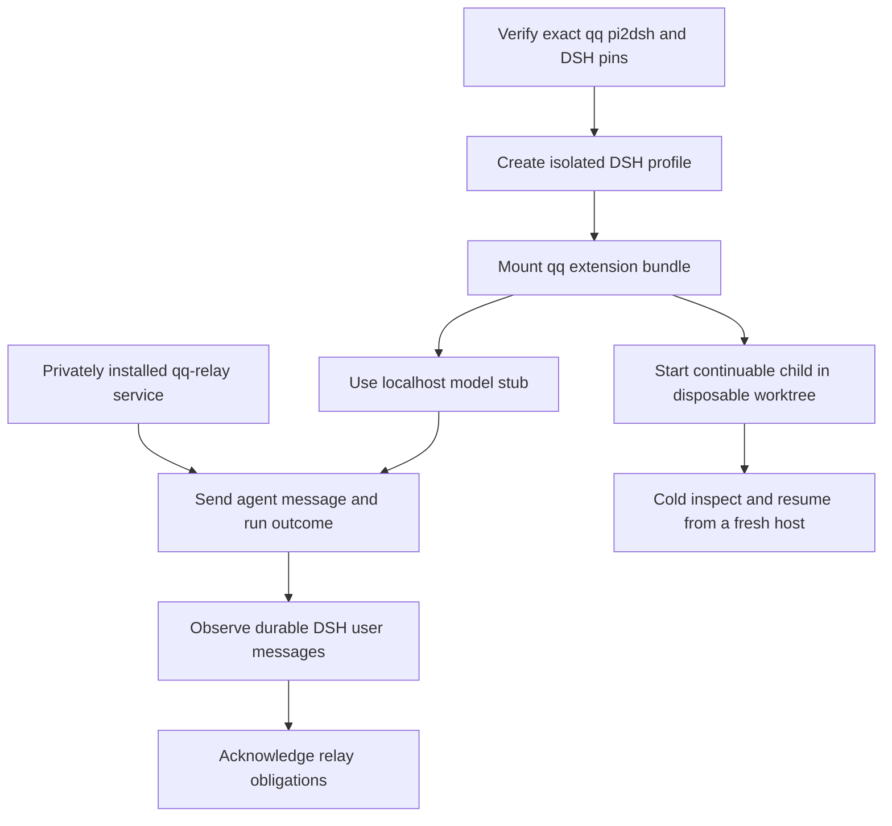

# DSH host compatibility

Consult this page when changing `extensions/`, DSH session identity, durable receipts, native runner launch/submission, or the isolated native QA proof. The `compat/pi2dsh/` harness mounts qq's `extensions/index.ts` bundle in a pinned DSH host through pi2dsh. Approved DSH delegation now has a production launch seam, but native review and landing are not wired, so this remains evidence—not an operator-runtime cutover from Pi and Herdr.

## What the proof establishes

*The live proof combines an exact pinned host, real installed relay, durable DSH entries, and a separate native-child persistence check.*

`tests/test-qq-relay.sh` owns the composed live path: it privately installs qq-relay, starts its isolated service, invokes `compat/pi2dsh/run.sh`, and proves messages to both `agents/<session-id>` and `qq/review-flow/<session-id>`. Delivery remains pending until the corresponding DSH `user/message` appears in host-managed durable entries. The model adapter points only to a deterministic localhost stub and uses no real credential.

`compat/pi2dsh/run-subagent-proof.sh` separately proves that `ctx.subagents.startContinuable()` with the `spawn` provider survives cold persistence inspection and fresh-host continuation.

## Approved native delegation boundary

When `delegate` runs in an owned DSH architect session, [delegation and review](../workflow/delegation-and-review.md) still performs admission, private-note creation, and the operator gate. It then selects the configured runner profile and dispatches the private bootstrap through the uniquely matching process-local adapter in `bin/lib/native-launch.mjs` and `dsh-native-launch/plugin.mjs`.

`startDshRun` in `bin/lib/dsh-run.mjs` reuses qq's protected Git worktree lifecycle, exclusively claims a durable bootstrap-parent context, starts one `spawn` continuable child, and exclusively claims that child as the runner. A returned child/message ID is only acceptance: `verifyDshPromptAcceptance` requires the exact parent, child, worktree, descriptor, message ID, and prompt marker in `sessionPersistence.inspect()`, flushing a live Session before declaring the handoff `running`.

Native `done` validates the exact claimed child, approved handoff, clean worktree, shared descendant commit, and runner profile. It records `runtime: dsh`, `status: submitted`, `awaiting: native-review`, and continuation identities at `look: 0`. It deliberately does **not** start QA, stop the shared host, create a proposal, or land.

The separate `native-qa-proof` profile demonstrates that an independent top-level QA Agent can inspect that unchanged submission with only `read`, `bash`, `edit`, `write`, and scope-owned `qa_verdict`. `bin/lib/qa-verdict.mjs` provides the shared strict schema and owner-only exclusive writer. This proof cold-resumes QA and verifies persisted prompt/tool/verdict evidence, but it does not consume the handoff or constitute production review-state integration.

## Host-specific session ownership

The child proof exercises the durable [session-context boundary](profiles-and-activation.md#dsh-per-session-ownership). A top-level DSH identity has form `session-<UUID>`; a continuable child has DSH's bare v4 UUID form and is treated as DSH-owned only when its private context record exists. Parent and child resolve independent role, profile, and run-state values even after process environment is cleared or the host restarts.

[Agent messaging](../event-plane/agent-messaging.md) and [delegation outcomes](../workflow/delegation-and-review.md) use `sessionManager.getEntries()` as the host-neutral receipt authority. Pi custom messages and pi2dsh-projected DSH user messages are both recognized; neither consumer falls back to reading a Pi session file.

## Limits and cutover blockers

The compatibility matrix still reports meaningful host differences: shortcut and session-tree handlers do not fire, shutdown is absorbed, trust is unavailable, qq's replacement `read` collides with DSH `tool-fs`, and the isolated model directory lacks qq's normal profile routes. Native launch and submission are now real, but production native review-state integration, look continuity, proposal UI, landing, and host lifecycle remain unwired; session scrub is also Pi-specific. Therefore do not infer operator-runtime readiness from the proofs.

The [DSH console](dsh-console.md) is a separate qq-owned operator slice over canonical DSH sessions. It does not change these cutover blockers.

## Change surface and validation

| Change | Start here | Narrow check |
|---|---|---|
| Extension imports, registration, or pi2dsh assumptions | `extensions/index.ts`, `compat/pi2dsh/pins.json`, `compat/pi2dsh/verify.mjs` | `node tests/test-pi2dsh-compat.mjs .` |
| Messaging identity or durable receipt projection | `extensions/agent-messages.ts`, `extensions/review-flow.ts`, `compat/pi2dsh/relay-probe.mjs` | `tests/test-qq-relay.sh` |
| DSH parent/child role ownership | `bin/lib/session-context.mjs`, `compat/pi2dsh/subagent-proof/plugin.mjs` | `node --experimental-strip-types tests/test-session-context.mjs .` then `compat/pi2dsh/run-subagent-proof.sh` conditionally |
| Native admission-to-submission path | `extensions/board.ts`, `bin/lib/native-launch.mjs`, `bin/lib/dsh-run.mjs`, `bin/lib/review.mjs`, `dsh-native-launch/plugin.mjs` | `node --experimental-strip-types tests/test-delegation.mjs .`; live `compat/pi2dsh/run-native-delegation-proof.sh` conditionally |
| Native QA verdict boundary | `bin/lib/qa-verdict.mjs`, `compat/pi2dsh/native-qa-proof/plugin.mjs` | `node tests/test-native-qa-proof.mjs .` |
| Pin or package update | `compat/pi2dsh/pins.json`, `toolchain/package.json`, integrity lock | Offline test, then the networked live proof |

The fast compatibility and native-QA tests are offline. `tests/test-qq-relay.sh` and `compat/pi2dsh/run-native-delegation-proof.sh` are conditional and expensive: they need Linux, Node.js 22.19+, npm, Git, and network access. Re-run and deliberately update evidence whenever `extensions/`, native adapter composition, or session-context ownership changes; the live harness refuses a mismatched qq pin.