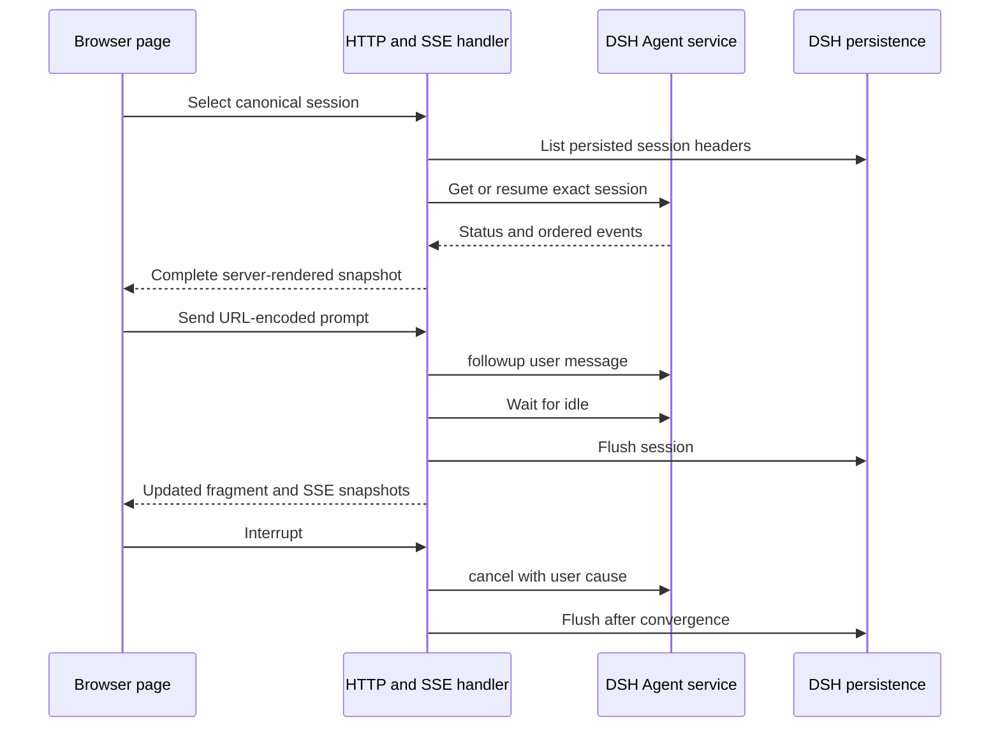

# DSH sequential web console

Consult this page for changes under `dsh-console/`. This qq-owned plugin is a small server-rendered operator surface over the exact pinned [DSH compatibility](dsh-compatibility.md) stack. It is not stock DSH Web, a client-side session implementation, or a replacement for Pi and Herdr.

## Runtime contract



*HTTP controls adapt DSH services; the console does not create a second transcript or lifecycle authority.*

`dsh-console/src/plugin.mjs` injects DSH's `agentDefaultModel`, `agents`, `sessions`, `sessionPersistence`, and `webServer` services. `createDshSessionBackend` lists only canonical `session-<UUID>` headers and live agents. It may create the configured default session or resume an existing persisted identity; an arbitrary URL cannot invent another session. Send calls `Agent.followup()`, waits for idle, and flushes the Session. Interrupt calls `Agent.cancel({ kind: "user" })`, waits when a turn was running, and flushes without synthesizing turn boundaries.

Home, laptop, and phone can sequentially select the same session and reconstruct its ordered DSH events. One-page-at-a-time use is only an operator convention: there is no presence, controller lease, observer mode, fanout coordination, browser identity, or concurrent-client rejection.

## HTTP, SSE, and browser boundary

`createConsoleHandler` serves complete pages, safe htmx fragments, an SSE stream, prompt/interrupt forms, and local assets below `/qq`. Two DOM nodes remain stable: the stream owner and session panel. htmx 2.0.10 and official SSE extension 2.2.4 are vendored and integrity-pinned; updates swap only panel children, so newly inserted Send or Interrupt forms are processed without a custom EventSource or `htmx.process()` workaround.

All event and metadata text is escaped. Data responses are `no-store`; CSP is self-only; frames are denied; mutations reject cross-origin requests and accept only bounded URL-encoded forms. `apply` refuses a web-server host other than `127.0.0.1`. The plugin adds **no authentication**, so remote use requires a separately authenticated loopback tunnel. Never weaken the bind check as a convenience.

The PWA caches only exact versioned presentation assets and a disconnected shell. Session pages, fragments, transcripts, SSE, Send, and Interrupt stay network-only. There is no offline command queue, cached transcript, background sync, or browser session store.

## Extension recipes

- **Change a session operation:** update the backend API (`read`, `list`, `prompt`, or `interrupt`), its route in `http-app.mjs`, rendering if the snapshot changes, and both deterministic and live tests. Preserve DSH as authority and flush only at the existing lifecycle boundaries.
- **Change markup or live updates:** keep `#console-stream` and `#session-panel` stable, return children for `innerHTML` swaps, escape all DSH-derived values, and rerun browser fixture assertions in `test-dsh-console.mjs`.
- **Change PWA assets:** edit canonical files under `dsh-console/assets/`, bump versioned URLs when required, update `vendor-pins.json` only for vendored libraries, and verify the cache allowlist remains presentation-only. Do not hand-edit minified vendor code.
- **Add an operator feature:** first determine whether DSH exposes the authoritative operation. Approval/question rendering, model selection, authentication, concurrent-client coordination, and offline DSH are explicitly outside this slice; they require design and live evidence rather than only a new route.

## Focused validation

```bash
node tests/test-dsh-console.mjs .
# Conditional: exact pinned DSH/Cordis host and localhost model wire
tests/test-dsh-console-live.sh
```

The fast test covers session selection, Send, live SSE states, inserted Interrupt, HTML safety, origin and form handling, sequential reconstruction, PWA allowlisting, and negative architecture checks. The live test installs the pinned toolchain, drives real Agent/Session APIs, switches two canonical sessions, interrupts, restarts the host, and verifies persistence reconstruction. Use the live suite when changing DSH service calls, profile composition, pins, cancellation, or persistence—not for CSS-only iteration. Real-browser evidence and mobile layout checks live in `compat/pi2dsh/WEB_QA.md` and are conditional when DOM/SSE/PWA behavior changes.

The console is included at the front of `npm test`; consult [validation routing](../testing/validation.md) before choosing the aggregate chain.