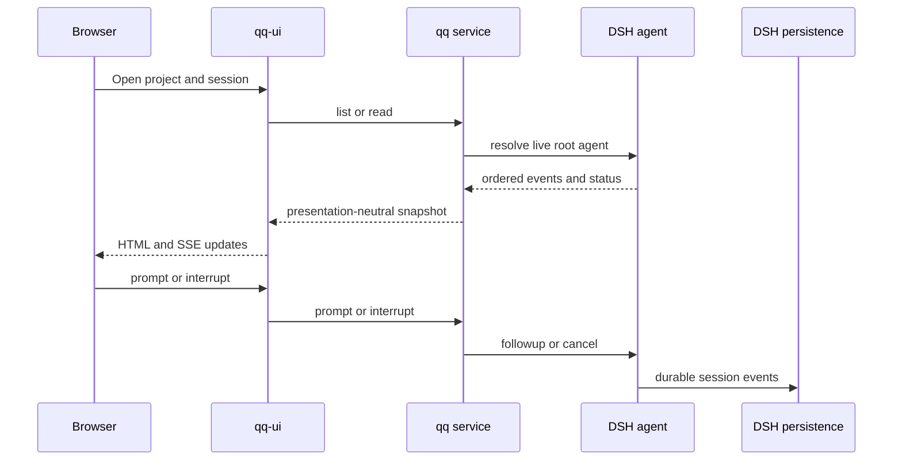

# Daily qq DSH host and console

Consult this page for `bin/qq`, `qq/`, `qq-ui/`, project/session behavior, browser controls, dictation, or host service changes. The old `dsh-console/` package and `bin/qq-dsh-workbench` no longer exist.

## Start and composition

Run `bin/qq` from the repository. It installs the locked `dsh/` toolchain when needed, creates private `DSH_HOME` (default `${XDG_STATE_HOME:-$HOME/.local/state}/qq`), prepares profile `qq`, binds available sibling plugins, and serves `http://127.0.0.1:3082/qq`. `QQ_PORT`, `QQ_DSH_PROVIDER`, `QQ_DSH_MODEL`, `QQ_DSH_REASONING_EFFORT`, and `QQ_DSH_SESSION_ID` override defaults.

The launcher accepts Qwen credentials from the supported environment/file seams and requires existing qq-models login files for `xai-auth` or `openai-codex`; it does not copy Pi credentials. [`qq-models`](model-connectors.md) owns those OAuth connectors. `bin/qq-host-activate` installs/starts `systemd/user/qq.service`, whose current production route is `xai-auth/grok-4.6`.

*The UI adapts the `qq` service; DSH remains transcript and lifecycle authority.*

## Projects and sessions

`QQ_PROJECTS_ROOT` defaults to `${HOME}/projects`. Startup cwd must be an immediate canonical child of that root. `listProjectCatalog` admits only immediate directories whose resolved paths remain under the root, preventing escaping symlinks. The browser redirects `/qq` to `/qq/project/:name` and treats projects as the outer navigation space.

Only live top-level `session-<UUID>` operator agents appear in the normal catalog; subagents are not chairs. `qq.session` stores the default resume ID. `qq/src/alias.mjs` gives live sessions short spoken numbers while preserving UUIDs as identity; `.qq-aliases.json` is private, atomic, and migrates the former relay-owned alias file once. Clear and close are refused while a session is running. Find-mode composer input is intercepted by image-finder rather than sent as a DSH turn.

## UI, security, and reload

`qq-ui` injects only `qq` and DSH `webServer`; it owns HTTP, forms, SSE, rendering, CSS, and PWA assets. It dynamically consults optional workflow, model, image-finder, and media-box services for overlays and status. The plugin refuses a non-loopback server. There is no application authentication, so remote access requires an authenticated tunnel.

Live assets are read from the linked tree with `no-store`; HMR disposes and reapplies plugin code without restarting DSH agents. UI edits need a page reload, not a service-worker version bump. Keep route/tool/listener cleanup in `ctx.effect`, keep Agent handles on DSH-owned agents, and do not dispose another plugin's runtime objects.

## Dictation

`qq-dictation` mounts `/qq/dictate` only when present. Mobile capture posts 16 kHz mono RIFF audio to the Handy recognizer; desktop Right-Alt toggles recording and Delete cancels. Binding freezes the DSH session at recording start. A successful non-empty transcription calls `qq.prompt`; cancellation, empty output, or a deleted target sends nothing. It has no offline queue.

## Change recipes and validation

- **Session or project operation:** change `qq/src/session.mjs`, then the UI route/render only if the snapshot contract changes. Run `node tests/test-qq-projects.mjs` and `node tests/test-qq-host.mjs .`.
- **Alias deck:** change `qq/src/alias.mjs`; relay consumes the service and must not grow another alias store. Run `node tests/test-qq-alias.mjs .` and `node tests/test-qq-relay-plugin.mjs .`.
- **HTTP, SSE, or browser behavior:** change `qq-ui/src/http-app.mjs`, `render.mjs`, and current assets. Run `node tests/test-qq-host.mjs .` and `node tests/test-qq-ui-fiber.mjs .`.
- **Plugin hot reload:** preserve complete inverse effects and run `tests/test-qq-host-boot.sh`; use `tests/test-qq-host-live.sh` conditionally for the exact pinned host.
- **Dictation:** change its service, recognizer, HTTP handler, and browser client together; run `node tests/test-qq-dictation.mjs`.

`tests/test-qq-host-real.sh` is credential-gated and appropriate only for real model/provider transport. CSS-only changes normally need the focused host/browser suites, not `npm test`.