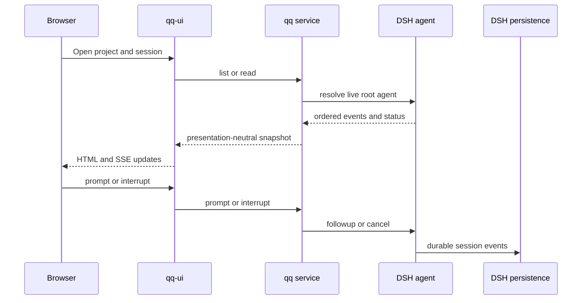
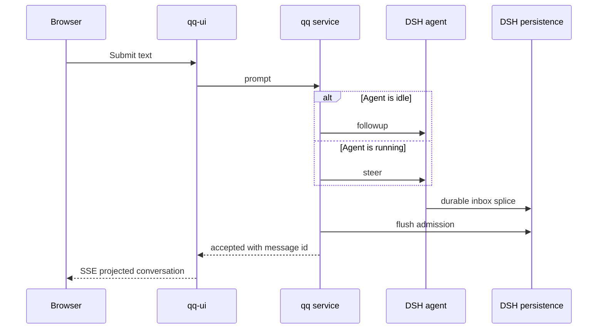

# Daily qq DSH host and console

Consult this page for `bin/qq`, `qq/`, `qq-ui/`, project/session behavior, browser controls, dictation, or host service changes. The old `dsh-console/` package and `bin/qq-dsh-workbench` no longer exist.

## Start and composition

Run `bin/qq` from the repository. It installs the locked `dsh/` toolchain when needed, creates private `DSH_HOME` (default `${XDG_STATE_HOME:-$HOME/.local/state}/qq`), prepares profile `qq`, binds available sibling plugins, and serves `http://127.0.0.1:3082/qq`. `QQ_PORT`, `QQ_DSH_PROVIDER`, `QQ_DSH_MODEL`, `QQ_DSH_REASONING_EFFORT`, and `QQ_DSH_SESSION_ID` override defaults.

The launcher accepts Qwen credentials from the supported environment/file seams and requires existing qq-models login files for `xai-auth` or `openai-codex`; it does not copy Pi credentials. [`qq-models`](model-connectors.md) owns those OAuth connectors. `bin/qq-host-activate` installs/starts `systemd/user/qq.service`, whose current production route is `xai-auth/grok-4.6`.

*The UI adapts the `qq` service; DSH remains transcript and lifecycle authority.*

## Projects and files

`QQ_PROJECTS_ROOT` defaults to `${HOME}/projects`. For that production root, `qq/host.patch.yml` registers logical projects that may group several folders; for example, `qq` groups core, relay, dictation, newspaper, dashboard, and image-finder when those folders exist. Missing optional folders are skipped. An alternate root falls back to one project per visible immediate directory. Folder names and canonical paths must be unique and remain under the root; startup cwd must equal a registered folder.

`qq/src/files.mjs#createProjectFileService` is the filesystem security boundary used by [`qq-ui`](#ui-security-and-reload). It exposes only project-relative paths, rejects symlink escapes, reads recognized UTF-8 Markdown/text/code up to 512 KiB, and opens an allowlist of binary formats up to 32 MiB. Grouped projects present a virtual folder level. The UI keeps drawer/folder locations URL-addressed, renders readable files without raw Markdown HTML, highlights recognized code, and serves admitted binaries from a bounded same-origin route.

Only live top-level `session-<UUID>` operator agents appear in a project's session catalog; subagents are not chairs. `qq.session` stores the default resume ID. `qq/src/alias.mjs` gives live sessions short spoken numbers while preserving UUIDs as identity; `.qq-aliases.json` is private, atomic, and migrates the former relay-owned alias file once. Clear and close are refused while a session is running.

## Conversation lifecycle

`qq/src/conversation.mjs#projectConversation` deterministically folds the DSH event log and current durable inbox into presentation nodes for user/context messages, streaming assistant output, tools, commands, retries, compaction, interruption, and pending prompts. It rebuilds on every `read()` and is not another transcript store. Optional DSH tool presenters enrich cards; missing or throwing presenters fall back to generic rendering. Encrypted reasoning is never a display fallback.

*Admission returns after the durable inbox splice is flushed; it does not wait for the turn to finish.*

Pending messages retain their DSH message IDs and FIFO position. `editPending` and `removePending` mutate the owning inbox, fail on a stale item, and flush persistence. Interrupt uses `keepInbox: true`, so accepted steering survives cancellation. Find-mode composer input remains an image-finder operation rather than a DSH turn.

## UI, security, and reload

`qq-ui` injects only `qq` and DSH `webServer`; it owns HTTP, forms, SSE, rendering, CSS, and PWA assets. It dynamically consults optional workflow, model, image-finder, and media-box services for overlays and status. The plugin refuses a non-loopback server. There is no application authentication, so remote access requires an authenticated tunnel.

On phone, a deliberate rightward swipe across the ordinary app surface opens the compact project drawer; controls, horizontal file panning, and vertical scrolling keep their native gestures. The drawer is swipe-open and closes through navigation/back or a leftward dismissal gesture rather than a persistent edge target. Installed PWA starts are recovered to the network-backed `/qq/` route. During transcript SSE swaps, the browser follows new output only when already near the bottom; scrolling away preserves the reading position.

Live assets are read from the linked tree with `no-store`; HMR disposes and reapplies plugin code without restarting DSH agents. UI edits need a page reload, not a service-worker version bump. Keep route/tool/listener cleanup in `ctx.effect`, keep Agent handles on DSH-owned agents, and do not dispose another plugin's runtime objects.

## Dictation

`qq-dictation` mounts `/qq/dictate` only when present. Mobile capture posts 16 kHz mono RIFF audio to the Handy recognizer. In desktop command mode, Space starts/ends capture; Right-Alt is equivalent and Delete cancels. Editable controls keep literal Space behavior.

A short opaque lease permits one owning browser capture at a time. Other clients see a foreign busy state and cannot end or cancel it; owner polling renews the lease, and abandoned leases expire. The process-global lease authority survives a Cordis fiber replacement while audio remains fiber-local, allowing the owner to resume after reload. Binding freezes the DSH session at start. A successful non-empty transcription calls `qq.prompt`; cancellation, empty output, or a deleted target sends nothing. It has no offline queue.

## Change recipes and validation

- **Project catalog or files:** change `qq/host.patch.yml`, `qq/src/session.mjs`, and `qq/src/files.mjs`; update UI routes only if the service contract changes. Preserve root containment, grouped virtual roots, byte limits, and the text/binary split. Run `node tests/test-qq-projects.mjs` and `node tests/test-qq-host.mjs .`.
- **Conversation or queue:** change `qq/src/conversation.mjs` and the admission methods in `qq/src/session.mjs`; update `qq-ui/src/render.mjs` only for presentation. Preserve DSH as authority, message identity/FIFO, and `keepInbox` interruption. Run `node tests/test-qq-conversation.mjs .`; add `node tests/test-qq-ui-transcript-scroll.mjs` when stream replacement or scrolling changes.
- **Alias deck:** change `qq/src/alias.mjs`; relay consumes the service and must not grow another alias store. Run `node tests/test-qq-alias.mjs .` and `node tests/test-qq-relay-plugin.mjs .`.
- **HTTP, SSE, PWA, or drawer:** change `qq-ui/src/http-app.mjs`, `render.mjs`, and current assets. Run `node tests/test-qq-host.mjs .`, which includes the real-browser proof; Chrome availability is required for gesture, service-worker, and installed-start behavior.
- **Plugin hot reload:** preserve complete inverse effects and run `tests/test-qq-host-boot.sh`; use `tests/test-qq-host-live.sh` conditionally for the exact pinned host.
- **Dictation:** change its service, lease-aware HTTP handler, and browser client together; preserve single-owner and HMR-resume behavior. Run `node tests/test-qq-dictation.mjs`.

`tests/test-qq-host-real.sh` is credential-gated and appropriate only for real model/provider transport. CSS-only changes normally need the focused host/browser suites, not `npm test`.