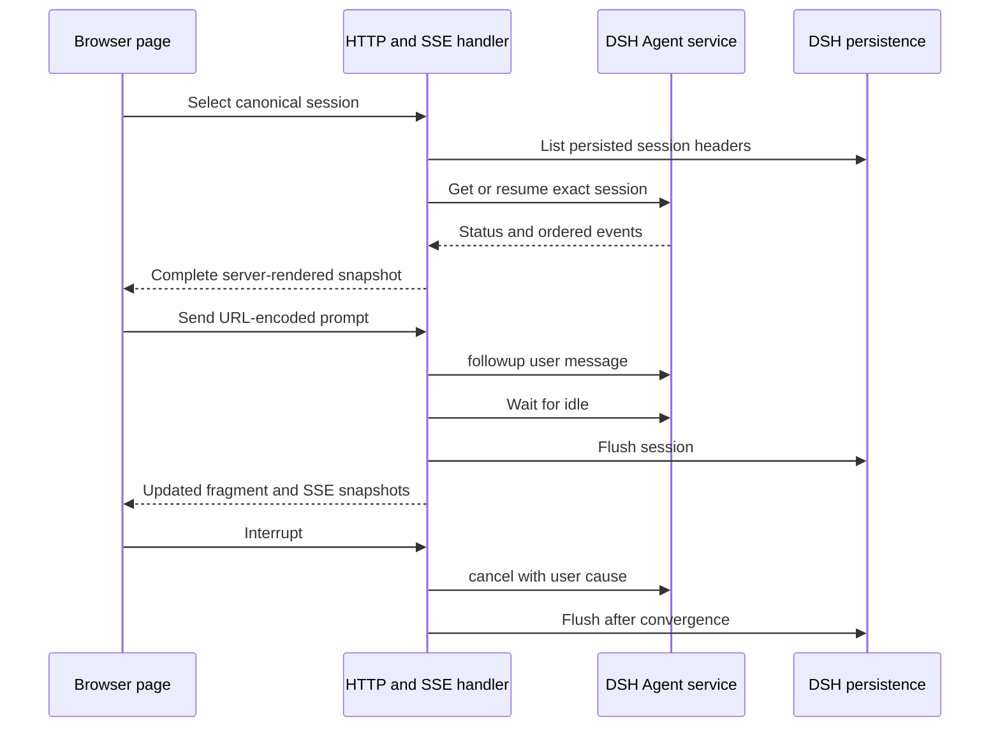

# DSH coding workbench

Consult this page for `dsh-console/` or `bin/qq-dsh-workbench` changes. The workbench is qq's daily server-rendered coding surface over the exact pinned [DSH compatibility](dsh-compatibility.md) stack. It uses DSH-native repository tools and persistence; it is not stock DSH Web, a client-side session implementation, or the [delegation and review](../workflow/delegation-and-review.md) runtime.

## Runtime contract



*HTTP controls adapt DSH services; the console does not create a second transcript or lifecycle authority.*

`dsh-console/src/plugin.mjs` injects DSH's `agents`, `sessions`, `sessionPersistence`, and `webServer` services. `createDshSessionBackend` requires an explicit configured provider/model instead of inheriting `agentDefaultModel`, lists only canonical `session-<UUID>` headers and live agents, and may create the configured default or resume persisted identity. Send calls `Agent.followup()`, waits for idle, and flushes; Interrupt calls `Agent.cancel({ kind: "user" })` and flushes after convergence without synthesizing turn boundaries.

Home, laptop, and phone can sequentially select the same session and reconstruct its ordered DSH events. One-page-at-a-time use is only an operator convention: there is no presence, controller lease, observer mode, fanout coordination, browser identity, or concurrent-client rejection.

## Daily start and persistence

Run `bin/qq-dsh-workbench` from any directory. It changes to the qq root, installs the locked toolchain on first use, prepares a persistent `qq-console` profile, and serves `http://127.0.0.1:3082/qq`. State defaults to `${XDG_STATE_HOME:-$HOME/.local/state}/qq/dsh-workbench`; `QQ_DSH_HOME` or `DSH_HOME` overrides it. `$DSH_HOME/qq-console.session` stores the default canonical session so a later launch resumes DSH's own transcript. `QQ_DSH_SESSION_ID=session-<UUID>` selects an existing identity or seeds a fresh home.

The launcher explicitly defaults to `qwen-token-plan/deepseek-v4-pro-0813` and requires `QWEN_TOKEN_PLAN_API_KEY` from the environment or owner-only `$DSH_HOME/.credentials.yaml`. It stores no key and does not read or copy Pi credentials. The selected model is declared through the supported DSH profile seam; the pinned rc.6 host cannot reproduce qq's `xai-auth/grok-4.6` OAuth refresh/proxy transport, so this is an explicit fallback rather than silent routing. The composed profile mounts DSH-native `read`, `write`, `edit`, `glob`, `grep`, and `bash`; it does not mount pi2dsh or qq orchestration.

## HTTP, SSE, and browser boundary

`createConsoleHandler` serves complete pages, safe htmx fragments, an SSE stream, prompt/interrupt forms, and local assets below `/qq`. Two DOM nodes remain stable: the stream owner and session panel. htmx 2.0.10 and official SSE extension 2.2.4 are vendored and integrity-pinned; updates swap only panel children, so newly inserted Send or Interrupt forms are processed without a custom EventSource or `htmx.process()` workaround.

All event and metadata text is escaped. Data responses are `no-store`; CSP is self-only; frames are denied; mutations reject cross-origin requests and accept only bounded URL-encoded forms. `apply` refuses a web-server host other than `127.0.0.1`. The plugin adds **no authentication**, so remote use requires a separately authenticated loopback tunnel. Never weaken the bind check as a convenience.

The PWA caches only exact versioned presentation assets and a disconnected shell. Session pages, fragments, transcripts, SSE, Send, and Interrupt stay network-only. There is no offline command queue, cached transcript, background sync, or browser session store.

## Extension recipes

- **Change a session operation:** update the backend API (`read`, `list`, `prompt`, or `interrupt`), its route in `http-app.mjs`, rendering if the snapshot changes, and both deterministic and live tests. Preserve DSH as authority and flush only at the existing lifecycle boundaries.
- **Change markup or live updates:** keep `#console-stream` and `#session-panel` stable, return children for `innerHTML` swaps, escape all DSH-derived values, and rerun browser fixture assertions in `test-dsh-console.mjs`.
- **Change PWA assets:** edit canonical files under `dsh-console/assets/`, bump versioned URLs when required, update `vendor-pins.json` only for vendored libraries, and verify the cache allowlist remains presentation-only. Do not hand-edit minified vendor code.
- **Change model selection:** update launcher defaults and profile configuration together, keep provider/model explicit, and run the credential-gated smoke when transport changes. In-page model selection remains outside this slice.
- **Add an operator feature:** first determine whether DSH exposes the authoritative operation. Approval/question rendering, authentication, concurrent-client coordination, and offline DSH require design and live evidence rather than only a new route.

## Focused validation

```bash
node tests/test-dsh-console.mjs .
# Conditional: exact pinned DSH/Cordis host and localhost model wire
tests/test-dsh-console-live.sh
# Credential-gated real request to the exact selected model
QWEN_TOKEN_PLAN_API_KEY='...' tests/test-dsh-workbench-real.sh
```

The fast test covers session selection, Send/Interrupt, SSE, HTML safety, PWA limits, explicit model configuration, and launcher architecture. The live test starts through `bin/qq-dsh-workbench`, drives real Agent/Session APIs and native coding tools, switches sessions, interrupts, restarts on the saved session, and verifies persistence reconstruction. Use it for DSH service calls, profile composition, launcher, pins, cancellation, tools, or persistence—not CSS-only iteration. The real-model smoke is credential-gated and should run only when provider/model transport changes. Browser/mobile evidence remains in `compat/pi2dsh/WEB_QA.md`.

The workbench console is included at the front of `npm test`; consult [validation routing](../testing/validation.md) before choosing the aggregate chain.