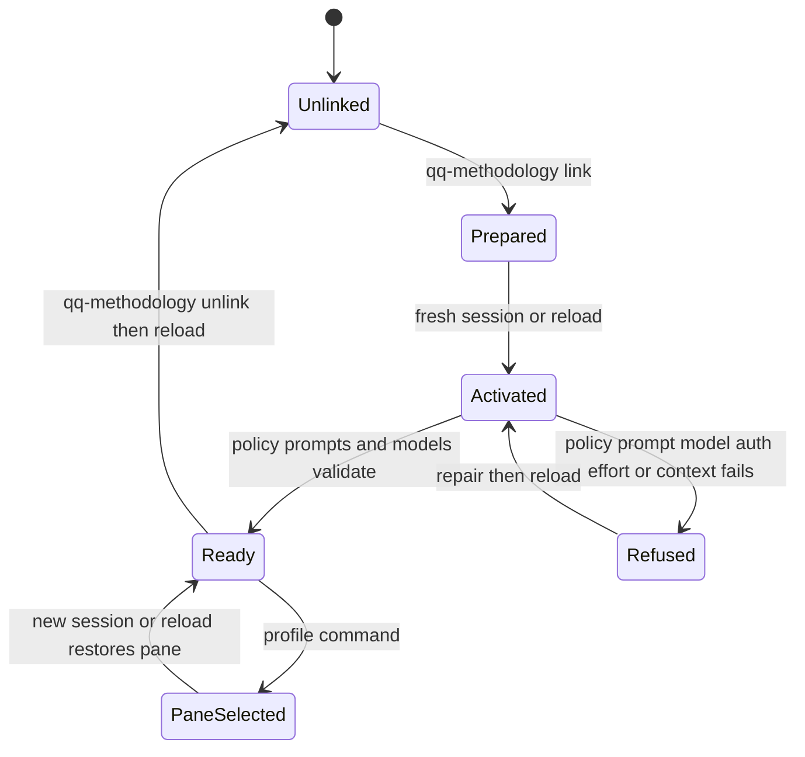

# Repository activation and execution policy

Activation answers whether qq should govern a Pi session. Profiles then bind the active role to a provider, model, and effort. Repository linkage, durable defaults, and pane-local choices are deliberately separate.

## Activation lifecycle



*Linking prepares repository state; session startup independently validates policy and either applies a profile or refuses agent input.*

### `qq-methodology link`

Run `bin/qq-methodology link` inside a Git checkout. It:

1. Resolves the repository root and common Git directory with caller-supplied Git environment overrides removed for activation checks.
2. Derives a safe project name and initializes `~/.local/state/qq/store/<project>/` as a no-Git Backlog.md store when absent.
3. Refuses a real or tracked Backlog file tree. It creates or retargets the checkout's `backlog` symlink and sets `auto_commit: false`. If the symlink is tracked and changes, it stages and commits only `backlog`.
4. Merges Pi settings `steeringMode: all`, `followUpMode: all`, and `tuiMode: fullscreen` into `~/.pi/agent/settings.json` without replacing unrelated fields.
5. Adds trust for the checkout and `~/.herdr/worktrees` to `~/.pi/agent/trust.json`.
6. Writes the single Boolean `qq.methodology=true` to the repository's **common local** Git config.

The marker therefore applies across worktrees sharing the common Git directory, but it does not travel to clones. qq's own repository tree is always activated. `QQ_AGENT_ROLE=runner|architect` also forces activation, principally for controlled worktrees.

### `inspect` and `unlink`

`bin/qq-methodology inspect` is fail-closed. It reports unlinked or invalid state for an absent, false, malformed, or repeated marker; a missing, dangling, or wrong Backlog symlink; missing store config or `auto_commit: false`; or missing required Pi settings/trust. Missing Git identity and execution policy are warnings because they block later work rather than linkage itself.

`bin/qq-methodology unlink` removes all common-local marker values. It intentionally preserves the external Backlog store, symlink, Pi settings, and trust. Start a fresh Pi session or run `/reload` after link, unlink, or repairs.

## Execution policy

The policy path is `${XDG_CONFIG_HOME:-~/.config}/qq/execution-profiles.json`. `bin/lib/execution-profiles.mjs` accepts only an owner-owned, non-symlink regular file that is not group/world writable. Writes are atomic, fsynced, and mode `0600`.

Schema `qq.execution-profiles/v1` has an exact top-level shape:

- `schema`: `qq.execution-profiles/v1`
- `contextWindowCeiling`: exactly `200000`
- `roles`: exactly `runner` and `architect`
- services: exactly `scribe`, `qa`, and `openwiki`

Each role has exactly `default` and a non-empty `profiles` map. Each profile and service binding has exactly `provider`, `model`, and `effort`. Names and bindings are bounded by the library's `NAME` and `BINDING` patterns; effort is one of `off`, `minimal`, `low`, `medium`, `high`, `xhigh`, or `max`. Provider `xai` is refused; use `xai-auth`. The reader migrates legacy `compactor` to `scribe` and adds the frozen `DEFAULT_OPENWIKI_PROFILE` when needed, then rewrites the policy.

`runner` and `architect` are the only built-in interactive role names; `runner` is the code-level startup default. Role profile names and their provider/model/effort bindings are deliberately machine-local policy, so the repository does not ship fixed role defaults. The only built-in binding is the migration fallback `openwiki = openai-codex/gpt-5.6-sol · medium`; `scribe` and `qa`, and normal role defaults, must already be present in policy. `scribe`, `qa`, and `openwiki` are fixed service bindings, not selectable session roles. Board and review consumers use the selected role, while note generation and QA/OpenWiki workers consume service bindings. See [system topology](../architecture/overview.md) and [delegation and review](../workflow/delegation-and-review.md).

## CLI defaults versus pane selection

`bin/qq-profile` provides:

```text
qq-profile list [role] [--json]
qq-profile default <role> [profile]
qq-profile context inspect
qq-profile context install
```

`default <role>` reports the durable default; supplying a profile atomically changes it. `list --json` returns schema `qq.profile-list/v1` with `roles` containing names, defaults, and profile arrays, plus `services` containing the three fixed bindings. This is a public consumer contract.

Pi's `/profile [role] [profile]` changes only the current Herdr pane. With a valid `HERDR_PANE_ID` such as `w2T:pA`, selection is stored at `${XDG_STATE_HOME:-~/.local/state}/qq/pane-profiles/<pane-id>.json` as exactly:

```json
{"version":1,"paneId":"w2T:pA","role":"runner","profile":"grok-high"}
```

The directory is owner-controlled mode `0700`; files are written through a synced exclusive `0600` temporary followed by rename, with best-effort temporary cleanup. Unsafe, missing, malformed, stale, or unknown records and read errors are ignored at startup, which falls back to the selected role's policy default. A missing/invalid pane ID disables both restore and persistence. By contrast, a write failure after `/profile` is surfaced as a UI error: the model/role has already been applied and its event emitted, but the pane selection is not durably recorded for reload. `/new` and `/reload` restore a valid pane selection. Another pane does not inherit it. A forced `QQ_AGENT_ROLE` wins at startup and neither reads nor overwrites the operator's pane mark.

Manual Pi model or thinking-level changes are allowed but status becomes `<role>:custom` unless provider, model, and effort exactly match a declared profile. `/profile` emits `qq:role-selected`, updates status, and persists only after model and effort application succeeds.

## Session startup, prompts, and refusal

On `session_start`, `extensions/execution-profiles.ts`:

1. Determines activation and validates an optional forced role.
2. Reads the policy and `prompts/roles/runner.md` and `prompts/roles/architect.md`.
3. Verifies **every** role profile and service model exists in Pi's model registry.
4. Restores a pane choice when allowed, otherwise selects the role default.
5. Calls `pi.setModel`, checks authentication, sets effort, verifies Pi retained that effort, updates status, and emits `qq:role-selected`.

Before each agent start, the extension **replaces**, rather than appends to, Pi's incoming system prompt. `composeSystemPrompt` starts with the active role prompt, reconstructs visible tool snippets and guidelines, appends optional system material and project context, exposes model-invocable skills only when `read` is selected, and records the working directory. Role changes therefore replace the role instruction on the next turn.

An unactivated repository receives no qq profile or prompt behavior, and `/profile` warns that it is not linked. In an activated repository, any unsafe/malformed policy, unreadable prompt, missing model, missing authentication, unsupported effort, or context violation sets status `runner:refused`, shows `qq startup refused`, and handles subsequent input without starting the agent. Repair the stated cause and reload; there is no permissive fallback.

## Context ceiling

`CONTEXT_WINDOW_CEILING` is 200,000 tokens and applies only to `xai-auth` bindings. Other providers retain their advertised defaults and any obsolete qq-managed `contextWindow` override is removed.

`qq-profile context inspect` runs `pi --list-models`, reports missing bindings and ceiling violations, and recommends installation. `qq-profile context install` validates that every bound model is available, then updates `${PI_CODING_AGENT_DIR:-~/.pi/agent}/models.json` atomically. For `xai-auth` models above the ceiling it sets `providers.<provider>.modelOverrides.<model>.contextWindow` to 200,000 while preserving sibling settings. Runtime startup independently refuses an `xai-auth` model whose registry context still exceeds the cap.

## Dashboard boundary

qq pins `@hypermemetic-ai/qq-dashboard` to immutable commit `3eb1309535459089930984f5fd4e31a2661d5edf` in both `package.json` and `package-lock.json`.

- `bin/qq-dashboard` executes only `node_modules/@hypermemetic-ai/qq-dashboard/bin/qq-dashboard` and exports the exact injection `QQ_PROFILE_BIN="$ROOT/bin/qq-profile"`.
- `bin/qq-dashboard-cookies` executes only the installed package's `bin/qq-dashboard-cookies`.
- The package reads profile policy only through `qq-profile list --json`; qq retains schema and validation ownership.
- Preserve `~/.local/state/qq/telemetry/` during installation and upgrades. It contains package-owned non-secret usage caches and the Qwen cookie snapshot; qq's extraction contract does not migrate or delete it.

The checked-in wrapper contract exposes `bin/qq-dashboard [--once]` and `bin/qq-dashboard-cookies refresh|status|validate`. qq guarantees exact pinned-package dispatch, argument pass-through, profile executable injection, and telemetry preservation. The meaning of `--once` and cookie operations belongs to the external package.

The dashboard implementation, tests, cookie semantics, and UI are external. Local evidence and tests cover only the pin, wrappers, profile JSON contract, and documented state boundary.

### Upgrade procedure

1. Validate a tagged dashboard release in the dashboard repository.
2. Replace the dependency with that release's exact commit in `package.json`.
3. Regenerate and commit `package-lock.json`; confirm both files resolve the same commit.
4. Install dependencies and preserve `~/.local/state/qq/telemetry/`.
5. From a checkout with **no sibling dashboard checkout**, run both installed launcher help paths and exercise `qq-profile list --json`. The wrappers must never search `PATH` or a sibling repository.

## Extension points and invariants

- To add an interactive role, update `ROLE_NAMES`, role prompts, exact policy validation, profile UI, and every role-event consumer together.
- To add a service, update `SERVICE_NAMES`, exact top-level validation and returned policy object, profile-list output, runtime model validation, migration/default logic if applicable, CLI consumers, and its composition consumer; it must not silently become a `/profile` role.
- A new provider normally needs no registry entry: valid binding syntax plus Pi model-registry support is enough. If it has provider-specific restrictions or context policy, update `validateProfile`, `GROK_PROVIDERS` (or a generalized ceiling map), `contextWindowCeilingFor`, `installContextCeiling`, runtime `validateModelContext`, CLI diagnostics, and focused policy/context tests together.
- Changing the ceiling requires `CONTEXT_WINDOW_CEILING`, exact policy validation, model override installation/removal behavior, runtime refusal text, and tests to remain consistent.
- Keep the policy and profile-list schema identifiers stable or introduce an explicit migration/version.
- Never persist a pane selection before authentication, model, effort, and context checks succeed.
- Never weaken owner, mode, symlink, exact-key, or atomic-write checks on policy and pane files.
- Linking must preserve unrelated Pi settings, authentication, model configuration, and existing Backlog data.

## Focused validation

```text
tests/test-methodology.sh
node --experimental-strip-types tests/test-execution-profiles.mjs .
bin/qq-methodology inspect
bin/qq-profile list --json
bin/qq-profile context inspect
```

`test-methodology.sh` covers clone/worktree marker scope, idempotent stores, symlink refusal and retargeting, trust/settings preservation, invalid inspection, and unlink. `test-execution-profiles.mjs` covers exact schemas, migrations, JSON output, private writes, context overrides, startup selection, role prompt replacement, events, pane isolation/restoration, forced-role precedence, and fail-closed input. The full sequential suite is `npm test`; see [practical test routing](../testing/validation.md).
