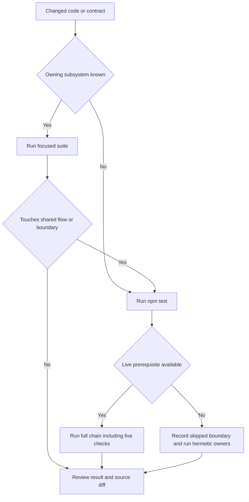

# Practical validation routing

Run the narrowest owning suite while iterating, then run `npm test` before landing broad or cross-cutting changes. The package script is a fail-fast `&&` chain: suites run sequentially in the order shown in `package.json`, and the first failure stops the run.

## Prerequisites

Baseline local requirements are Bash, Node.js with `--experimental-strip-types` support, Python 3, Git, and standard Unix tools used by the shell harnesses. Tests create temporary directories and repositories; several deliberately use `$HOME`, so it must be writable. Run from a clean repository root unless a suite says otherwise.

Additional boundaries:

- Event Plane tests need Python's standard SQLite and Unix-socket support.
- OpenWiki publication tests need Git features including `merge-tree --write-tree`, `flock`, and a filesystem where permission checks are meaningful.
- `test-herdr-live.sh` requires an executable installed Herdr binary at `$HOME/.local/lib/qq/herdr/bin/herdr`, or `QQ_HERDR_TEST_BINARY`.
- `test-herdr-downstream.sh` and `test-q-mode.sh` prefer configured landed repositories but may fetch pinned upstream refs, so they can cross the network boundary.
- No suite invokes the real hosted OpenWiki provider or the GitHub Actions job.

*Validation starts with the owning suite, expands for shared contracts, and records unavailable live boundaries rather than treating them as covered.*

## Test harness styles

- **Shell harnesses** set strict mode, create fixtures, invoke real CLIs, and assert files, modes, processes, or Git history.
- **Node harnesses** import TypeScript directly with Node's experimental type stripping and exercise extensions with mocks and temporary state. `test-brief-gate.mjs` runs as plain Node.
- **Python scenarios** in `event_plane_test.py` drive the real Event Plane service and both client implementations; `test-event-plane.sh` supplies isolated state.
- **Contract/live harnesses** inspect checked-in integration metadata and, where stated below, installed binaries or external repository revisions.

“Hermetic” here means the test isolates mutable state and does not require a hosted service. It does not imply portability to non-Unix systems.

## Route by subsystem

| Area | Focused command | What it proves | Boundary |
|---|---|---|---|
| Activation and methodology | `tests/test-methodology.sh` | Link, unlink, inspect, activation marker, external Backlog store, trust/settings preservation | Hermetic; invokes local CLIs and Git |
| Execution profiles | `node --experimental-strip-types tests/test-execution-profiles.mjs .` | Policy validation/migration, profile selection, availability and prompt composition seams | Hermetic mocks |
| Event Plane | `tests/test-event-plane.sh` | Service protocol, SQLite schema behavior, replay, obligations, retries, recovery, admin and Python/TS clients | Local live service on a temporary Unix socket; no external daemon |
| Agent messaging | `node --experimental-strip-types tests/test-agent-messages.mjs .` then `tests/test-agent-messages-live.sh` | Config/lifecycle logic, then real Event Plane presence, delivery, role ordering, and receipt behavior | First mocked; second starts a local service |
| Operator stage | `node --experimental-strip-types tests/test-operator-stage.mjs .` | Operator-stage contract and brief-gate interactions | Hermetic mocks |
| Safety/context extensions | Run `test-read.mjs`, `test-continue.mjs`, `test-session-scrub.mjs`, `test-backlog-guard.mjs`, and `test-grok-paraphrase-guard.mjs` with `node --experimental-strip-types ... .` | Focused decision trees, guards, cleanup, and recovery behavior | Hermetic mocks and temporary files |
| Delegation and review | `node --experimental-strip-types tests/test-delegation.mjs .`; `node tests/test-brief-gate.mjs .`; `node --experimental-strip-types tests/test-review-flow.mjs .` | Admission, worktree lifecycle, generated-tree modes, brief gate, QA/proposal handling, landing and rollback | Hermetic mocks plus temporary Git repositories |
| q mode | `tests/test-q-mode.sh` | Config/plugin contract, pane validation, readiness and dictation control | May use landed `qq-dictation` or fetch upstream |
| Herdr checked-in integration | `tests/test-herdr-downstream.sh` | Pinned downstream metadata, config, launcher/pane adapter, upstream Rust contract symbols | May use landed Herdr repository or fetch upstream |
| Herdr installed runtime | `tests/test-herdr-live.sh` | Smoke behavior of the installed binary | Live external binary required |
| OpenWiki automation | `tests/test-openwiki-service.sh`; `tests/test-openwiki-dispatch.sh`; `tests/test-openwiki-refresh.sh`; `tests/test-openwiki-refresh-legacy.sh` | Profile mapping, timer contract, registry/parallel routing, clone and legacy paths, locks, modes, path confinement, races, merge/push/cleanup | Hermetic temporary Git repositories and fake generator; no model/API |

Canonical behavior belongs on the subsystem pages rather than here: [profiles and activation](../runtime/profiles-and-activation.md), [Event Plane service](../event-plane/service.md), [agent messaging](../event-plane/agent-messaging.md), [delegation and review](../workflow/delegation-and-review.md), [operator workflows](../herdr/operator-workflows.md), [safety and context](../extensions/safety-and-context.md), and [OpenWiki automation](../operations/openwiki-automation.md).

## Full validation order

`npm test` currently runs:

1. methodology and Event Plane;
2. execution profiles, read, agent-messaging unit and local-live suites;
3. operator stage, continue, scrub, Backlog guard, and Grok guard;
4. delegation, brief gate, and review flow;
5. q mode, Herdr downstream contract, and installed Herdr smoke;
6. OpenWiki refresh, legacy refresh, dispatcher, and service.

Because the chain includes installed/external Herdr checks, `npm test` is not fully hermetic. If that prerequisite is unavailable, run all applicable focused commands and explicitly report that the Herdr live boundary was not validated; do not describe the partial run as a passing `npm test`.

## Practical failure routing

1. **Identify the first failing suite.** Later suites have not run.
2. **Read the harness assertion and owning source together.** Shell tests often fail at a bare `[[ ... ]]`; rerun with `bash -x tests/<name>.sh` when the failing line is unclear.
3. **Separate fixture failure from product failure.** Check required binaries, Git versions, writable `$HOME`, socket support, and optional network access before changing code.
4. **Rerun the focused owner.** For process tests, ensure a failed run did not leave an installed service or manually selected binary running; temporary harness processes have cleanup traps.
5. **Expand after a focused pass.** Changes to profile composition, Event Plane contracts, landing, filesystem modes, or operator integrations have downstream owners and warrant `npm test` when live prerequisites exist.

For OpenWiki failures specifically, the automation suites prove local control flow with a fake generator. Provider authentication, model quality, GitHub secret wiring, and real PR creation must be diagnosed from the live service or Actions run, not inferred from those tests.

## Known gaps

- The pinned `@hypermemetic-ai/qq-dashboard` implementation is external and has no local implementation tests. Local evidence covers package pinning and wrappers/contracts only; see [profiles and activation](../runtime/profiles-and-activation.md).
- Repository skill prose and the OpenWiki runtime's consumption of those skills have no focused local suite; review the contracts and validate through the consuming OpenWiki runtime. See [model-visible skills](../runtime/skills.md).
- The GitHub OpenWiki workflow has no execution test here. Checked-in tests protect local automation and preserve the workflow from local writer commits, but do not validate Actions permissions, secrets, OpenRouter, LangSmith, or `create-pull-request` behavior.
- OpenWiki tests substitute a fake generator; they do not validate hosted model output, Mermaid rendering in the installed OpenWiki package, or OKF retrieval quality.
- Herdr Rust internals and dashboard internals are not owned by this repository. Downstream symbol checks and an installed-binary smoke test are integration evidence, not complete upstream test coverage.
- Most extension tests use mocks rather than a complete interactive Pi session. The local-live messaging suite closes the Event Plane boundary, but not every UI/session lifecycle combination.

## Evidence

The authoritative aggregate is `package.json`'s `test` script. Harness inventory and assertions live under `tests/`, especially `test-event-plane.sh`, `event_plane_test.py`, `test-agent-messages-live.sh`, `test-herdr-{downstream,live}.sh`, `test-q-mode.sh`, and the four `test-openwiki-*.sh` suites.
