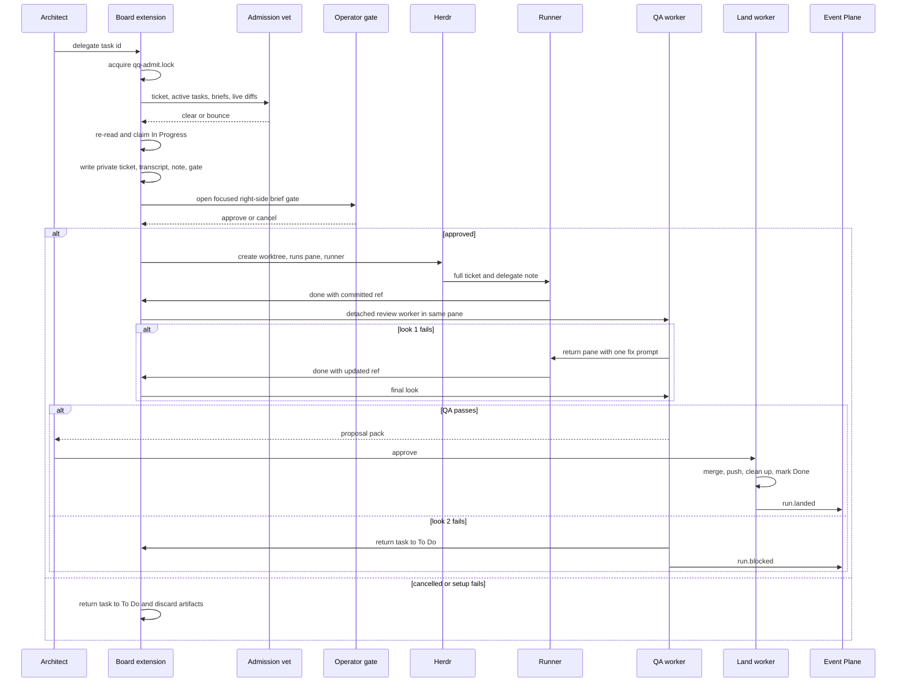
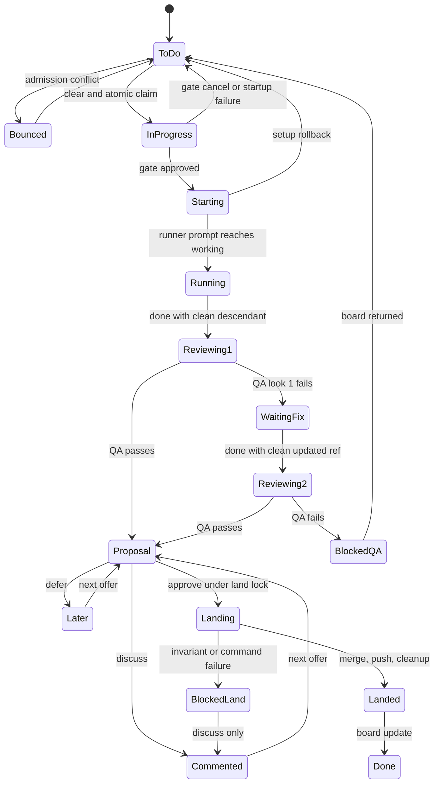

# Delegation and review lifecycle

qq turns one Backlog ticket into an isolated, operator-approved run. The architect owns admission and landing; the runner owns implementation; an isolated QA session owns the verdict and may add only test changes. For role activation, see [Profiles and activation](../runtime/profiles-and-activation.md); for pane behavior, see [Operator workflows](../herdr/operator-workflows.md); for durable outcome delivery, see [Agent messaging](../event-plane/agent-messaging.md) and [Event Plane](../event-plane/service.md).

## Entrypoints and ownership

| Entrypoint | Caller | Effect |
|---|---|---|
| `sketch({title,note?})` | architect Pi session | Creates a Backlog task; optional text is appended as a timestamped take. |
| `note({id,text})` | architect Pi session | Appends a timestamped implementation note. |
| `delegate({id})` | architect Pi session in Herdr | Serializes admission, claims a `To Do` task, creates the private brief, asks the operator, and starts a runner. |
| `done({ref})` | delegated runner with `QQ_RUN_STATE` | Validates the committed ref, advances the QA look, starts `qq-review-worker.mjs`, then stops the runner. It never merges. |
| proposal picker | owning architect session | Offers `approve`, `discuss`, or `later`; only `approve` invokes the land worker. |
| `qa_verdict(...)` | isolated QA extension only | Writes exactly one structured pass/fail result and shuts QA down. |

`extensions/board.ts` registers the architect tools. `extensions/review-flow.ts` registers `done`, polls proposals, and consumes run outcomes. `extensions/qa-result.ts` is deliberately launched with `--no-extensions`; it is not part of the global extension bundle (`source`).

## End-to-end flow



*The sequence shows the source-backed admission, approval, runner, two-look QA, landing, and outcome path.*

### 1. Admit and claim

`delegate` is architect-only. `withAdmissionLock` creates `<git-common-dir>/qq-admit.lock` with mode `0600`, waits, removes a dead-owner lock, and deletes only its own token on exit (`source`). While holding it, admission gathers:

- the incoming full task plus every `To Do` and `In Progress` task;
- each live worktree's changed and untracked paths since its merge base with main `HEAD`;
- the newest prior `note.md` or `brief.md` for the same task, if present.

The pinned scribe model receives this evidence and must return only `clear` or `bounce` with a one-line reason. A bounce stays in chat and changes no status. On clear, qq re-reads the task under the lock; only a still-`To Do` task is moved to `In Progress`. This second read prevents stale claims (`source`).

### 2. Disclose context and gate the brief

The scribe receives the raw formatted ticket, the latest operator-turn transcript (up to 100 turns), assistant tool names, and file paths read or modified. The outbound transcript includes text and tool names, not tool arguments or file contents; paths modified are not also listed as read (`source`). The generated note is non-empty and records the current QA provider, model, and effort binding.

`prepareRun` creates an owner-only state directory under `$XDG_STATE_HOME/qq/runs/<project>/<task>-<nonce>/`; the directory must be non-symlink, owned by the current UID, and inaccessible to group/other. It writes `ticket.md`, `transcript.md`, `note.md`, and `gate.md` as `0600` files. The brief-gate plugin renders `gate.md` in Glow and atomically writes only `approved` or `cancelled` to `brief-gate-decision` (`source`). Calls sharing a git common directory are also serialized in-process so two Glow turns do not overlap.

Cancellation returns the ticket to `To Do` and deletes the prepared directory. Any exception before successful start attempts the same rollback; error text is scrubbed if it contains the private generated note.

### 3. Start the isolated runner

Approval creates branch `qq/<task-slug>-<nonce>` and a worktree below `${QQ_WORKTREE_ROOT:-~/.herdr/worktrees/<project>}` at the captured main `HEAD`. Generated OpenWiki materialization is frozen. qq creates or right-splits the literal `runs` tab without focus and injects:

- `QQ_AGENT_ROLE=runner`, `QQ_AGENT_PROJECT`, and `QQ_RUN_STATE`;
- `QQ_RUN_ID` and the owning `QQ_ARCHITECT_SESSION`.

After writing a `qq.run-handoff/v1` state with `status: starting`, qq waits until the pane contains only an available shell, starts the Pi runner, and sends the full ticket and note with a bounded wait for `working`. Only then does state become `running` (`source`). Setup failure closes the owned pane, force-removes the worktree, deletes the branch and private state, and lets `delegate` return the task.

### 4. Submit and review

`done` refuses unless it runs in the handoff's real worktree, state is `running` or `waiting_fix`, fewer than two looks were used, `ref` resolves to a commit descending from `baseRef`, and the worktree is completely clean. It records the SHA, increments `look`, sets `reviewing`, starts a detached review worker, and shuts down the runner (`source`).

QA takes over the same pane only after the old Herdr agent identity disappears and the shell is free. It receives a private file-backed system prompt, a persistent QA session ID, only `read,bash,edit,write,qa_verdict`, and no normal extensions, skills, templates, or context files. Look 2 resumes look 1's QA session.

QA may commit test-only changes. Enforcement is independent of its claim:

- a passing verdict with a dirty worktree is converted to failure;
- QA may only append descendants of the reviewed ref;
- every added path must satisfy `isTestPath`; production paths, rewritten history, or an empty commit convert the verdict to failure;
- a valid test-only commit becomes the proposal ref.

Look 1 failure sets `waiting_fix`, restarts the runner in the pane, and supplies the rejection for one fix. Look 2 failure sets `blocked`, returns the task to `To Do`, emits `run.blocked`, closes the pane, and notifies the operator. There is no third look (`source`).

### 5. Propose and land

A pass writes an operator pack containing the normalized QA summary and `git diff --numstat` files, sets `proposal`, closes the run pane, and notifies the operator. Only the architect session ID stored in the handoff may see the offer. `discuss` persists a comment and steers it into that session; `later` persists deferral. A QA-failed `blocked` state is not offered, while a QA-passed landing failure is offered for discussion but not silently re-landed.

`approve` runs `qq-land-worker.mjs` under `<git-common-dir>/qq-land.lock`. Landing requires a QA-passed proposal, the original named base branch, clean main and delegated worktrees, and no changed `openwiki/` paths. It freezes main OpenWiki output, verifies a clean merge with `merge-tree`, makes a `--no-ff` merge unless already merged, discovers the branch upstream, pushes `HEAD` to it, removes the worktree, deletes the merged branch, then records `landed`. Only afterward is Backlog moved to `Done` (`source`). A failure records `blockedReason` and leaves the board `In Progress`; cleanup is not falsely reported as success.

The land worker emits idempotent `run.landed`; final QA failure emits `run.blocked`. The owning architect receiver validates producer, recipient, schema, and session, persists a custom transcript message, then acknowledges. It retries until transcript persistence is observable and blocks unsupported outcomes (`source`, `receiver`).

## State machine



*The state diagram distinguishes handoff state from Backlog state and preserves the two-look limit.*

## Artifact and invariant reference

| Artifact or invariant | Contract |
|---|---|
| `handoff.json` | Atomic `0600` `qq.run-handoff/v1`; canonical owner of paths, refs, pane, architect session, QA binding, look, status, verdict, pack, and failures. |
| `qa-look-1.json`, `qa-look-2.json` | Atomic `0600` `qq.qa-verdict/v1`; one call per QA process with pass/fail, summary, feedback, and `tests_modified`. |
| `qa-session/` | Private resumed QA context across the two looks. |
| `qq-admit.lock` | Serializes conflict evidence and claim across worktrees; stale PID cleanup is guarded. |
| `qq-land.lock` | Serializes landing with other qq publishers that share the git common directory. |
| base/ref relation | Submitted and QA-added refs descend from the captured base; runner and main worktrees must be clean at their boundaries. |
| board order | `To Do` → `In Progress` at claim; `Done` only after merge, push, and cleanup; final QA failure returns to `To Do`; landing failure remains `In Progress`. |
| ownership | Only the stored architect session gets proposal UI and durable outcomes; runners and QA never merge. |

## Failure handling

- Malformed Backlog JSON, admission output, Herdr JSON, handoff, verdict, or gate decision fails closed.
- Missing Herdr pane/workspace, unsafe private paths, detached main, unavailable model, unavailable shell, prompt timeout, or unclean refs prevents progression.
- Review infrastructure failure records `blocked` with `qa infrastructure failed`; unless QA had already passed, it returns the task to `To Do` and sends a Herdr notification.
- Landing failure preserves the worktree and branch when cleanup cannot complete, records the exact reason, and is re-offered only for discussion. If thaw/remove fails, OpenWiki protection is restored or an aggregate failure exposes both faults.
- Outcome delivery is durable but depends on a running Event Plane; send failure makes the worker fail rather than pretending the architect was informed.

## Validation

Run focused checks from the repository root:

```bash
node tests/test-delegation.mjs "$PWD"
node tests/test-review-flow.mjs "$PWD"
node tests/test-brief-gate.mjs "$PWD"
```

These cover role refusal, transcript disclosure, admission locking/evidence and bounce paths, private artifacts, gate approval/cancellation, startup rollback, `done` ancestry/cleanliness, same-pane takeover, two-look continuity, test-only QA commits, proposal ownership/actions, landing order/locks/failures, board transitions, generated-path refusal, and run-event receipts. Use `npm test` for the sequential repository suite; see [Validation](../testing/validation.md).

## Source anchors

- Architect tools and orchestration: `extensions/board.ts`
- Runner submission, proposal UI, and outcome receiver: `extensions/review-flow.ts`
- Admission lock and evidence: `bin/lib/admission.mjs`
- Private artifacts, gate, worktree, and runner start: `bin/lib/run.mjs`
- QA and landing: `bin/lib/review.mjs`
- Workers and outcomes: `bin/qq-review-worker.mjs`, `bin/qq-land-worker.mjs`, `bin/lib/run-events.mjs`
- Tests: `tests/test-delegation.mjs`, `tests/test-review-flow.mjs`, `tests/test-brief-gate.mjs`
