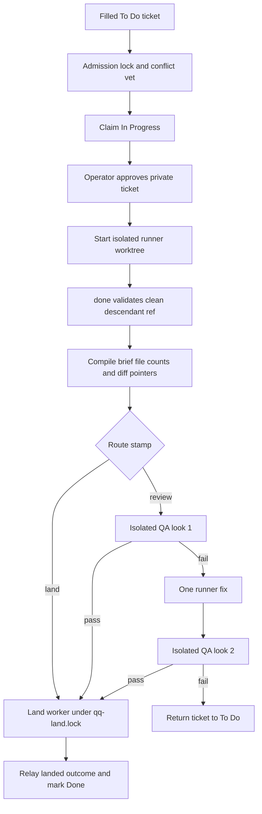
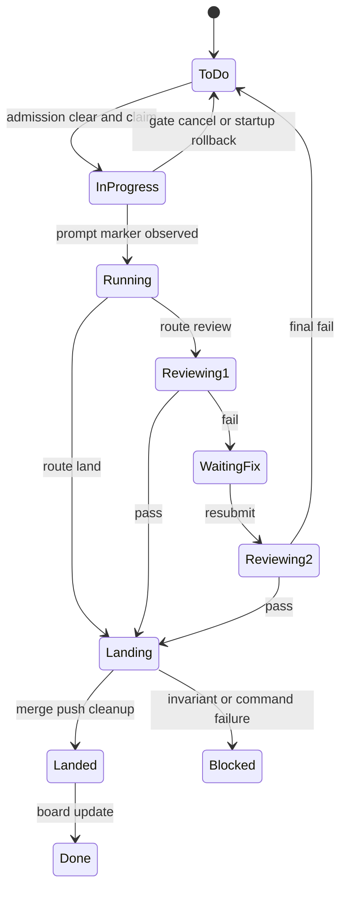

# Legacy delegation, review, and landing

This page covers the Pi/Herdr Backlog workflow, not the daily [DSH architect and iterate workflows](dsh-workflows.md). It turns one filled Backlog ticket into an operator-approved isolated run, then compiles a completion packet and routes it either directly to landing or through isolated QA. The operator approves the private work order before the runner starts; a QA pass now lands automatically rather than waiting for a second proposal approval.

## Public tools and owners

| Surface | Owner | Contract |
|---|---|---|
| `sketch`, `note`, `delegate` | `extensions/board.ts` | Architect-only task creation/notes and serialized admission. The ticket itself is the runner work order. |
| `done({ref})` | `extensions/review-flow.ts` | Runner-only clean descendant submission; compiles and route-stamps the packet. |
| `qa_verdict` | isolated `extensions/qa-result.ts` | Exactly one structured pass/fail verdict; unavailable in the global extension bundle. |
| land worker | `bin/qq-land-worker.mjs` | Only process allowed to merge, push, clean the worktree, and mark the ticket Done. |

## Runtime flow



*Every path preserves a clean Git boundary; only routing decides whether QA runs before the land worker.*

## Admission and startup invariants

`withAdmissionLock` serializes evidence and claims through `<git-common-dir>/qq-admit.lock`. The vet sees the incoming ticket, active To Do/In Progress tickets, live worktree diffs, and the newest prior ticket note. It returns `clear` or `bounce`; on clear, qq re-reads the task under the lock and moves only a still-To Do ticket to In Progress.

`prepareRun` writes private owner-only ticket, transcript, and gate artifacts below `$XDG_STATE_HOME/qq/runs/`. The ticket is the work order; the former generated scribe brief is gone. The Glow gate writes only `approved` or `cancelled`. Cancellation and pre-start failures return the ticket to To Do and discard private artifacts.

The Pi/Herdr start worker creates `qq/<task-slug>-<nonce>` below the configured protected worktree root, launches the runner in the Herdr `runs` pane, and considers it running only after the exact prompt marker appears in the Pi transcript. Startup rollback removes owned Git/pane state and stores a sanitized private failure outbox until the installed [Pi relay](../event-plane/service.md#legacy-installed-relay) delivers `run.bootstrap-failed`.

## Packet routing

On the first valid `done`, `compilePacket` reads the original ticket, file counts, and zero-context diff pointers into `qq.route-packet/v1`. `routePacket` asks the configured scribe model to return exactly `review` or `land`; parse/model failure falls back to `stampFromEvidence`, which defaults to review and permits land only for clearly presentation-only evidence.

Control paths or words involving session, store, identity, review, land, run, handoff, or relay route to QA even when the diff is small. The land fast path is intended for paint—copy, comments, color, or stylesheet-only changes—not a line-count threshold. If uncertain, route review.

A route-stamped land invokes the same locked land worker as a QA pass. It is not a merge from the runner process. The packet is retained in handoff/outcome data so the architect can sniff what landed.

## QA and automatic landing

A review stamp starts `qq-review-worker.mjs`. QA owns a private persistent session, receives only `read,bash,edit,write,qa_verdict`, and has no normal extensions, skills, templates, or context files. It may append committed test-only changes; dirty output, rewritten ancestry, empty commits, or production paths convert a claimed pass to failure.

Look 1 failure returns the pane to the runner with one fix prompt. Look 2 failure blocks the run, returns the task to To Do, emits `run.blocked`, and closes the pane. A pass records proposal state only as an internal land-ready invariant; `finishReview` immediately calls the land worker. There is no operator approve/later proposal picker in the current path.

Landing requires the named base branch, clean main and delegated worktrees, a mergeable descendant, no changed `openwiki/` paths, and a configured upstream. Under `qq-land.lock` it freezes OpenWiki output, merges with `--no-ff` when needed, pushes, removes worktree/branch, records `landed`, and only then marks Backlog Done. Failure records `blocked` and preserves evidence rather than claiming success.

## State summary



*The only operator gate is before execution; route-land and QA-pass both converge on the same land worker.*

## Change recipes and validation

- **Admission/ticket evidence:** start at `extensions/board.ts` and `bin/lib/admission.mjs`; preserve lock/re-read/rollback behavior.
- **Routing:** update `compilePacket`, `routePacket`, fallback patterns, `prompts/services/route.md`, and review-flow tests together. Test model failure and ambiguous evidence defaulting to review.
- **QA:** preserve runner/QA separation, two-look maximum, session continuity, and test-only commit enforcement.
- **Landing:** preserve lock, clean checks, OpenWiki exclusion, push-before-Done ordering, and idempotent outcome emission.
- **Installed outcome delivery:** use the consumer-facing relay suite; unit-importing review flow alone does not prove `client.mjs` resolution.

```bash
# Creates the private installed-relay fixture and runs delegation/review consumers
tests/test-qq-relay.sh

# Additional isolated verdict helper
node tests/test-native-qa-proof.mjs .
```

The relay suite is networked. When a valid `QQ_RELAY_INSTALL_ROOT` fixture already exists, the narrower delegation, review-flow, and brief-gate tests may be run directly as described in [validation routing](../testing/validation.md).