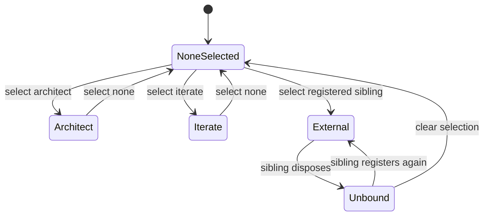

# DSH workflows and task pile

`qq-workflows` is the daily host's selectable methodology layer. A new root session has no workflow until `/workflows architect`, `/workflows iterate`, or `/workflows find`; `/workflows none` detaches it. Selection is private, atomic, restart-safe, and keyed by DSH session. Subagents cannot become workflow chairs.

This is separate from the legacy [Backlog delegation lifecycle](delegation-and-review.md): there is no `run_workflow` dispatcher and no port of Pi `delegate`, QA, or landing.

## Registry and lifecycle

The `qq-workflows` service exposes `workflows.register(spec)` so sibling plugins can join the selector without being imported. A spec supplies `name`, `candidate`, idempotent attach/detach, and settings list/write functions. Reserved or duplicate names fail. The returned disposer detaches live behavior but preserves the durable selection, allowing hot reload or a temporarily absent sibling to reattach later.



*Selection persists independently of a workflow plugin's current fiber.*

Architect and iterate optionally hang namespaced labels through the [DSH relay](../event-plane/service.md#dsh-in-process-relay). Their plugin owns attach/detach and label cleanup. Role bindings live in `${XDG_CONFIG_HOME:-$HOME/.config}/qq/workflows-settings.json`; `/workflows settings` reads or updates only the selected workflow's roles.

## Architect

Architect keeps one live concern in a session-keyed notebook. A post-turn clerk uses the configured `scribe` role to append short notes cited to DSH sequence numbers; `notes_expand` returns to the authoritative DSH log. Fold runs after clerk and applies at the next request, replacing old turn ranges with frozen cited stubs. `compact-basic` auto-compaction stays disabled so the workflow, not a generic summary, owns this context lifecycle.

`invoke` compiles a packet off-session, starts a fresh DSH child, and returns the child's final answer through qq-relay; it refuses when relay is absent. Post-turn leftovers may be banked in `qq-tasks` or offered for handoff/bank/ignore without blocking the talking turn.

## Iterate

Iterate is a separate chair. Intake records directive, theory, nits, and praise in an append-only journal. Nothing reaches implementation until the operator says go. One fresh hands child receives this breath's nits plus selected wiki nodes and frontend-design tools. An independent one-shot reviewer receives screenshots and patch-surface evidence. Pass closes the nits and files contributed wiki nodes; failure returns as mail and waits—there is no silent retry or unattended loop.

A go requires qq-relay and a bound reviewer role. Hands, desk, and reviewer are distinct authorities; do not put pixel tools on the desk or reuse the architect session.

## Task pile

`qq-tasks` is an optional service, not Backlog.md. It stores private markdown outside project Git and exposes `create`, `read`, `list`, `edit`, `append`, `archive`, and model-backed `rundown`. IDs are globally unique across configured projects, use a fixed spoken-number deck before numeric overflow, and remain warm briefly after archive before reuse. Editing cannot change ID or project.

Architect registers the `rundown` tool only when the tasks service is present. Missing tasks must remove/refuse task features without preventing architect or the host from loading.

## Change recipes

- **Add an internal workflow:** define its candidate, durable state, reversible attach/detach, role settings, tools, and labels in `qq-workflows`; update selection tests and boot composition.
- **Register a sibling workflow:** call `service.workflows.register(spec)` from the sibling's `ctx.effect`; dispose the returned handle. Do not edit the wrapper's reserved built-ins or import the sibling into `qq-workflows`.
- **Change fold/clerk behavior:** preserve turn boundaries, post-turn ordering, DSH log authority, and the no-mid-turn rule. Run workflow and session-prompt suites.
- **Change iterate:** test collect-without-go, go, pass/fail evidence, relay absence, role absence, and fresh-child isolation.
- **Change task persistence or IDs:** preserve private atomic files, cross-project uniqueness, warm/archive behavior, and service-only access.

```bash
node tests/test-qq-workflows-plugin.mjs .
node tests/test-session-prompt.mjs
tests/test-qq-workflows-boot.sh
node tests/test-qq-tasks.mjs .
tests/test-qq-tasks-boot.sh
```

Use the plugin unit suite first. Boot suites are necessary when bundle discovery, absence tolerance, public service registration, or host wiring changes.