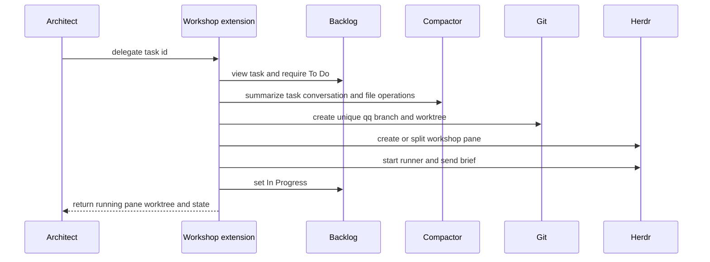

# Workshop Delegation

The workshop extension turns an architect's board item into an isolated asynchronous runner. It depends on [execution profiles](../agent-runtime/execution-profiles.md) for role, compactor, and QA bindings; starts a runner that participates in [agent messaging](../agent-messaging/extension.md); and relies on the [Backlog guard](../agent-runtime/session-safety.md) to keep board Markdown CLI-managed.

## Tools

- `sketch(title, note?)` creates one Backlog task.
- `note(id, text)` appends task notes.
- `delegate(id)` requires an architect role and a task in `To Do`; it generates a compact outbound brief, starts the workshop, moves the task to `In Progress`, and returns without waiting for implementation.

## Delegation flow

*Delegation provisions a runner and returns; merging and completion are outside this implemented flow.*

`makeBrief` serializes current conversation context and records files read versus modified, then invokes the policy's compactor with no cache retention. `spawnWorkshop` requires a named base branch and `HERDR_WORKSPACE_ID`, creates branch `qq/<task>-<nonce>`, writes private `brief.md` and `qq.workshop-handoff/v1` state, reuses or creates a no-focus `workshop` tab, and starts a Pi runner with `QQ_AGENT_ROLE=runner`, workshop identity, and architect session metadata. The runner is prompted to implement, commit, and call `done`; this repository does not yet track that completion/merge implementation.

If pane or runner setup fails, the function attempts to close its pane, force-remove its worktree, delete its branch, and remove private handoff state. If the runner starts but the board update fails, `delegate` reports a partial result rather than pretending nothing started.

## Change and validation

Changes to handoff schema must update writer, `readHandoff`, runner consumers when present, and tests. Changes to delegation must preserve To Do gating, unique branch/worktree isolation, private state, no-focus Herdr startup, asynchronous return, and scoped cleanup. Run `node --experimental-strip-types tests/test-workshop.mjs .`; also run profile or messaging tests when changing those boundaries. Full `npm test` is conditional on cross-extension wiring.