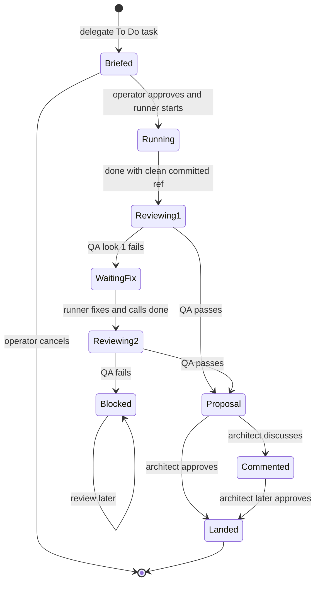

# Workshop Delegation and Review

This workflow turns an architect's Backlog item into isolated runner work, independent QA, and an operator-approved merge. It depends on [execution profiles](../agent-runtime/execution-profiles.md) for compactor and QA bindings, uses [agent messaging](../agent-messaging/extension.md) presence to find the architect on final QA failure, and follows the [Backlog safety boundary](../agent-runtime/session-safety.md).

## Agent-facing tools

| Tool | Role | Contract |
|---|---|---|
| `sketch(title, note?)` | architect | Creates one Backlog task. |
| `note(id, text)` | architect | Appends task notes through the Backlog CLI. |
| `delegate(id)` | architect | Compacts a `To Do` task into a brief, asks the operator to approve that exact brief, then starts an isolated runner. |
| `done(ref)` | delegated runner | Requires a clean worktree and committed descendant of the delegated base; submits at most twice and stops the runner. |
| `review()` | architect with UI | Reopens waiting proposals, blocked results, and discussed reviews. |
| `qa_verdict(...)` | isolated QA service only | Atomically records exactly one structured pass/fail verdict. |

## Lifecycle



*The handoff file is the durable state machine; there is one repair cycle and no third QA look.*

### Delegation

`makeBrief` compacts task and conversation context, including files read versus modified, with no cache retention. `prepareWorkshop` writes private `brief.md`; `awaitBriefGate` links/enables `plugins/brief-gate`, opens a focused Herdr overlay, renders the exact brief with Glow, and accepts only `approved` or `cancelled` from an owned private decision file. Cancellation removes prepared state without moving the task.

After approval, `delegate` moves the task to `In Progress`. `spawnWorkshop` creates `qq/<task>-<nonce>` and a private worktree, creates or splits the no-focus `workshop` tab, waits until the pane contains only an available shell, writes `qq.workshop-handoff/v1`, and starts a Pi runner. Startup failure removes attempt-owned pane, worktree, branch, state, and restores the task to `To Do`.

### QA and operator review

`done` pins the submitted commit and starts `bin/qq-review-worker.mjs`. `conductReview` takes over the same workshop pane with the policy-pinned QA model, a private file-backed system prompt, only the declared tools, and a persistent QA session shared by both looks. QA may add committed test-only changes; dirty output, rewritten ancestry, empty commits, or production-file changes turn a pass into failure.

A first failure returns the pane to the runner with feedback. A pass closes the pane and creates an operator pack (summary plus diff numstat). A second failure becomes `blocked`, closes the pane, and also steers the architect when its presence can be resolved. Architect polling and `review()` offer `approve`, `discuss`, or `later`; discussion moves the task to `To Do`, records the comment, and steers the current architect session without discarding the reviewed ref.

Approval runs `bin/qq-land-worker.mjs` under a common-Git-directory `flock`. `landHandoff` requires the original base branch, a clean delegated worktree, and a clean `merge-tree` check; it then performs a non-fast-forward merge, removes worktree and branch, marks the handoff `landed`, and moves the task to `Done`. Failures persist as `blocked`.

## Change and validation

Keep handoff schema/state transitions synchronized across both extensions, both libraries, workers, and tests. Preserve exact-brief approval, private mode-0600 artifacts, named-base and clean-worktree checks, two-look limit, QA test-only ownership, same-pane handoff, explicit architect approval, and serialized landing.

Run the narrow checks separately:

```bash
node --experimental-strip-types tests/test-workshop.mjs .
node tests/test-brief-gate.mjs .
node --experimental-strip-types tests/test-review-flow.mjs .
```

Run profile tests when compactor/QA bindings change, messaging tests when architect lookup changes, and `npm test` only for composition or cross-area changes.
