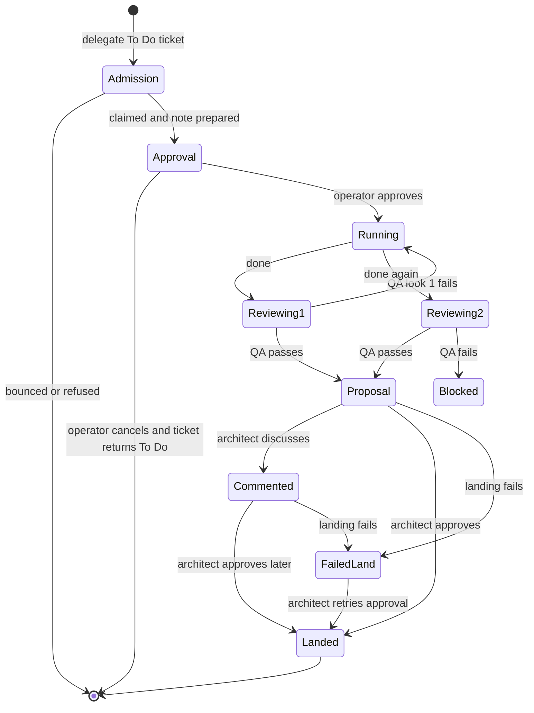

# Board Delegation and Run Review

This workflow turns an architect's Backlog ticket into isolated runner work, independent QA, and an operator-approved merge. It uses the `scribe` and `qa` [execution-profile bindings](../agent-runtime/execution-profiles.md), [agent messaging](../agent-messaging/extension.md) to steer the architect after final failure, and the [Backlog write boundary](../agent-runtime/session-safety.md).

## Agent-facing tools

| Tool | Role | Contract |
|---|---|---|
| `sketch(title, note?)`, `note(id, text)` | architect | Create or append to a Backlog ticket through the CLI. |
| `delegate(id)` | architect | Vet one `To Do` ticket, claim it, generate a short note, obtain operator approval, and start an isolated run. |
| `done(ref)` | delegated runner | Submit a clean committed descendant of the delegated base; at most two submissions. |
| `review()` | architect with UI | Reopen proposals, blocked results, comments, and retryable failed landings. |
| `qa_verdict(...)` | isolated QA only | Atomically record one structured pass/fail verdict. |

## Lifecycle



*The private `qq.run-handoff/v1` file is durable workflow state; QA allows one repair cycle, while a QA-passed ref survives a failed landing for retry.*

## Delegation

`admitDelegate` runs under the common-Git-directory `qq-admit.lock`. It supplies the low-reasoning, no-cache `scribe` model with the incoming full ticket, every `To Do` and `In Progress` ticket, live worktree file diffs against main, and any prior note/brief for the ticket. The admission vet returns only `clear` or `bounce`; a clear decision rechecks the ticket and atomically claims it as `In Progress`. This serialization prevents concurrent delegates from admitting overlapping work against stale evidence.

`makeNote` then gives the scribe the ticket, recent architect transcript, and observed read/modified paths. `prepareRun` writes private mode-0600 `ticket.md`, `transcript.md`, `note.md`, and combined `gate.md`. `awaitBriefGate` shows the literal ticket and delegate note in an operator-focused Herdr plugin pane. Cancellation returns the ticket to `To Do` and deletes prepared state.

After approval, `startRun` creates `qq/<task>-<nonce>`, a private worktree, and a no-focus pane in the literal `runs` tab. It writes `handoff.json` under `$XDG_STATE_HOME/qq/runs/<project>/...`, waits for an available shell, starts the runner, and sends the full ticket plus note. Startup failure removes attempt-owned pane, worktree, branch, state, and restores the ticket.

## QA and landing

`done` reads `QQ_RUN_STATE`, pins the submitted commit, and starts `bin/qq-review-worker.mjs`. `conductReview` takes over the same pane with the policy-pinned QA model, a private system prompt, and a persistent QA session across both looks. QA can commit tests only; dirty output, rewritten ancestry, empty commits, or production-file edits invalidate a pass. Before reusing the pane, review waits for Herdr's agent identity to disappear and then for a free shell.

Only a state carrying `qq.qa-verdict/v1` with `verdict: pass` can offer `approve`. Infrastructure/QA blocks offer only `discuss` or `later`. Approval executes `landHandoff` under `qq-land.lock`: the main checkout must still be on the original base branch and completely clean, the delegated worktree must be clean, and `merge-tree` must succeed before a non-fast-forward merge. A failed land remains `blocked` with its QA pass and ref intact; `review()` can retry it. Polling suppresses the unchanged failure but surfaces a changed failure reason.

## Change and validation

Keep the run schema synchronized across board, run, review, workers, and tests. Preserve admission serialization, literal ticket/note approval, private files, exact `runs` names, two-look/test-only QA, identity-drop-before-pane-reuse, QA-pass-only approval, clean-main checks, and the shared landing lock used by [OpenWiki automation](../operations/runbook.md#openwiki-automation).

```bash
node --experimental-strip-types tests/test-delegation.mjs .
node tests/test-brief-gate.mjs .
node --experimental-strip-types tests/test-review-flow.mjs .
```

Also run profile tests for `scribe`/QA binding changes, live messaging tests for architect steering, and `npm test` only for composition or cross-area changes.
