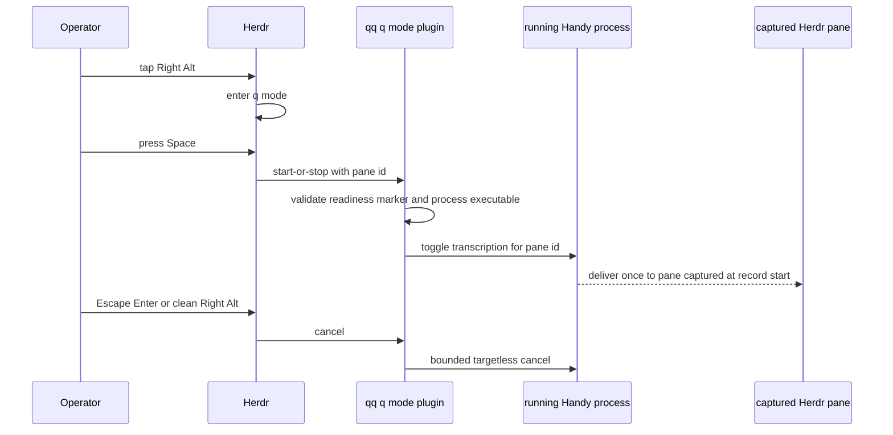

# Herdr, q mode, and dashboard operations

## Ownership boundary

QQ owns Herdr configuration, plugin integration, activation, smoke testing, pane policy, Ghostty/systemd launch surfaces, and dashboard wrappers. Herdr's Rust source, build, installation, and product tests belong to `/home/qqp/projects/herdr`; QQ intentionally has no `qq-herdr-build` or `qq-herdr-upgrade` wrapper.

`herdr/downstream/upstream.env` records the upstream `master` ref, the landed repository, and `HERDR_OPERATOR_INPUT_COMMIT`. That commit is a minimum capability floor for operator input, not a pinned product release. `tests/test-herdr-downstream.sh` uses the landed checkout when available and otherwise fetches the branch to prove that the floor is an ancestor and required Rust symbols exist.

The private `@hypermemetic-ai/qq-dashboard` implementation is also outside this checkout. QQ owns only its exact dependency pin, launchers, `QQ_PROFILE_BIN` contract, and preserved state boundary.

## q mode and dictation flow



*Q mode binds dictation to the pane selected at recording start and never cold-starts Handy.*

`herdr/config.toml` gives q mode a clean Right Alt toggle. While active, unconfigured input is consumed: arrows move among panes/workspaces, Ctrl+arrows move tabs, `1..9` focuses visible agents, `?` shows help, Space invokes `qq.q-mode.start-or-stop`, and Delete invokes `qq.q-mode.cancel`. Escape and Enter exit and run the configured cancel action; neither submits dictation. The configuration also keeps 80-column preferred panes and disables pane borders.

`plugins/q-mode/q-mode.sh` is the adapter to qq-dictation:

- `start-or-stop` requires an exact public `HERDR_PANE_ID` and forwards `handy --toggle-transcription --herdr-pane <id>`.
- Before forwarding, it requires a non-symlink readiness marker under `XDG_RUNTIME_DIR`, an allowed `ready`, `prepared`, or `armed` state, a live PID, and `/proc/<pid>/exe` resolving to the installed Handy executable.
- `cancel` is targetless and idempotent. Missing readiness means there is nothing to cancel; it must not launch Handy.
- Every control is bounded by `timeout`. Success proves forwarding to the existing instance, not acceptance or completion of dictation.
- `plugins/q-mode/qq-dictation.env` records the upstream branch, landed checkout, and pane-targeting feature floor. The installed `qq-dictation-commit` file is provenance only, not a runtime pin.

The retained Left-Control bridge and remote/laptop workflows are outside this integration and must not be retired as part of q mode work.

## Coordinated activation

Herdr and qq-dictation must be built and installed by their owning repositories. Then use:

```text
qq-q-mode-uat preflight
qq-herdr-activate
qq-q-mode-uat post-activate
```

`bin/qq-herdr-activate` first checks q mode/Handy readiness, requires `herdr.service` to be inactive, and accepts exactly one live Herdr server in the Ghostty scope. The server executable must be either the installed QQ path or the supported Homebrew path. It snapshots workspaces, tabs, panes, and pane shell PIDs; installs `herdr/config.toml`; points `~/.local/bin/herdr` at the installed binary; and performs `server live-handoff --import-exe` without hard-coded version/protocol expectations.

The live handoff is the commit point. Before it, failure restores the prior config/client. After it, the script installs the user service, verifies all object IDs and pane shell processes survived, links and enables `qq.q-mode`, and checks the live config. Reconnect from the outer prompt with `~/.local/bin/herdr`, then run post-activation UAT.

`bin/qq-q-mode-uat` validates staged configuration, Handy readiness, and retained bridge files. In `post-activate` mode it additionally requires exact live config, an enabled plugin, and the installed Herdr binary owning the server. Its printed keyboard/dictation checklist is manual by design; do not synthesize those keys in automated validation.

## Other Herdr surfaces

- `bin/qq-herdr-pane-add` always right-splits and rejects caller-supplied direction or ratio. Raw Herdr commands are the explicit layout escape hatch.
- `bin/qq-herdr-smoke [PATH]` defaults to `~/.local/lib/qq/herdr/bin/herdr`, starts a disposable server/client, and tests public workspace/tab/pane operations plus both `qq.brief-gate` and `qq.q-mode` plugin contracts. It does not build Herdr or enforce a product version.
- `systemd/user/herdr.service` runs the installed library binary with `ExitType=cgroup`; service changes affect the terminal server that owns live pane processes.
- `bin/qq-herdr-launch` starts an outer single-instance Ghostty client after clearing inherited Herdr context. Layout policy belongs to Herdr, not Ghostty.

The delegation workflow consumes Herdr panes and the brief-gate plugin; see [Delegation and review](../runtime/delegation-and-review.md). Profile and dashboard contracts are owned by [Profiles and extensions](../runtime/profiles-and-extensions.md).

## Dashboard boundary

`package.json` and `package-lock.json` pin `@hypermemetic-ai/qq-dashboard` to an exact Git commit. `bin/qq-dashboard [--once]` executes only the installed package binary and exports this repository's exact `bin/qq-profile` as `QQ_PROFILE_BIN`; `bin/qq-dashboard-cookies` similarly delegates to the installed package. Neither launcher searches `PATH` or a sibling checkout.

Preserve `~/.local/state/qq/telemetry/` across dashboard installs, including its usage caches and Qwen cookie snapshot. Validate an upgrade in the private repository, update both package manifests, install dependencies, run both launcher `--help` commands, and smoke `bin/qq-profile list --json` from a checkout without a sibling dashboard.

## Focused validation

```bash
# q mode adapter, config, manifest, and qq-dictation capability floor
tests/test-q-mode.sh

# QQ Herdr config, wrappers, service, and Herdr capability floor; may fetch GitHub
tests/test-herdr-downstream.sh

# Conditional: installed binary and disposable live smoke
bin/qq-herdr-smoke
tests/test-herdr-live.sh
```

Run `qq-q-mode-uat preflight` or `post-activate` only on a prepared workstation. Activation itself is an operator-visible mutation, not a routine test.