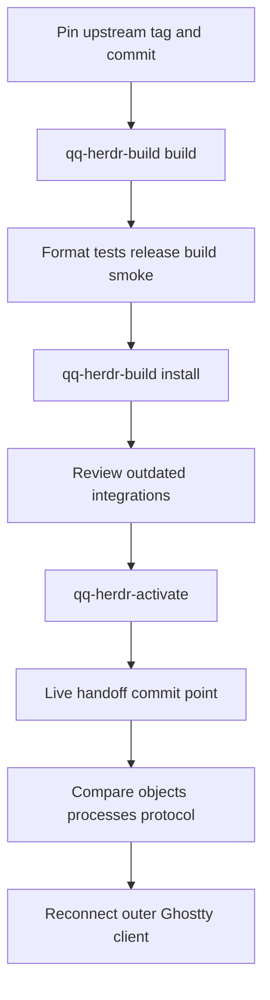

# Herdr and dashboard operations

## Scope and ownership

QQ owns the distribution and operational policy around Herdr: the immutable upstream pin, build and smoke scripts, installation path, activation checks, pane-add wrapper, live configuration, Ghostty launch surface, and user service. Herdr's Rust implementation and centered-pane tests live in the pinned external repository, not this checkout. There is no QQ patch application step.

QQ also owns two dashboard launchers and the execution-profile producer contract. The installed `@hypermemetic-ai/qq-dashboard` package is private and absent from this checkout, so its server, UI, cookie handling, telemetry schema, and internal tests cannot be documented from repository evidence.

## Herdr release and configuration

`herdr/downstream/upstream.env` pins all three immutable coordinates:

- repository: `https://github.com/hypermemetic-ai/herdr.git`;
- tag: `qq-v0.8.0-1`;
- commit: `f1e8f5793ecad4feab4c6df6bebca3f564cdbe05`.

`herdr/config.toml` selects Tokyo Night, disables automatic theme switching, gives workspaces vertical Alt-arrow navigation and tabs horizontal Alt-arrow navigation, defines `hcy` and `hcbr` pane commands, sorts the agent panel by spaces, and sets `pane_preferred_width = 80`.

`bin/qq-herdr-pane-add` is the QQ-owned split primitive. It always invokes `herdr pane split --direction right`, accepts a pane target plus `--cwd`, `--env`, current/focus options, and rejects caller-supplied direction, ratio, and unknown options. Raw Herdr APIs remain the escape hatch when an explicit layout override is genuinely required.

## Build, install, and activation lifecycle

*The release moves through separate verification, installation, live activation, and preservation proof stages.*

### Build and smoke

`bin/qq-herdr-build [build|install]` requires Git, Cargo, and Zig 0.15.x. It reuses `${XDG_CACHE_HOME:-~/.cache}/qq/herdr/source` when it is already a Git checkout, otherwise clones it once. Every run resets the origin URL and force-fetches the exact tag ref, rejects a tag whose resolved commit moved, then hard-resets and cleans the checkout before running:

1. `git diff --check` and `cargo fmt --all -- --check`;
2. locked Rust tests serially, skipping `generated_workspace_ids_are_short_base32_handles` because it depends on a process-global counter and `live_server_holds_one_pty_master_fd_per_pane` because a Herdr-hosted run cannot observe the replacement server's PTY descriptors; then rerun the workspace-ID test alone exactly (the PTY test remains excluded);
3. a locked release build;
4. `bin/qq-herdr-smoke` against the resulting binary.

The smoke test creates isolated HOME/XDG directories and a disposable server/client. It proves the expected version, preferred-width centering, balanced rightward splits, JSON CLI responses, workspace/tab/pane operations, pane shell process visibility, notification and close operations, and the linked `qq.brief-gate` plugin's open/approve/close path. The brief gate is consumed by delegation, but its decision workflow is documented with delegation rather than owned by Herdr operations.

`build` leaves the executable at `${XDG_CACHE_HOME:-~/.cache}/qq/herdr/bin/herdr`. `install` atomically replaces `~/.local/lib/qq/herdr/bin/herdr`, then reports `herdr integration status --outdated-only`; it neither updates integrations nor changes the running server.

### Live activation

`bin/qq-herdr-activate` is intentionally specific to migration from a Homebrew Herdr 0.7.5 server to the pinned Herdr 0.8.0 protocol 19 binary. Before mutation it requires the user service to be inactive, exactly one Homebrew server, and that server to belong to a Ghostty scope. It snapshots all live objects and each pane's shell PID, validates the repository configuration, installs that configuration, and atomically points `~/.local/bin/herdr` at the pinned binary.

`server live-handoff` is the commit point. Before it, failure cleanup restores the prior config and client and asks the old server to reload configuration. After it, the script does not attempt rollback: it installs `systemd/user/herdr.service`, reloads the user manager, and proves that workspace, tab, and pane ID sets and pane shell PIDs are unchanged, while version and protocol became 0.8.0 and 19. The attached client detaches once; reconnect from the outer prompt with `~/.local/bin/herdr`.

### Service and outer client

`systemd/user/herdr.service` starts the pinned library binary, uses `ExitType=cgroup` so a handoff replacement remains owned after the old main process exits, restarts on failure after two seconds, supplies an explicit `PATH` containing QQ/user, Bun, OpenCode, Homebrew, system, games, and Snap executable locations, and appends both streams to `~/.local/state/herdr/herdr.log`. Starting, restarting, or switching it affects the terminal server that owns active pane processes and is therefore operator-visible.

`bin/qq-herdr-launch` accepts no arguments. It clears inherited Herdr pane/workspace/socket variables and launches single-instance Ghostty with the exact title `herdr`; this makes a new outer client rather than a nested pane client. `ghostty/config` supplies fullscreen display, a 24-point MxPlus font, 12-point edge padding, and the same title. Large simulated margins and the retired edge-mask shader must not return: pane centering belongs to Herdr.

## Herdr invariants and upgrade recipe

Operational invariants are:

- a release tag must resolve to the pinned commit;
- upstream source is built clean, without QQ Rust patches;
- build, install, and activation are separate actions;
- installation is atomic and does not silently update lifecycle integrations;
- QQ-created panes split right without caller-selected ratios;
- activation cannot run while the systemd service owns the old server;
- successful handoff preserves every workspace, tab, pane, and pane shell process;
- the service and local CLI resolve to the pinned binary;
- Ghostty exposes the full canvas instead of implementing layout policy.

Upgrade safely:

1. Run `bin/qq-herdr-upgrade` or pass a tag matching `qq-vMAJOR.MINOR.PATCH-REVISION`. With no argument it lists remote `refs/tags/qq-v*`, strips the prefix, version-sorts them, and selects the highest tag. It shallow-clones that exact candidate and prints its exact commit; it makes no changes.
2. Validate the tagged release in the Herdr repository, then update both tag and commit in `herdr/downstream/upstream.env`.
3. Update version/protocol assumptions in activation and tests if the release is not 0.8.0 protocol 19. Do not treat the current activation script as generic.
4. Run `bin/qq-herdr-build build`, inspect the full upstream test and smoke results, then run `bin/qq-herdr-build install`.
5. Review outdated integrations, especially Pi integration, before updating them deliberately.
6. Run `bin/qq-herdr-activate` only in its supported source-state transition, then reconnect and inspect `systemctl --user status herdr.service` and the log.

Upstream synchronization and centered-pane implementation changes belong in the Herdr repository; QQ should advance only to a validated immutable release.

## Dashboard launcher boundary

`package.json` and `package-lock.json` pin `@hypermemetic-ai/qq-dashboard` 0.1.0 to commit `3eb1309535459089930984f5fd4e31a2661d5edf`. `npm install` materializes its two package binaries.

- `bin/qq-dashboard [--once]` resolves the repository through its real script path, exports `QQ_PROFILE_BIN` as the exact repository `bin/qq-profile`, and executes only `node_modules/@hypermemetic-ai/qq-dashboard/bin/qq-dashboard`.
- `bin/qq-dashboard-cookies ...` executes only the corresponding installed package binary. Repository documentation records `refresh`, `status`, and `validate` operations.

Neither launcher searches `PATH` for a dashboard binary or consults a sibling checkout. The documented consumer contract is `qq-profile list --json`; profile definition, role filtering, validation, and fail-closed behavior remain QQ responsibilities. See [Profiles and extensions](../runtime/profiles-and-extensions.md) for that producer contract.

Dashboard installation or extraction must preserve `~/.local/state/qq/telemetry/`, including non-secret usage caches and the Qwen cookie snapshot. This repository supplies no evidence for files below that boundary beyond the README statement, and no evidence for cookie acquisition, storage security, HTTP endpoints, telemetry semantics, UI lifecycle, or `--once` internals. Those claims require the private package source.

To upgrade the dashboard, validate a tagged release in its own repository, replace the exact dependency commit in `package.json`, regenerate `package-lock.json`, run `npm install`, and exercise both launcher `--help` commands from a checkout with no sibling dashboard repository. Preserve the telemetry state directory. Also verify `qq-profile list --json`; changing its output is a cross-package contract change.

## Validation

- `tests/test-herdr-downstream.sh` checks the immutable coordinates, absence of the retired patch flow, config/navigation policy, service paths and cgroup ownership, Ghostty invariants, executable scripts, upstream commit contents, and pane-wrapper argument rejection. It fetches the pinned upstream and therefore needs network access.
- `tests/test-herdr-live.sh` requires an installed executable at `QQ_HERDR_TEST_BINARY` or `~/.local/lib/qq/herdr/bin/herdr`, then runs the disposable smoke suite.
- `bin/qq-herdr-smoke PATH` is the focused binary contract test and does not use the live server.
- `tests/test-brief-gate.mjs` and delegation/review tests cover the QQ workflow around the plugin; the Herdr smoke test covers only plugin compatibility.
- `tests/test-execution-profiles.mjs` validates QQ's profile producer. There is no repository-owned dashboard implementation test; launcher `--help` and a private-package test run are upgrade gates, not substitutes for source inspection.
