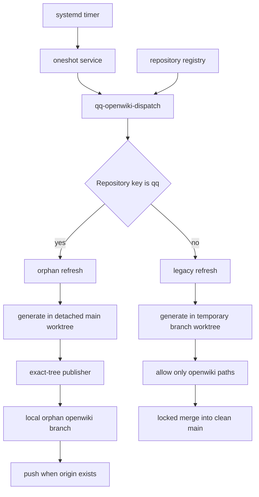

# OpenWiki automation

## Scope and authority

The local automation has two publication models selected by repository key:

- **QQ publication model:** `qq` publishes the generated directory as the root tree of an orphan `openwiki` branch. It never writes generated files into `main`.
- **Legacy model:** other registered repositories generate in a private worktree, commit only `openwiki/**`, and merge that commit into a clean local `main` checkout.

A dispatcher, registry, systemd service, and timer operate both models. A separate GitHub Actions workflow updates a normal branch and opens a pull request. These are distinct authorities: the hosted workflow does not call the local dispatcher or orphan publisher, and its PR paths include files that the local legacy model explicitly restores or removes. Operators must decide which workflow is authoritative for a repository rather than assuming schedules coordinate.

This page covers QQ wrappers and configuration. OpenWiki CLI generation logic, provider behavior, and generated-content quality are external to this repository.

## Local dispatch and publication flow



*The dispatcher selects orphan publication for `qq` and the legacy main-merge path for every other registered key.*

### Dispatcher and registry

`config/openwiki-repositories` accepts blank lines, comments, lowercase repository keys, or absolute repository paths. A missing or non-regular registry is refused before parsing; an unreadable file also terminates the `set -e` dispatcher while opening the loop, so no repository jobs launch. Relative keys resolve below `${QQ_OPENWIKI_PROJECTS_ROOT:-~/projects}`; an absolute entry's basename becomes its key. Keys must match `[a-z0-9][a-z0-9-]{0,62}` and every entry must resolve to a Git top level. The checked-in registry contains `qq`, `qq-newspaper`, `herdr`, `discuss`, and `qq-dictation`; DecIQ is deliberately excluded because it uses a separately frozen QQ runtime.

`bin/qq-openwiki-dispatch` requires a non-empty registry and a positive `QQ_OPENWIKI_MAX_PARALLEL`, default 3. It routes the configured published key, default `qq`, to `qq-openwiki-refresh` and all others to `qq-openwiki-refresh-legacy`. Output is prefixed by repository key. Jobs are launched in registry order, capped at the configured concurrency, and all are awaited; one failure does not prevent already queued repositories from completing, but any failure makes the dispatcher exit nonzero.

## Orphan publication model

`bin/qq-openwiki-refresh` requires its source checkout to be on `main`, but intentionally does not require that checkout to be clean. It validates that the repository key equals `QQ_OPENWIKI_PUBLISHED_REPO_KEY`, default `qq`, and uses a non-blocking lock in the Git common directory; an overlapping refresh reports that it is already running and exits successfully.

Initial publication is an explicit safety boundary. `QQ_OPENWIKI_ACTION=init` must be supplied when neither local nor remote-tracking `openwiki` exists. `auto` becomes `update` and refuses to seed. For an update, the previous publication branch is archived into `project/openwiki`; this gives OpenWiki its prior generated state without making that branch an ancestor of the detached source worktree.

Generation occurs in a temporary detached worktree at committed `main`. A temporary Git excludes file hides `/openwiki/` from status, and the command is:

```text
openwiki code --init|--update --print "Keep this wiki short and practical."
```

The binary, prompt, action, main branch/root, repository key, publisher, and preload are configurable through the `QQ_OPENWIKI_*` variables present in the script; the publication branch is fixed as `openwiki`. The generated `openwiki` path must be a real directory. On success, only that directory is passed to `bin/qq-openwiki-publish`; edits elsewhere in the disposable worktree are ignored rather than published. Cleanup removes and prunes the temporary worktree.

### Exact-tree publisher

`bin/qq-openwiki-publish REPOSITORY_KEY GENERATED_DIRECTORY` is the publication boundary. It rejects a wrong or malformed key, symlinked/non-directory root, and entries other than regular files and directories. Under a blocking publication lock, it uses a temporary Git index and the generated directory as work tree to construct an exact root tree: publication contains the directory's children, not a nested `openwiki/` directory.

The publisher adopts `origin/openwiki` as a local parent when necessary. If a parent exists, it rejects the branch when that parent has a merge base with `main`; the publication history must remain orphaned. An identical tree is a no-op. A changed tree creates `Refresh OpenWiki` with the prior publication commit as sole parent; the first tree creates parentless `Publish OpenWiki`. The local ref is updated atomically with the expected old value, and is pushed to `origin` when that remote is configured. Push failure is a command failure, although the local ref has already advanced.

Key invariants:

- committed `main`, not dirty source state, is the generator input;
- `main` and its work tree are not mutated;
- first publication is explicit;
- the branch remains unrelated to `main` and contains exactly generated files;
- failed generation never reaches the publisher;
- identical output creates no commit;
- refresh and publication have separate common-directory locks.

## Legacy main-merge model

`bin/qq-openwiki-refresh-legacy` requires the main checkout to be on `main` and completely clean. It creates a mode-700 state parent and defaults the worktree to `${XDG_STATE_HOME:-~/.local/state}/qq/openwiki/REPOSITORY_KEY/worktree`. A non-blocking repository lock makes overlap a successful no-op. Stale registered worktrees and temporary branches are cleaned; an unregistered object at the intended worktree path is rejected rather than deleted.

A temporary branch, default `qq/openwiki-refresh`, starts from `main`. `auto` chooses `update` only when `openwiki/.last-update.json` exists, otherwise `init`. After generation, the wrapper restores tracked `AGENTS.md`, `CLAUDE.md`, and `.github/workflows/openwiki-update.yml`, removes generated versions when untracked, and rejects every changed path outside `openwiki/**`. No changes is a successful no-op; otherwise it runs `diff --check`, commits `Refresh OpenWiki`, and retains the commit ID for landing.

Landing takes the shared `qq-land.lock`, then rechecks branch and cleanliness. `git merge-tree --write-tree` must prove the generated commit still merges cleanly. The wrapper merges with `--no-ff`; on merge failure it aborts. Cleanup removes the worktree and temporary branch. This model therefore produces a generated commit plus a merge commit on `main` and never pushes by itself.

Legacy invariants differ deliberately from orphan publication:

- dirty `main` is always rejected, both before generation and before merge;
- only `openwiki/**` can land;
- generated root instructions and hosted workflow changes cannot land;
- merge serialization is shared with other QQ landing operations;
- the temporary branch and worktree are removed on success, no-op, and failure;
- remote synchronization is outside this script.

## Environment shim

Both refreshers append `--require=bin/qq-openwiki-shell-env.cjs` to `NODE_OPTIONS`. The preload patches Node's `child_process.spawn` only for the narrow case where a caller requests `shell: true` with an explicitly empty environment. It substitutes inherited values for `PATH`, `HOME`, `TMPDIR`, `LANG`, and `LC_ALL`, then synchronizes built-in ESM exports. Other spawn calls are unchanged. This compatibility shim allows shell helpers such as `node` to resolve without forwarding the full service environment.

## Local schedule and service configuration

`systemd/user/qq-openwiki.timer` invokes `qq-openwiki.service` at 03:00 and 13:00 local time, exactly, with no randomized delay. `Persistent=false` means missed runs are not replayed after downtime. Enabling the timer is an operator action:

```text
systemctl --user daemon-reload
systemctl --user enable --now qq-openwiki.timer
systemctl --user list-timers qq-openwiki.timer
```

The oneshot service runs from `~/projects/qq`, has a six-hour timeout and `UMask=0077`, sets `OPENWIKI_PROVIDER=openai-chatgpt`, fixes the published key to `qq`, supplies an explicit executable path, and executes the dispatcher as the current user. It has no privileged identity and no post-run mutation hook. Provider authentication is expected from the user's environment or provider tooling; its storage and renewal are outside these scripts.

Useful manual operations are:

```text
bin/qq-openwiki-dispatch
QQ_OPENWIKI_ACTION=init bin/qq-openwiki-refresh
QQ_OPENWIKI_MAIN_ROOT=~/projects/herdr QQ_OPENWIKI_REPO_KEY=herdr bin/qq-openwiki-refresh-legacy
journalctl --user -u qq-openwiki.service
```

Run the explicit `init` command only for the published repository and only after reviewing that it will create and possibly push the orphan `openwiki` branch.

## Hosted pull-request workflow

`.github/workflows/openwiki-update.yml` runs on manual dispatch and daily at `0 8 * * *` UTC. It checks out full history, installs Node 22 and globally pins `openwiki@0.3.2`, `mermaid@11.16.0`, and `jsdom@29.1.1`. It runs `openwiki code --update --print` with OpenRouter model `z-ai/glm-5.2`, repository secrets for OpenRouter and LangSmith connectors, and optional LangSmith tracing.

`peter-evans/create-pull-request` then writes branch `openwiki/update` and proposes `openwiki`, `AGENTS.md`, `CLAUDE.md`, and the workflow itself. Actions are pinned by commit. Unlike local legacy generation, those root files are intentionally in scope; unlike orphan publication, the output is reviewed and merged through a normal PR. GitHub cron, secret administration, branch protection, PR review, and merge are hosted operational boundaries not enforced by local scripts.

## Change and upgrade recipes

### Add or remove a locally maintained repository

1. Ensure its checkout exists below `~/projects` or use an absolute path.
2. Add one valid key/path to `config/openwiki-repositories`; do not add repositories whose runtime is intentionally frozen.
3. Decide publication semantics. Only the configured published key gets the orphan model; all other entries merge generated files into local `main`.
4. Run `tests/test-openwiki-dispatch.sh`, then invoke a manual dispatch with suitable provider credentials. For a legacy repository, ensure `main` is clean.

### Change the published repository or branch model

Changing `QQ_OPENWIKI_PUBLISHED_REPO_KEY` is not merely registry configuration: the refresh and publisher both enforce it, the service fixes it, and tests assume `qq`. Seed any new orphan publication explicitly and verify no merge base with `main`. Never point legacy repositories at the publisher without planning how existing `openwiki/**` history will be retired.

### Upgrade OpenWiki or provider configuration

The local service resolves `openwiki` from `PATH` and does not pin its version in this repository; record and validate the deployed binary separately. The hosted workflow is pinned to 0.3.2 and must be upgraded by editing the install command. For either path:

1. run the three focused shell tests with a fake generator;
2. validate init/update behavior on a disposable repository;
3. run Mermaid validation when diagrams are generated;
4. perform one credentialed manual generation and inspect exact changed paths/tree;
5. confirm no-op reruns and failure behavior before re-enabling schedules.

Keep local and hosted upgrades separate unless intentionally making their output and authority converge.

## Tests

- `tests/test-openwiki-refresh.sh` creates local and bare repositories and proves explicit seeding, dirty-source isolation, exact orphan trees, remote continuation, no-op updates, parent continuity, failed-generation safety, key restriction, cleanup, and service ownership constraints.
- `tests/test-openwiki-refresh-legacy.sh` proves the shell environment shim, init/update selection, root-file restoration, `openwiki/**` allowlisting, no-op behavior, dirty-main rejection, non-generated-path rejection, merge shape, cleanup, and service configuration.
- `tests/test-openwiki-dispatch.sh` proves model routing, a concurrency ceiling of three, registry membership and DecIQ exclusion, completion of all scheduled jobs, and aggregated failure status.

These tests use fake generators and local Git repositories, so they validate wrappers rather than OpenWiki generation quality, provider APIs, GitHub Actions execution, systemd calendar delivery, credentials, or real remote permissions. A production smoke run remains necessary after changes to binaries, providers, secrets, remotes, or service installation.
