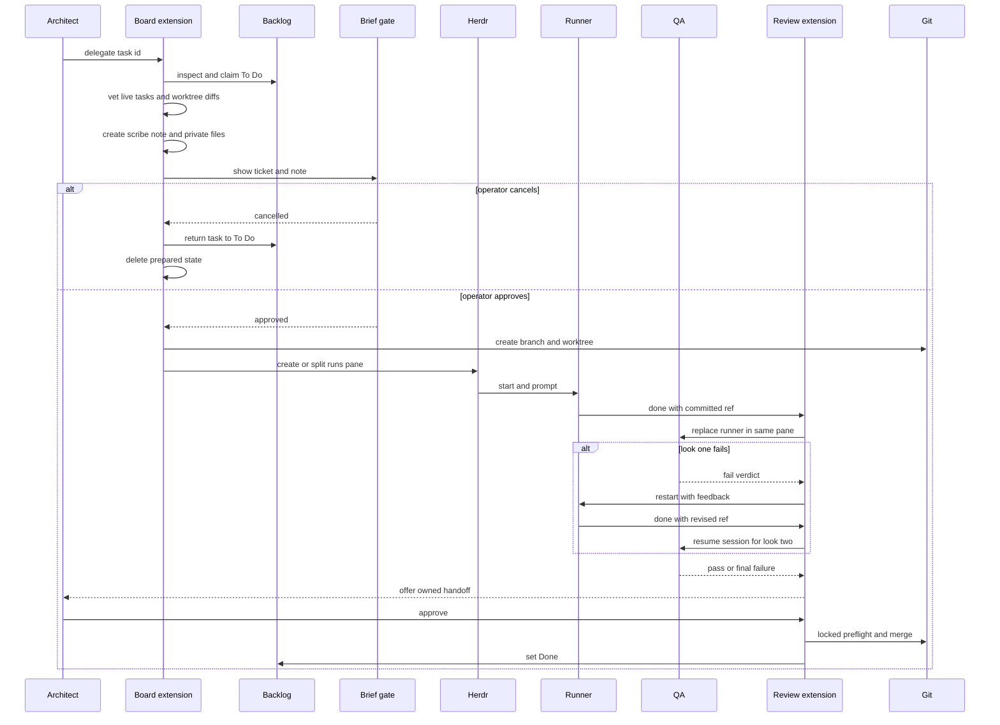
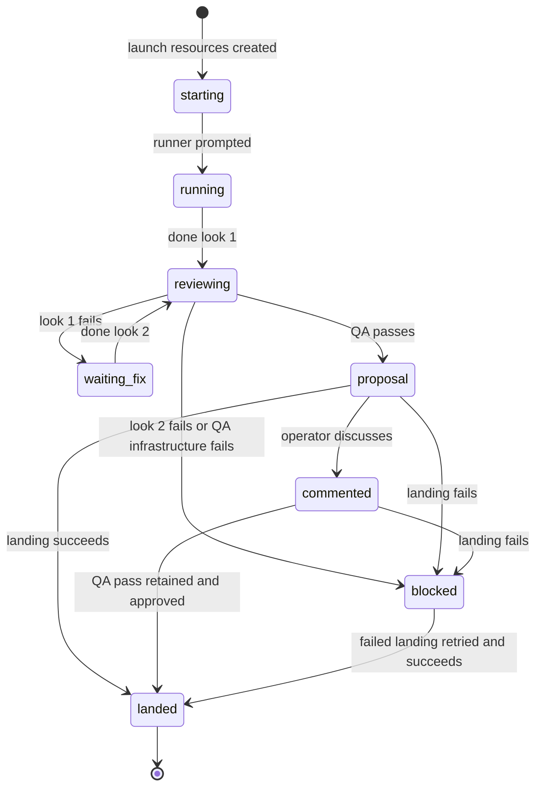

# Delegation and review

QQ turns an architect-owned Backlog task into an isolated Git change and keeps merge authority with the originating architect session. The implementation is split across `extensions/board.ts`, `extensions/review-flow.ts`, `extensions/qa-result.ts`, `bin/lib/admission.mjs`, `bin/lib/run.mjs`, `bin/lib/review.mjs`, and the two detached worker scripts.

## Public surfaces

| Surface | Caller and input | Effect |
|---|---|---|
| `sketch` Pi tool | Architect; `{title, note?}` | Creates a Backlog task; an optional note is timestamped and appended as implementation notes. |
| `note` Pi tool | Architect; `{id, text}` | Appends a timestamped implementation note. |
| `delegate` Pi tool | Architect; `{id}` | Vets and claims one `To Do` task, creates the private brief, waits for operator approval, then starts an isolated runner. |
| `done` Pi tool | Delegated runner; `{ref}` | Validates a clean committed descendant, records the next QA look, starts `qq-review-worker.mjs`, and shuts down the runner. It never merges. |
| `review` Pi tool | Interactive architect; `{}` | Reopens owned `proposal`, `blocked`, and `commented` handoffs. |
| `qa_verdict` Pi tool | Restricted QA process; `{verdict, summary, feedback, tests_modified}` | Writes exactly one private `qq.qa-verdict/v1` document, then shuts down QA. |
| Brief gate | Operator keys `a` or `c` | The `qq.brief-gate` Herdr plugin atomically writes `approved` or `cancelled`. |
| Workers | `qq-review-worker.mjs handoff.json`; `qq-land-worker.mjs handoff.json` | Conduct QA or land an already QA-passed proposal. These are internal process entrypoints, not general operator CLIs. |

Role checks are runtime checks: board tools require `architect`; `done` requires `runner` plus `QQ_RUN_STATE`; review also requires UI. Role changes arrive through `qq:role-selected`.

## Ordered workflow



*The sequence shows the serialized claim, explicit operator gate, pane handoffs, at most two QA looks, and architect-only landing.*

### Admission and launch

1. `withAdmissionLock` acquires `<git-common-dir>/qq-admit.lock` with exclusive creation. It waits, removes only a lock naming a dead PID, honors cancellation, and removes only its own token.
2. Admission rereads the ticket under the lock. Only `To Do` is eligible. Evidence includes the full incoming task, all `To Do` and `In Progress` tasks, current worktree diffs from each merge base, and the newest prior `note.md` or `brief.md` for that task.
3. The profile-bound scribe model returns either exact `clear` or a one-line `bounce` reason. A clear result is followed by another task read before the status changes to `In Progress`.
4. A separate scribe call builds the delegate note from the ticket, the last 100 operator turns, assistant text and tool names, and file read/write paths. Reasoning internals and tool results are not serialized. The selected profile’s QA binding is captured now.
5. `prepareRun` creates a mode-`0700`, account-owned, non-symlink run directory and mode-`0600` ticket, transcript, note, and combined gate files. The operator reads the exact ticket and note in a focused right-hand Glow plugin split on the architect's current tab. Before opening, `awaitBriefGate()` deletes any old decision. It accepts only an account-owned, regular non-symlink decision file with no group/other bits and exact text `approved` or `cancelled`. Whether waiting or validation succeeds or fails, it attempts to close the owned plugin pane and deletes the decision file; close failure is itself a refusal.
6. Cancellation returns the card to `To Do` before deleting prepared state. Approval creates `qq/<task-slug>-<nonce>` from the current named base branch, creates a private worktree, then creates a no-focus `runs` tab or right-splits its last pane. The pane receives `QQ_AGENT_ROLE=runner`, `QQ_AGENT_PROJECT`, `QQ_RUN_STATE`, `QQ_RUN_ID`, and `QQ_ARCHITECT_SESSION`. The handoff is written as `starting` before shell readiness and agent startup. The prompt embeds the full ticket and delegate note, points to the note path, requires a commit and `done HEAD`, and forbids merging; only after prompt delivery does the handoff become `running`.

Gate turns for one shared Git common directory are serialized in-process by `withGlowTurn`; admission is serialized across processes by the lock.

## Handoff state and lifecycle

`handoff.json` has `schema: qq.run-handoff/v1`, `version: 1`. Stable identity and ownership fields are `id`, `project`, `task{id,title}`, `mainRoot`, `baseBranch`, `baseRef`, `branch`, `worktree`, `pane`, `architectSession`, artifact paths, `statePath`, captured `qa{provider,model,effort}`, and timestamps. Progress fields include `status`, `look`, `ref`, `qaSessionId`, `qaVerdict`, `pack`, `operatorComment`, `blockedReason`, and `landedAt`. Writes use a private temporary file, `fsync`, and atomic rename.



*The persisted handoff lifecycle; `later` is deliberately not a state transition, and only QA-passed blocked states caused by failed landing can reach `landed`.*

A QA verdict has `schema: qq.qa-verdict/v1`, `version: 1`, `verdict` (`pass` or `fail`), non-empty `summary` up to 240 characters, `feedback` up to 8000 characters, `tests_modified`, and `createdAt`. The landed architect message exposes `qq.run-landed/v1` details with run/task identity, merged ref, target branch, time, summary, and changed-file numstat.

## QA, proposal, and review ownership

`prepareDone` refuses the wrong worktree, a status other than `running` or `waiting_fix`, a third look, a non-commit ref, a ref not descending from `baseRef`, or any tracked/untracked residue. It increments `look`, resolves the SHA, and persists `reviewing` before the detached worker starts.

QA reuses the runs pane only after the prior Herdr agent identity disappears and the pane is an idle shell. It runs Pi with no normal extensions, skills, templates, or context files; allowed tools are `read,bash,edit,write,qa_verdict`. Look 1 starts a new QA session; look 2 resumes it. QA may add committed test-only changes. The conductor converts a claimed pass to failure if the tree is dirty, the reviewed history was replaced, no test path changed, or production paths changed. A valid test-only descendant becomes the proposal ref.

Look-1 failure records `waiting_fix` and returns the same pane to the runner with feedback. Look-2 failure records `blocked`, closes the pane, and notifies the architect and operator. A pass records a numstat `pack`, sets `proposal`, closes the pane, and notifies the operator.

The review extension polls every two seconds, at session start, after role selection, and after `agent_settled`. It offers only handoffs whose `architectSession` exactly matches the current session ID:

- **approve** appears only for a QA-passed proposal/commented handoff or a QA-passed failed landing;
- **discuss** preserves the reviewed ref and verdict, stores an operator comment, returns the Backlog task to `To Do`, and steers the architect session;
- **later** makes no persisted change; `review` can offer it again;
- infrastructure/final-QA blocked handoffs can only be discussed or deferred.

## Landing invariants and failure paths

Approval resolves the shared Git directory and runs the land worker under `flock <common-dir>/qq-land.lock`. `landHandoff` then requires all of the following before mutation:

- the handoff still contains a QA pass and an approvable status;
- the main checkout is attached to the recorded `baseBranch`;
- main and delegated worktrees are clean, including untracked files;
- `git merge-tree --write-tree HEAD ref` succeeds.

It performs `git merge --no-ff --no-edit`, removes the worktree, deletes the merged branch, atomically records `landed`, and only then marks Backlog `Done`. A failure records `blockedReason` while preserving the QA verdict and ref, so a transient failed landing remains approvable. If the merge succeeded but cleanup failed, status is still `blocked`; operators must inspect the repository before retrying.

Delegate failures are compensating rather than transactional: after claim, the extension best-effort returns the task to `To Do`; after preparation it deletes the private state; launch failure closes a created pane, force-removes a created worktree and branch, and removes state. Cleanup errors are intentionally suppressed in these rollback paths, so Git, Herdr, Backlog, and the run directory should be inspected after a refusal. The outward error also redacts the generated note if a downstream error embeds it.

## Dependencies and extension seams

- **Backlog CLI:** task read/list/create/edit and status transitions.
- **Git and `flock`:** shared-directory admission/landing locks, worktrees, ancestry, clean-tree checks, merge preflight, merge, and cleanup.
- **Herdr and brief-gate plugin:** operator pane, runs panes, agent replacement, prompts, notifications. Operational details belong in [Herdr and dashboard operations](../operations/herdr-and-dashboard.md).
- **Execution policy and model registry:** profile-bound scribe and QA model selection; see [Profiles and extensions](profiles-and-extensions.md).
- **Presence files:** final-QA rejection finds the owning architect pane through Event Plane presence; see [Event Plane](../services/event-plane.md).
- **Injection seams:** board accepts injected command runner, admission/note/gate/run functions, environment and clock; review-flow accepts runner, worker launcher and environment; QA verdict accepts a writer; review library functions accept a command runner. Keep state transitions in the libraries so workers and extensions share one contract.

## Focused validation

Run the narrow checks from the repository root:

```bash
node --experimental-strip-types tests/test-delegation.mjs .
node tests/test-brief-gate.mjs .
node --experimental-strip-types tests/test-review-flow.mjs .
```

These tests cover strict task/Herdr parsing, admission serialization and stale-lock recovery, transcript redaction, private artifact modes, exact gate placement/decision validation/close behavior, approve/cancel rollback, new-tab and existing-tab runner placement, pane environment, shell readiness before agent startup, prompt contents and startup ordering, clean descendant validation, two-look pane/session ordering, QA test-only enforcement, architect-session ownership, discuss/later behavior, dirty-main and merge-conflict blocking, retryable failed landings, cleanup, and landed messages. After cross-cutting changes, run `npm test`; Herdr live checks have external runtime prerequisites described in [Testing and change guide](../development/testing-and-change-guide.md).
