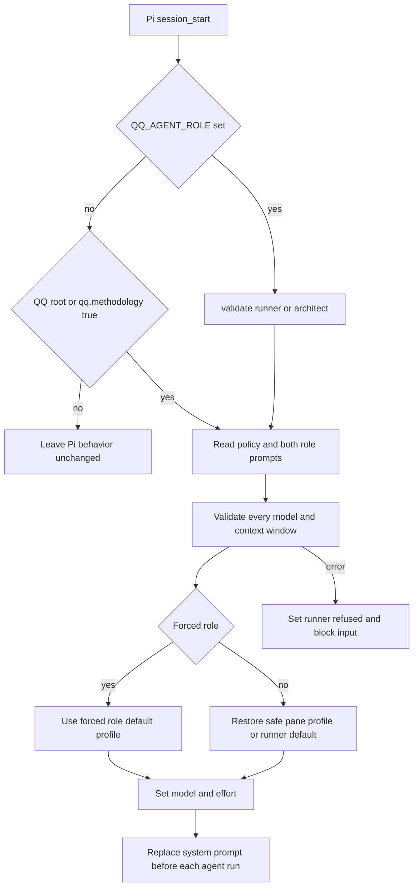

# Execution profiles, Pi extensions, and skills

`extensions/index.ts` is the normal Pi composition root. Its default `registerQQ(pi)` registers execution profiles, agent messaging, operator staging, continue, session scrub, Backlog guard, Grok repetition recovery, board tools, and review flow in that order. `extensions/qa-result.ts` is a separate QA-worker extension and must not be added to the normal aggregate.

## Activation and profile lifecycle

QQ activates inside this repository, in a repository linked by `bin/qq-methodology link`, or when a worker starts with a valid `QQ_AGENT_ROLE`. `bin/lib/roles.mjs` owns `ROLE_NAMES`, `DEFAULT_ROLE`, `validateRole()`, and `isActivatedRepository()`. The Git marker is read without inherited `GIT_DIR`, `GIT_WORK_TREE`, or `GIT_COMMON_DIR` overrides. Linking writes the common local Git configuration, so all worktrees share activation but clones do not.

Linking also initializes or reuses `${HOME}/.local/state/qq/store/<project>` as the Backlog.md store, disables Backlog auto-commit, and makes the checkout's `backlog` a symlink to that store. A tracked Backlog file tree is refused; a tracked symlink is retargeted and committed. It merges Pi defaults `steeringMode=all`, `followUpMode=all`, and `tuiMode=fullscreen`, trusts the checkout and `${HOME}/.herdr/worktrees`, and preserves unrelated settings, model/auth files, packages, themes, and trust entries. `inspect` treats missing setup as invalid and reports missing Git identity or execution policy as warnings. `unlink` removes only the activation marker.



*Profile startup is inactive outside QQ scope and fail-closed after activation.*

`registerExecutionProfiles()` in `extensions/execution-profiles.ts` owns this lifecycle. On `session_start`, it concurrently loads policy and `prompts/roles/{runner,architect}.md`, resolves every role profile plus `scribe` and `qa` through `ctx.modelRegistry.find(provider, model)`, and validates integer context windows before restoring a pane selection. Applying the chosen profile calls `pi.setModel()` and treats `false` as missing authentication, calls `pi.setThinkingLevel(effort)`, then requires `pi.getThinkingLevel()` to equal the request exactly before emitting `qq:role-selected`. On `before_agent_start`, `composeSystemPrompt()` **replaces**, rather than appends to, Pi's base system prompt with the selected role prompt plus Pi-provided tool, guideline, context-file, and skill sections. Manual `model_select` or `thinking_level_select` events do not rewrite durable/pane state; they relabel status as the matching declared profile or `custom`. On shutdown it clears status and in-memory state.

### Policy schema and commands

The durable file is `${XDG_CONFIG_HOME:-~/.config}/qq/execution-profiles.json`. `bin/lib/execution-profiles.mjs` owns `POLICY_SCHEMA`, `validateExecutionPolicy()`, `readExecutionPolicy()`, and atomic private writes.

```json
{
  "schema": "qq.execution-profiles/v1",
  "contextWindowCeiling": 200000,
  "roles": {
    "runner": {
      "default": "profile-name",
      "profiles": {
        "profile-name": { "provider": "provider-id", "model": "model-id", "effort": "high" }
      }
    },
    "architect": {
      "default": "profile-name",
      "profiles": {
        "profile-name": { "provider": "provider-id", "model": "model-id", "effort": "high" }
      }
    }
  },
  "scribe": { "provider": "provider-id", "model": "model-id", "effort": "low" },
  "qa": { "provider": "provider-id", "model": "model-id", "effort": "xhigh" }
}
```

Invariants:

- Top-level, role, and profile objects have exact keys. Role names are exactly `runner` and `architect`; each role has at least one named profile and a declared default.
- A profile is exactly `{provider, model, effort}`. Effort is one of `off`, `minimal`, `low`, `medium`, `high`, `xhigh`, or `max`; provider `xai` is refused in favor of `xai-auth`.
- The policy ceiling is exactly 200,000. `contextWindowCeilingFor()` applies it to `xai-auth`; startup refuses a larger registered Grok context. `qq-profile context install` changes only the `contextWindow` field for model bindings declared by the QQ policy: it adds/updates the required `xai-auth` ceiling and removes that field from declared non-capped bindings. It preserves unrelated providers, unrelated models, and other keys on a touched override.
- The policy must be an owner-owned regular non-symlink file not writable by group/other. Writes use mode `0600`, exclusive temporary creation, `fsync`, and atomic rename. A legacy exact `compactor` field is migrated once to `scribe`.

`bin/qq-profile` is the administrative and dashboard contract:

- `list [role] [--json]` returns text or `qq.profile-list/v1`; `scribe` and `qa` appear as services.
- `default <role> [profile]` reads or changes durable defaults.
- `context inspect|install` compares policy bindings with `pi --list-models` and manages context overrides.
- Pi `/profile [role] [profile]` changes only the current Herdr pane. Version 1 pane state is `${XDG_STATE_HOME:-~/.local/state}/qq/pane-profiles/<HERDR_PANE_ID>.json` with exact keys `paneId`, `profile`, `role`, `version`; directory mode is `0700`, file mode `0600`, and unsafe or stale records are ignored. A forced worker role wins and does not overwrite the operator's pane record.

The private dashboard is only a consumer: `bin/qq-dashboard` supplies `QQ_PROFILE_BIN` and the pinned package reads profiles through `qq-profile list --json`. Do not duplicate validation in dashboard-facing code.

## Extension catalogue

### Execution profiles — `extensions/execution-profiles.ts`

- **Surface:** `/profile`; `session_start`, `session_shutdown`, `input`, `before_agent_start`, `model_select`, and `thinking_level_select`; event `qq:role-selected`.
- **Ownership:** `registerExecutionProfiles()`, `composeSystemPrompt()`, policy helpers in `bin/lib/execution-profiles.mjs`, role helpers in `bin/lib/roles.mjs`.
- **Invariant/seam:** Activated startup either fully validates model presence/context and authenticated exact-effort application or blocks input. Inject policy/prompt paths, environment, and pane-state root through `deps`. Registration order is intentional: execution profiles installs its `session_start` handler and restores/emits `qq:role-selected` before agent-messages and review-flow session handlers run; those consumers register event listeners during composition and therefore observe the restored role before building presence or review ownership behavior.
- **Safe role/binding change:** adding a role is a closed-contract change, not a policy-only edit: update `ROLE_NAMES`/`ROLE_SET`, exact policy validation and public listing, add its role prompt, profile command/UI and pane-state acceptance, every role consumer, then tests. A new profile/provider/model/effort binding normally changes external policy, but new provider/context semantics also require `contextWindowCeilingFor()`, `context inspect|install`, model override reconciliation, dashboard JSON expectations, and startup tests.
- **Validation:** `tests/test-execution-profiles.mjs` covers policy migration, model/context refusals, private writes, context override preservation/removal, pane isolation/restoration, forced-role precedence, prompt replacement, model/effort selection and startup blocking; `tests/test-agent-messages-live.mjs` proves the restored role reaches the later messaging consumer. Activation is covered by `tests/test-methodology.sh`.

### Agent messages and presence — `extensions/agent-messages.ts`

- **Surface:** `agent_messages` actions `list`, `send`, and `status`; `/agent-tasks`; role-selection and agent/tool lifecycle events.
- **Flow:** `start()` derives project from `QQ_AGENT_PROJECT`, `.pi/agent-messages.json`, or cwd; role from the selected/forced/configured role or linked repository. `list` filters valid unexpired records by project, role, or exact task and excludes the caller. `send` requires a canonical target session ID, bounded content, and `default` or `immediate`, sends to `agents/<session-id>`, then returns the Event Plane event ID. `status` maps obligations to `queued`, `delivering`, `blocked`, `delivered`, `expired`, or `failed`, including failure reasons and a current recipient busy card when useful.
- **State/schema:** `.pi/agent-messages.json` permits only `project` and `role`. Presence lives under `${XDG_STATE_HOME:-~/.local/state}/qq/event-plane/presence/` in `sha256(session_id).json`, with private mode and atomic writes. It expires after 45 seconds, renews every 15 seconds, and discovery ignores expired, unsafe, oversized, malformed, or unknown-role/busy records. The core service rejects unexpected entries in its fixed startup namespace, so deployments must separate extension presence from core service state or account for startup ordering; the live harness injects a service socket while using a separate XDG root for presence. `/agent-tasks` advertises up to 32 unique exact labels of at most 191 characters. Lifecycle hooks publish `idle`, `thinking`, or `tool`; cards display `thinking Ns` or `tool NAME Ns` only after five seconds. Canonical recipient IDs are Pi UUID session IDs; project, role, tasks, and pane are discovery metadata, never substitutes for the ID.
- **Persistence/invariant:** `receiveOne()` validates `qq.agent-message/v2`; malformed payloads are blocked. Before injection it searches session JSONL for the event ID plus content hash. An in-memory injection-key set prevents duplicate injection while persistence is pending; absent receipt causes guarded retry, not acknowledgement, because successful `pi.sendMessage` alone is not durable evidence. The receiver long-polls with one endpoint token and sleeps 500 ms before reconnecting after failures. `immediate` publishes idempotent `agent.immediate-claim` request `immediate_<event-id>`; only the first claimant aborts a busy turn. The receiver waits up to five seconds for Pi to become idle, then injects a normal triggered turn; if Pi remains busy, it retries instead of steering into the aborted turn. Shutdown clears dedup state and removes presence. Inject client, paths, clock, sleep, list function, and send function through `deps`.
- **Validation:** `tests/test-agent-messages.mjs` covers invalid/expired presence and messages, normalization, status mapping, filters, cards, and refusals. `tests/test-agent-messages-live.sh` proves delayed transcript persistence is retried without duplicate injection, eventual acknowledgement/delivered status, and one immediate interruption/steer against the real service. Transport behavior is covered by `tests/test-event-plane.sh`.

### Operator staging — `extensions/operator-stage.ts`

- **Surface:** `operator_stage({command, description, danger})`.
- **Flow/invariant:** Requires `HERDR_PANE_ID`, rejects multiline commands, creates a no-focus pane through `qq-herdr-pane-add`, renames it, waits for a shell prompt, sends text only, and posts a request notification. The agent never sends Enter or confirmation keys. Low danger needs Enter; high danger stages an additional `y` confirmation. Failure after pane creation attempts to close the owned pane and reports an orphan if cleanup fails.
- **Seam/test:** inject `deps.exec` and `deps.env`; run `tests/test-operator-stage.mjs`.

### Continue shortcut — `extensions/continue.ts`

- **Surface:** `shift+alt+enter`.
- **Invariant:** Sends the user message `continue` only when `ctx.isIdle()` is true. It is adapted from `mitsuhiko/agent-stuff` under Apache-2.0.
- **Validation:** `tests/test-continue.mjs`.

### Session scrub — `extensions/session-scrub.ts`

- **Surface:** `mark_session_for_scrub`; `session_start` with reason `new`.
- **Lifecycle:** The tool writes a marker for the current transcript. At the next `/new`, `handleSessionStart()` acts only when `previousSessionFile` exactly matches that marker; `scrubSessionFile()` requires an owner-owned regular non-symlink beneath the Pi sessions root and refuses the current live session. `durableShred()` overwrites random bytes, `fsync`s, overwrites zeros, `fsync`s, and unlinks, then appends a content-free ledger entry and clears the marker.
- **State:** `${XDG_STATE_HOME:-~/.local/state}/qq/scrub/marker.json` contains absolute `sessionFile`, `sessionId`, `createdAt`, and `mode: full`; `ledger.jsonl` records the completed path/id/time/mode. A mismatched extant marker is left alone; a stale missing target clears it.
- **Seam/test:** inject state and sessions roots; run `tests/test-session-scrub.mjs`.

### Backlog write guard — `extensions/backlog-guard.ts`

- **Surface:** intercepts Pi `tool_call` for `write` and `edit`.
- **Invariant:** Resolves Pi path forms (`@`, `~`, file URLs, Unicode spaces) and blocks both lexical and real paths at or below the checkout's `backlog/`. It does not block unrelated tools or paths; workflow extensions mutate planning through the pinned Backlog CLI.
- **Validation:** `tests/test-backlog-guard.mjs`.

### Grok repetition recovery — `extensions/grok-paraphrase-guard.ts`

- **Surface:** session/tree/turn/message/settled hooks; only model ID `grok-4.6`.
- **Lifecycle:** Three exact repetitions of a 12–96-word block in one bounded stream abort and receive one grounding message. Recurrence within three completed turns enters escalation. Separately, five adjacent substantial completed turns with trigram Jaccard similarity at least 0.6 enter escalation directly. Escalation rewinds once to a usable last-good leaf; another recurrence applies policy profile `runner/sol-high` and emits `qq:role-selected`.
- **Invariant/seam:** Stream evidence is bounded and scanned before trimming; non-Grok turns reset turn similarity. Constants and policy/model operations are exported or dependency-injectable. Retire by removing this file and its aggregate import.
- **Validation:** `tests/test-grok-paraphrase-guard.mjs`.

### Board and delegation — `extensions/board.ts`

- **Surface:** architect-only `sketch`, `note`, and `delegate`.
- **Ownership:** `sketch` and `note` call the pinned `node_modules/.bin/backlog`. `delegate` uses `admitDelegate()`, `makeNote()`, `prepareRun()`, `awaitBriefGate()`, and `startRun()` across `extensions/board.ts` and `bin/lib/{admission,run}.mjs`.
- **Invariant:** Admission is serialized and compares the To Do task with active tasks, live worktree diffs, and an existing brief. A bounce makes no claim; a clear decision is rechecked before moving to In Progress. Scribe output uses the policy `scribe` model with no cache retention. Cancellation returns the task to To Do and discards prepared state. Start failure rolls back the claim, worktree, pane, and private run state where possible.
- **Validation:** `tests/test-delegation.mjs` and `tests/test-brief-gate.mjs`.

### Review and landing — `extensions/review-flow.ts`

- **Surface:** delegated-run `done({ref})`; automatic architect proposal polling and Event Plane outcome reception. There is no manual `review` tool.
- **Lifecycle:** `done` validates and records a committed ref through `prepareDone()`, launches detached `bin/qq-review-worker.mjs`, then shuts down the runner. Architect polling offers only owned proposals and retryable QA-passed landing failures. `later` persists and suppresses repeat offers; discuss stores a comment and steers without changing the board. Final QA failure returns the task to `To Do` and emits `qq.run-blocked/v1`. Landing runs `bin/qq-land-worker.mjs` under `<git-common-dir>/qq-land.lock`, merges when needed, pushes the target upstream, then cleans up and marks `Done`; the worker emits `qq.run-landed/v1`.
- **State/seam:** `qq.run-handoff/v1` is read by `readHandoff()`; `bin/lib/run-events.mjs` owns run outcome addressing, payloads, guards, and parsing. Inject command execution, worker launcher, Event Plane client, sleep, and outcome emitter. Keep landing, ownership, polling, board status, and outcome delivery together when changing statuses.
- **Validation:** `tests/test-review-flow.mjs`.

### QA verdict — `extensions/qa-result.ts`

- **Surface:** worker-only `qa_verdict({verdict, summary, feedback, tests_modified})`.
- **Invariant:** A registration instance accepts exactly one result. The result path is `QQ_QA_RESULT`, or `qa-look-<look>.json` derived from `QQ_RUN_STATE` for look 1 or 2. It atomically writes private `qq.qa-verdict/v1`, then shuts down. Normal sessions do not register this extension.
- **Validation:** exercised through the QA/review scenarios in `tests/test-review-flow.mjs`.

## Prompt and skill discovery

Skills are repository content discovered by Pi; `extensions/index.ts` does not register them. Pi supplies skill metadata in `event.systemPromptOptions.skills`. `composeSystemPrompt()` exposes a skill only when:

1. the selected tool set includes `read`, and
2. the skill does not set `disableModelInvocation`.

For each visible skill it XML-escapes and emits `name`, `description`, and `filePath`, instructing the model to read the file only when the task matches and to resolve relative references against the skill directory. With no `read` tool, no skill catalogue is shown. The role prompt remains first and Pi's original system prompt is not retained.

### Shipped skills

| Canonical skill | Apply when | Workflow and safety boundary |
|---|---|---|
| `skills/mermaid-diagrams/SKILL.md` | Documenting request/runtime flows, sequences, lifecycles, data models, or non-trivial control flow; also when maintaining an existing or degraded Mermaid fence. | Choose the matching diagram type, ground every element in inspected source, add a one-line caption, keep labels short, and follow parser-safe restrictions on reserved words and punctuation. Fix inaccurate or degraded diagrams rather than preserving them. |
| `skills/migrate-wiki-to-okf/SKILL.md` | An existing OpenWiki has Markdown without valid OKF front matter, or the user requests OKF migration. | Inventory every wiki directory, assign exactly one directory per subagent, edit only leading front matter in non-generated Markdown, preserve bodies, never edit `index.md`, and use only the specified OKF fields. This is a metadata migration, not page reorganization. |
| `skills/write-connector/SKILL.md` | Adding or implementing a built-in OpenWiki source connector. | Change the OSS connector type/registry/source and tests; use deterministic ingestion and built-in reviewed code, confine raw/state/config paths, keep secrets only as environment references, and treat MCP as allowlisted read-only. Do not invent a plugin marketplace or runtime-load untrusted connectors. |

`skills/write-connector/SKILL.md` is canonical because it has discoverable skill front matter and the current user-facing command `openwiki personal --update`. The root-level `skills/write-connector.md` is a legacy duplicate without front matter; it already drifts (`openwiki --update`). Do not edit or link consumers to the duplicate as authority. Update the canonical `SKILL.md`; remove or synchronize the duplicate only as an explicit compatibility cleanup.

## Adding or changing an extension

1. Implement one focused `registerX(pi, deps = {})` module; keep pure parsers/validators exported where tests need them.
2. Register normal-session behavior in `extensions/index.ts` at a deliberate order. Keep restricted worker extensions, such as `qa-result.ts`, out of the aggregate.
3. Define tool JSON schemas with `additionalProperties: false`, enforce role/environment gates again in `execute()`, and return structured `details` for operational outcomes.
4. Use Pi events for cross-extension state (`qq:role-selected`) rather than importing another extension's mutable state.
5. Put durable external formats behind explicit schema/version checks and private atomic writes. Preserve symlink, ownership, path-containment, rollback, and operator-confirmation invariants.
6. Add a focused `tests/test-<extension>.mjs` using injected dependencies. Add it to `package.json` only after the narrow test is stable; label live-service checks conditional.

## Focused validation

```text
tests/test-methodology.sh
node --experimental-strip-types tests/test-execution-profiles.mjs .
node --experimental-strip-types tests/test-agent-messages.mjs .
node --experimental-strip-types tests/test-operator-stage.mjs .
node --experimental-strip-types tests/test-continue.mjs .
node --experimental-strip-types tests/test-session-scrub.mjs .
node --experimental-strip-types tests/test-backlog-guard.mjs .
node --experimental-strip-types tests/test-grok-paraphrase-guard.mjs .
node --experimental-strip-types tests/test-delegation.mjs .
node tests/test-brief-gate.mjs .
node --experimental-strip-types tests/test-review-flow.mjs .
```

Use `tests/test-agent-messages-live.sh` only with the required live Event Plane. Run `npm test` for the full ordered suite after focused checks; it also includes Event Plane, Herdr, and OpenWiki boundaries described in [Architecture overview](../architecture/overview.md).
sts/test-operator-stage.mjs .
node --experimental-strip-types tests/test-continue.mjs .
node --experimental-strip-types tests/test-session-scrub.mjs .
node --experimental-strip-types tests/test-backlog-guard.mjs .
node --experimental-strip-types tests/test-grok-paraphrase-guard.mjs .
node --experimental-strip-types tests/test-delegation.mjs .
node tests/test-brief-gate.mjs .
node --experimental-strip-types tests/test-review-flow.mjs .
```

Use `tests/test-agent-messages-live.sh` only with the required live Event Plane. Run `npm test` for the full ordered suite after focused checks; it also includes Event Plane, Herdr, and OpenWiki boundaries described in [Architecture overview](../architecture/overview.md).
