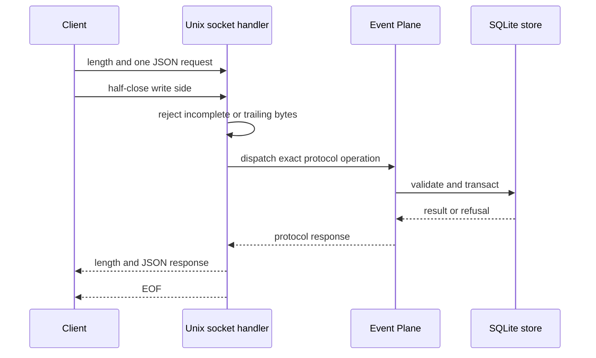
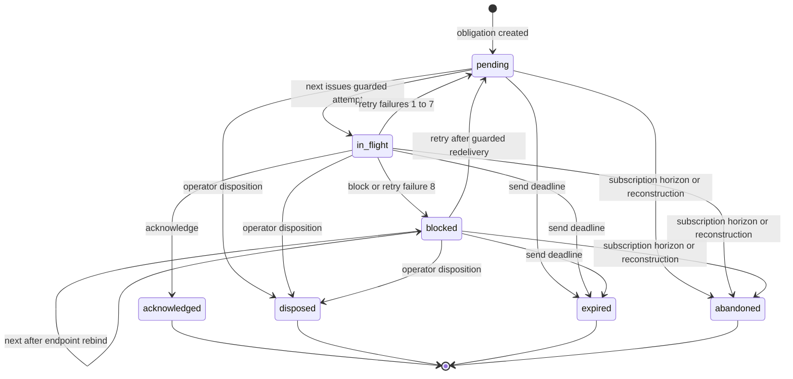
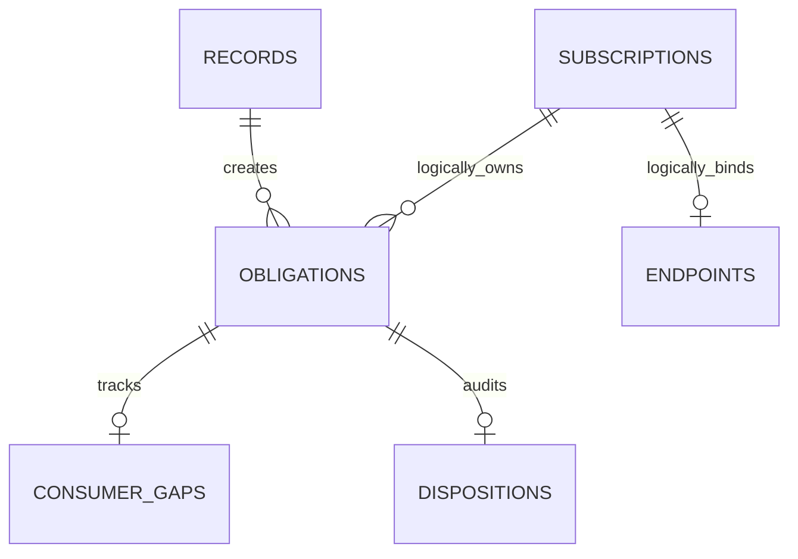

# Event Plane

The Event Plane is a dependency-free, machine-local Python service. It is payload-agnostic, owns the sole SQLite connection, and exposes bounded state transitions over a Unix socket rather than exposing SQL. The authoritative implementation is `bin/lib/event_plane_service.py`; Python and TypeScript clients mirror the same operation set.

## Launch and client surfaces

```bash
bin/event-plane serve [--state-dir /absolute/private/path]
bin/event-plane-admin [--state-dir /absolute/private/path] OPERATION 'JSON_OBJECT'
bin/event-plane-admin [--state-dir /absolute/private/path] OPERATION @body.json
bin/event-plane-admin [--state-dir /absolute/private/path] OPERATION -
```

The default state directory is `$XDG_STATE_HOME/qq/event-plane`, otherwise `$HOME/.local/state/qq/event-plane`. `bin/event-plane` requires `python3` and execs the service. `bin/event-plane-admin` prints one compact `{ok,result}` or `{ok:false,error}` JSON document and exits `2` on client/service refusal (`69` if Python is unavailable).

`EventPlaneClient` exists in Python (`event_plane_client.py`) and TypeScript (`event-plane-client.ts`). Both expose `send`, `publish`, `ensure_subscription` or `ensureSubscription`, `next`, `wait`, `acknowledge`, `retry`, `block`, `disposition`, `status`, `inspect`, `backup`, and `shutdown`. `wait` is a client alias for `next` that requires explicit `wait_ms`. The bounded operation set is repeated in four change surfaces: `EventPlane.dispatch`, Python `OPERATIONS`, TypeScript `OPERATIONS`, and the admin `argparse` choices; public methods must match them (`wait` remains an admin/client alias, not a dispatched operation). Python raises `EventPlaneClientError`; TypeScript exports `EventPlaneError`, `QQ_EVENT_PLANE_PROTOCOL`, `JsonValue`, `JsonObject`, and `canonicalEventPlaneJson`.

## Wire protocol

Each connection carries exactly one request and one response:

1. four-byte unsigned big-endian length;
2. UTF-8 JSON of 2 to 131072 bytes;
3. client half-close, proving EOF and therefore no trailing bytes or second frame;
4. one response framed the same way, then EOF.

A request is exactly `{protocol:"qq-event-plane/v1", operation, body}`. A response is exactly `{protocol,ok:true,result}` or `{protocol,ok:false,error:{code,message}}`. A valid service refusal preserves its service `code` and `message` in the client exception. Missing/refused sockets map to `unavailable`; other I/O and timeout failures map to `transport_error`; incomplete, trailing, invalid JSON/protocol/refusal/result responses are client-side malformed-response errors. Unexpected exceptions inside service dispatch become an `internal_error` refusal, while known validation/state failures keep their specific refusal code. The service times connections out after 35 seconds; `next` and `status` cap `wait_ms` at 30000. Client transport timeouts are bounded to 60 seconds.



*The one-request-per-connection framing handshake prevents dispatch until the server observes request EOF.*

JSON is intentionally narrower than generic JSON: strings must contain Unicode scalar values; numbers are integers in the JavaScript safe range; object keys must be unique and cannot be JavaScript array-index keys `0` through `4294967294`; cycles, floats, NaN, infinity, non-JSON objects and duplicate fields are rejected. Canonical JSON recursively sorts keys by Unicode scalar order. Payload canonical JSON is capped at 64 KiB. Bodies are exact objects: unknown fields are refused.

## Operations

### Append and subscriptions

| Operation | Exact body contract | Result and semantics |
|---|---|---|
| `send` | Required `producer_id,request_id,origin_id,recipient_id,product_id,kind,schema_version,payload`; optional `subject_id,correlation_id,causation_id,source_revision,source_ref,occurred_at,deadline_at` | Appends one record and one recipient obligation. Deadline defaults to one hour and an explicit deadline must be after acceptance and no later than that horizon. |
| `publish` | Same as `send` without `recipient_id`; same optional metadata except `deadline_at` is forbidden | Appends one record and fans out obligations to every active, unexpired subscription matching product and kind. Zero subscribers makes the record immediately terminal. |
| `ensure_subscription` | `subscription_id,product_id,kind,generation`; optional `reconstruct_from` | Creates generation 1 only with an explicit reconstruction position; renews an unchanged active generation only without it; an expired or changed selector requires exactly the next generation and explicit reconstruction. Returns subscription, `reconstructed`, and replay count. |

`product_id` is a lowercase product token. Producer, origin, recipient, subscription and consumer IDs are logical IDs prefixed by that product and `/`. `kind` is a bounded lowercase token. `(producer_id,request_id)` is the idempotency key: identical normalized bytes return the original record even after payload compaction; different bytes return `idempotency_conflict`.

Reconstruction abandons unresolved obligations from the previous generation, drops its endpoint binding, resets high-water to `reconstruct_from - 1`, and replays retained matching publications in journal order. A request crossing purged or deleted history fails with `replay_unavailable`; callers must reconstruct current authority at a newer position.

### Delivery transitions

`next` requires `consumer_type,consumer_id,generation,endpoint_token` and optional `wait_ms`. Recipient generation is `0`; subscription generations are positive. It validates subscription existence, current generation, active lease, and then atomically binds the endpoint and selects the oldest due obligation. Rebinding resets pending/in-flight attempts and clears blocked delivery fencing while preserving blocked custody and reason. A returned delivery includes the immutable record, obligation, attempt and endpoint tokens, plus a guard containing expected high-water, gap token, and gaps.

Every modifying delivery operation must echo this full identity and concurrency guard: `obligation_id,event_id,consumer_type,consumer_id,generation,attempt_token,endpoint_token,expected_high_water,expected_gap_token`.

| Operation | Additional fields | Allowed source state | Destination |
|---|---|---|---|
| `acknowledge` | none | `in_flight` | `acknowledged`; removes subscription gap and advances high-water. |
| `retry` | non-empty bounded `reason` | `in_flight` or `blocked` | `pending` with backoff; the eighth failure becomes `blocked`. |
| `block` | non-empty bounded `reason` | `in_flight` | `blocked`, preserving an explicit gap. |
| `disposition` | `authorized_by,authorization:"operator",reason,expected_status` | exactly the named `pending`, `in_flight`, or `blocked` state | `disposed`; writes an audit row, removes a subscription gap and advances high-water. |



*The obligation state machine; terminal states never return to delivery, while restart converts only `in_flight` to `pending`.*

Backoff is exactly 1s, 2s, 5s, 10s, 30s, 60s, 120s, then 300s. Attempt count advances on each delivery; failure count advances on `retry`. A blocked earlier subscription position remains an explicit `consumer_gaps` row while later publications may be claimed and acknowledged; high-water can advance over those later positions without erasing the unresolved earlier gap. Guard mismatch errors distinguish wrong identity/gap (`guard_conflict`, `gap_conflict`), replaced endpoint (`stale_endpoint`), stale attempt/state (`stale_attempt`), and stale subscription generation (`generation_conflict`). Rebinding an endpoint invalidates the prior endpoint/attempt tokens; restart removes endpoint bindings and changes `in_flight` to `pending`, so a pre-restart transition is stale rather than able to mutate recovered custody.

### Query and administration

- `status`: select either `event_id`, or `producer_id` plus `request_id`; optional `wait_ms`. Returns record, all obligations, `terminal`, and `terminal_failure` (only an expired or disposed send). Waiting uses the same condition lock as commits, preventing missed wakeups.
- `inspect`: exact `view` is `health`, `integrity`, `journal`, `obligations`, `subscriptions`, or `dispositions`. List limits default to 20 and cannot exceed 20. Journal accepts `after_position`; obligations accept `status` and `consumer_id`. Health includes identity, schema/protocol, SQLite durability mode, counts, and runtime constants.
- `backup`: body `{path}`. The path must be a new, lexical absolute name outside Event Plane state, under a real account-owned mode-`0700` parent and safe ancestor chain. It creates one mode-`0600`, single-link file without following links, takes a lock-serialized SQLite snapshot, validates exact schema/integrity/instance/content baseline, then fsyncs file and parent. Failure removes only the inode created by that operation.
- `shutdown`: body `{expected_instance_id,authorization:"operator"}`. Both guards must match. New dispatches are refused as unavailable while server shutdown proceeds.

There is deliberately no restore, rollback, routing DSL, dead-letter API, mailbox/session registry, model call, or product-specific callback.

## Storage schema and ownership



*Schema-v2 delivery relationships; only obligation links to records, gaps, and dispositions are declared foreign keys, while subscription and endpoint ownership is enforced by service logic.*

The exact schema-v2 objects are:

- `metadata`: only `instance_id` (`plane_` plus 32 hex digits) and `schema_version=2`;
- `records`: monotonic `journal_position`, immutable identity/envelope metadata, normalized input/hash, payload, terminal and purge timestamps; unique event ID and producer/request pair;
- `subscriptions`: selector, generation, reconstruction position, high-water, lease and active/expiry timestamps;
- `obligations`: per-record consumer custody, delivery status/counters/tokens, retry time and reason; unique per record, consumer and generation;
- `consumer_gaps`: unresolved subscription positions and their obligation/status/reason;
- `endpoints`: current endpoint token per consumer/generation;
- `dispositions`: operator-authorized terminal audit;
- `retention_boundaries`: highest deleted publication position per product/kind;
- `obligations_delivery` index and `records_immutable` trigger.

The service validates the exact set and normalized SQL of every table, index, and trigger, metadata keys, `PRAGMA user_version=2`, integrity, and foreign keys. It refuses old, unknown, altered, corrupt, WAL-mode, loose-permission, or non-empty unversioned databases; it has no migration path. SQLite uses DELETE journal mode, `synchronous=FULL`, foreign keys, a 10-second busy timeout, and `BEGIN IMMEDIATE` transactions. One `RLock` serializes the sole connection; its condition variable also covers wait predicate checks and notifications.

## Startup, recovery, retention, and security

Startup ordering is fail closed: set umask `077`; validate the optional test clock before creating state; validate/create the real private directory chain; reject unexpected fixed names; acquire the mode-`0600` singleton lock; validate/recover the exact database; record lock owner; remove only an account-owned stale socket; bind and chmod the socket `0600`; then accept requests. State is `0700`, account-owned and non-symlink. Writable ancestors are refused unless a sticky shared parent fences an account-owned private child. Fixed database/lock/socket files must be account-owned, mode `0600`, single-link objects of the expected type.

On restart SQLite first performs native DELETE hot-journal recovery. The store then changes persisted `in_flight` obligations and gaps to pending and deletes all endpoint bindings; immutable records and acknowledged state remain. SIGINT, SIGTERM, and guarded shutdown close the server/store, remove only the owned socket, and release the singleton lock.

Cleanup runs at startup and before public store operations in batches of 100:

1. expire subscription leases after 24 hours;
2. abandon unresolved subscription publications when the lease/horizon ends;
3. expire undelivered sends at their deadline;
4. after a terminal record is 24 hours old, erase normalized input, envelope and payload but retain hash/status tombstone;
5. after seven days, delete terminal records, first advancing publication retention boundaries;
6. delete old inactive subscriptions only after no obligations remain.

Test-only timing overrides and `--test-clock` require `QQ_EVENT_PLANE_TESTING=1`; production refuses them.

## Agent-message integration

`extensions/agent-messages.ts` is a product adapter, not part of the core service. Its default paths derive both the socket and private `qq.agent-presence/v2` files from the Event Plane root, placing presence under `event-plane/presence`, and it registers the `agent_messages` tool (`list`, `send`, `status`) plus `/agent-tasks`. This is an integration constraint: the core service accepts only its fixed namespace entries at startup, so deployments must keep extension presence outside the core state directory or start the service before such adjacent state exists; the live harness deliberately injects the socket while using a separate XDG state root for presence.

For durable messages it sends kind `agent.message` to recipient `agents/<canonical-session-id>`. A background recipient consumer uses generation `0` and a fresh endpoint token. Unsupported payloads are blocked. Valid messages are injected into Pi; acknowledgement happens only after the session transcript contains the matching event ID and content hash. If persistence is not observable, the adapter retries instead. Immediate delivery may abort a busy turn, with an idempotent `agent.immediate-claim` publication coordinating the interrupt. Presence starts and renews with the Pi session, reflects thinking/tool/idle events, and is removed on shutdown. See [Profiles and extensions](../runtime/profiles-and-extensions.md) for its Pi-facing behavior.

## Extension seams and safe changes

- Add a core operation only in the service dispatch map and both clients/admin choices; keep exact body validation and object results, then extend protocol tests. Unknown operations must remain side-effect free.
- Schema changes require a deliberately new exact schema contract; this implementation cannot migrate installed state.
- Product behavior belongs in adapters using envelopes and delivery guards. Do not import Pi, Herdr, Backlog, or product registries into the core.
- `Clock`, isolated timing constants, state directory, and command/client boundaries are explicit test seams. Production timing overrides remain forbidden.
- Long-poll changes must preserve the shared lock/condition predicate-installation ordering.

## Focused validation

```bash
tests/test-event-plane.sh
node --experimental-strip-types tests/test-agent-messages.mjs .
# Conditional live service integration
tests/test-agent-messages-live.sh
```

`tests/event_plane_test.py`, invoked by the shell harness, proves crash durability and native hot-journal recovery; strict framing/JSON and cross-client canonical equivalence; unsupported/removed-operation refusal; idempotency conflicts and concurrent monotonic journal positions; independent fan-out, guards, rebinding, gaps, restart redelivery and atomic waits; exact backoff; guarded operator disposition and its audit row; expiry, lease reconstruction and retention truth; exact schema/singleton/filesystem fences; backup success and race/refusal safety; and absence of removed/out-of-scope APIs. The live agent-message harness requires a running local Event Plane; broader ordering is listed in [Testing and change guide](../development/testing-and-change-guide.md).
